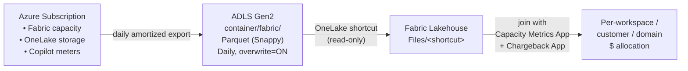
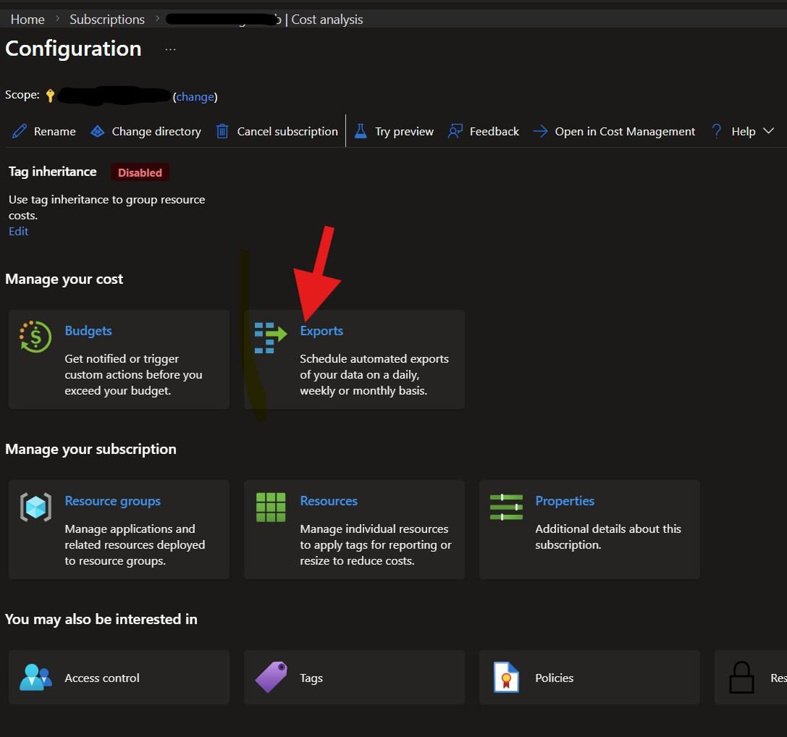
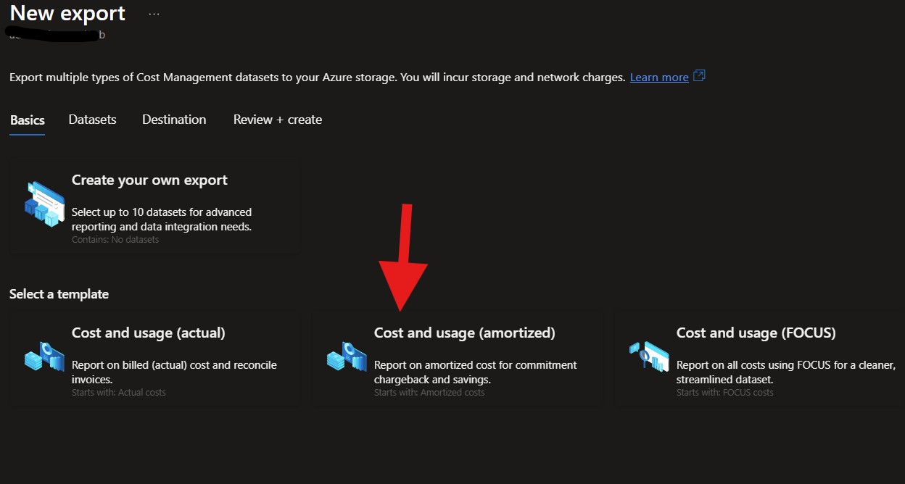
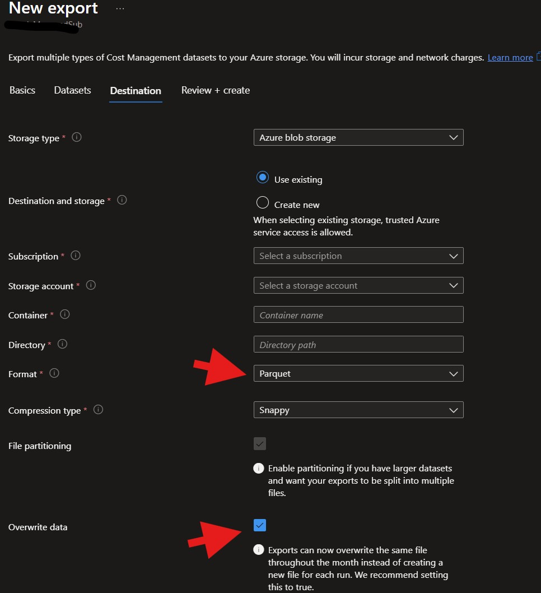
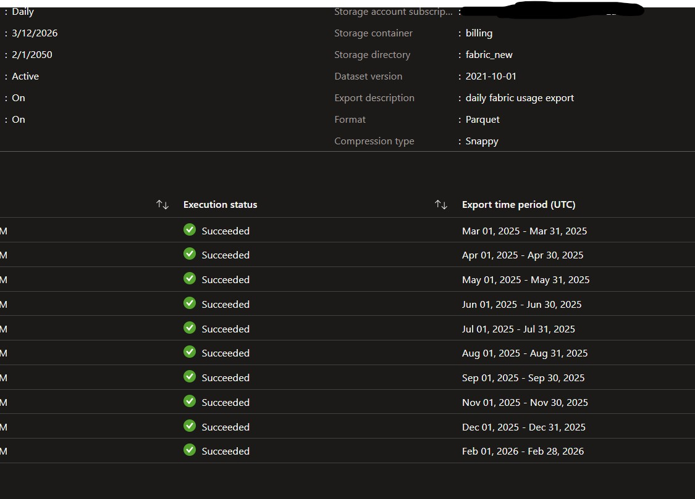
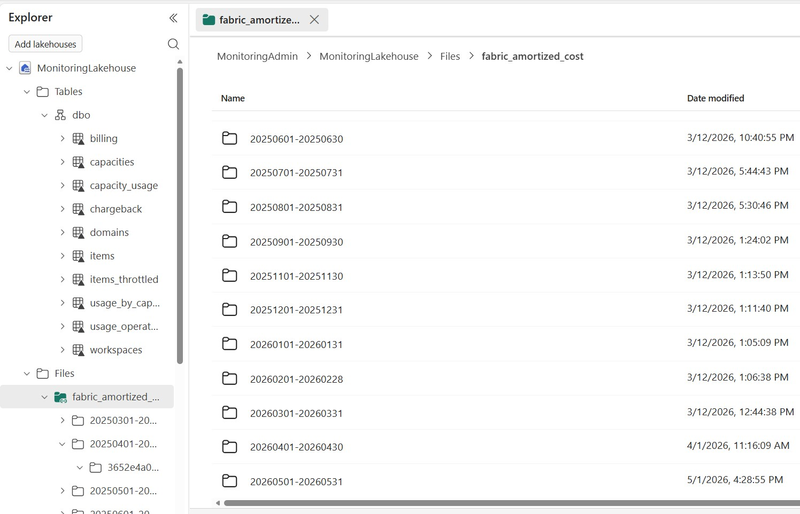

# Azure Cost Export → Fabric — Real $ Cost Reporting Inside Fabric

A guide to landing **Azure Cost Management amortized-cost exports** into ADLS Gen2, mounting them as a **OneLake shortcut**, and joining the actual Azure dollars (capacity SKU + reservations + OneLake storage + **Copilot consumption**) to your CU-consumption and chargeback data — **all inside Fabric, no Azure portal hopping**.

The Capacity Metrics App tells you *how much CU* a workspace burned. The Chargeback App tells you *who* burned it. **Neither tells you the actual dollar bill** — you only see CU-seconds, not the SKU price, not your reservation discount, not the per-hour OneLake storage charge, not Copilot tokens. This guide closes that gap.

---

## What this gives you

- **Daily Parquet drop** of your full Azure cost dataset into your ADLS Gen2 storage (overwritten throughout the month, then a new month's file the following month). Configured once in the Azure portal — runs forever.
- **Amortized cost** — spend is split across capacity, OneLake storage, and Copilot meters per day, so you can break the bill down by workload instead of seeing one upfront lump sum.
- **Captures everything billed under `Microsoft.Fabric`** — capacity hours, OneLake storage GB-hours, **Copilot-in-Fabric consumption (when billed against your capacity)**, autoscale CU.
- **Lives in Fabric as a OneLake shortcut** — no Azure RBAC handed out to report consumers, no copy job to maintain, the shortcut points straight at the ADLS container.
- **Joinable with the Capacity Metrics App and Chargeback App** — once the shortcut is in place, you can build a Direct Lake / Power BI / lakehouse SQL model that ties real Azure dollars to CU consumption per capacity, workspace, domain, item, or user. *(How you wire that join is up to your data team — the CU side comes from the two apps, the dollar side comes from this shortcut.)*

---

## Why this matters — use cases

### 1. ISVs running multiple customers on shared capacities

You're an ISV with 1–2 Fabric capacities serving N customers. Each customer typically gets their own workspace (or set of workspaces). Your Azure bill is **one number per capacity per day** — but you need to invoice each customer for their slice.

The building blocks:
- This export → daily $ per capacity (with reservation discount applied)
- **Chargeback App** → per-workspace, per-day CU-seconds (`Chargeback` fact table)
- Allocate: `customer_$_per_day = capacity_$_per_day × (customer_workspace_CU / total_capacity_CU)`

You get a **defensible per-customer $ figure** that ties back to a real Azure invoice line item.

### 2. Enterprise org splitting one capacity across teams

Finance owns one F64. Marketing, Data Science, and Engineering each have workspaces on it. Resource tagging at the Azure level can't help — there's only one capacity resource. Use the **same CU-share allocation** above to split the monthly capacity invoice across cost centers / domains (the Chargeback App already exposes Domain mapping out of the box).

### 3. Reservation savings visibility

Did the F64 reservation actually pay off? Compare:
- `CostInPricingCurrency` / `UnitPrice` → on-demand list price
- `Cost` (amortized) / `EffectivePrice` → post-reservation price
- The delta = your reservation savings in dollars, which you can then allocate per workspace by CU share.

### 4. OneLake storage chargeback

OneLake is billed **per GB-hour** at the capacity level, not per workspace. The Capacity Metrics App's `Storage By Workspaces And Day` table gives you GB-days per workspace. Combine with the `OneLake - Storage` line items in the cost export to allocate the storage bill to the workspaces that actually held the data.

### 5. Copilot-in-Fabric usage tracking

Copilot in Fabric is billed against your Fabric capacity. Where it surfaces depends on the configuration — it can show as additional CU on the capacity meters or as a dedicated Copilot meter under the same resource. Either way, the export captures the **dollar impact of Copilot on each capacity** — so when leadership asks "what is Copilot costing us per month per team", you have a real, invoice-aligned answer once you allocate by CU share.

### 6. Catch capacity sprawl

A daily $-export catches a paused-then-forgotten F8 sitting in a non-prod resource group. CU-only views miss this (no CU = no rows). Cost-only catches it.

---

## Architecture



---

## Setup — Step by Step

### Prerequisites

- **Azure subscription owner / cost-management contributor** rights to create exports
- **An ADLS Gen2 storage account** in the same tenant (any region works; same region as the bulk of your Fabric capacities is best for transfer cost)
  - Hierarchical namespace: **enabled**
  - Container created (e.g., `billing`)
- **A Fabric workspace + lakehouse** to host the shortcut
- **Workspace contributor** (or higher) on the Fabric workspace to create the OneLake shortcut

### Step 1 — Open Cost Management → Configuration

In the [Azure portal](https://portal.azure.com), navigate to your **Subscription** → **Cost analysis** → **Configuration** (top right ellipsis → Configuration, or search "Cost Management" in the subscription blade).

Click **Exports** under "Manage your cost".



### Step 2 — New export → choose "Cost and usage (amortized)"

Click **+ Create**, pick **Cost and usage (amortized)**, and give the export a clear name (e.g., `fabric-amortized-daily`).



### Step 3 — Destination → ADLS Gen2 + Parquet

On the **Destination** tab:

| Field | Value |
|---|---|
| Storage type | Azure blob storage |
| Destination and storage | Use existing |
| Storage account | Your ADLS Gen2 account |
| Container | e.g., `billing` |
| Directory | e.g., `fabric` (used as the shortcut sub path later) |
| **Format** | **Parquet** |
| Compression type | Snappy |
| **Overwrite data** | **ON** |



### Step 4 — Schedule + verify runs

Set **Frequency** → **Daily**, **Start date** today, **End date** far in the future. The export runs immediately and then daily; the run history shows one row per month with **Execution status: Succeeded**.



### Step 5 — Create the OneLake shortcut

In Fabric:

1. Open your lakehouse
2. Right-click **Files** → **New shortcut** → **Azure Data Lake Storage Gen2**
3. **URL**: `https://<storage-account>.dfs.core.windows.net/<container>` (e.g., `https://myfinopslake.dfs.core.windows.net/billing`)
4. **Connection** — pick *Organizational account* or, recommended for production, a *Service principal* that has **Storage Blob Data Reader** on the container
5. **Sub Path**: the directory you set in step 3 (e.g., `/fabric`)
6. **Shortcut name**: `fabric_amortized_cost` (or any name you prefer)
7. Click **Create**

The shortcut is read-only and points live at the storage account — no data is copied into OneLake.



### Step 6 — Validate the data

From a notebook, SQL endpoint, or directly in the lakehouse explorer, browse `Files/<your-shortcut-name>/` and confirm one subfolder per billing period (`YYYYMMDD-YYYYMMDD`) containing the monthly Parquet file. A quick row sample should show columns like `Date`, `ResourceId`, `ConsumedService`, `MeterCategory`, `MeterSubCategory`, `MeterName`, `Quantity`, `EffectivePrice`, `Cost`, `CostInBillingCurrency`, `BillingPeriodStartDate`, `ChargeType`, `PricingModel`.

Filter to `ConsumedService = 'Microsoft.Fabric'` (and `Microsoft.PowerBIDedicated` if you still have legacy Premium capacities) to scope the data down to your Fabric spend. From here, you can build a Direct Lake / Power BI / SQL / notebook model that joins these rows to the **Capacity Metrics App** and **Chargeback App** datasets to drive the use cases above.

---

## Cost-Allocation Patterns

These are the formulas your team will implement on top of the shortcut + the two app datasets. They are model-agnostic — write them in SQL on the lakehouse SQL endpoint, in DAX in a composite model, or in PySpark in a notebook.

### Allocate capacity $ to workspaces by CU share (per day)

For each `(capacity, day)`:

```
workspace_$ = capacity_$ × (workspace_CU / total_capacity_CU)
```

- `capacity_$`: sum of `Cost` (amortized) for the capacity from the export, filtered to capacity-unit meters (exclude OneLake storage and Copilot if you want pure compute)
- `workspace_CU` and `total_capacity_CU`: from the **Chargeback App** `Chargeback` table grouped by `Workspace Id` / `Capacity Id` and `Date`
- Match the export to the capacity using either capacity tags (when [tag inheritance](https://learn.microsoft.com/en-us/azure/cost-management-billing/costs/enable-tag-inheritance) is on) or by parsing the capacity name out of `ResourceId`

### Allocate OneLake storage $ by GB-day share

Same pattern, but on the storage side:

- `storage_$`: filter the export to `MeterSubCategory` containing `Storage` (OneLake / Hot / Archive lines under Microsoft.Fabric)
- GB-day share: from the **Capacity Metrics App** `Storage By Workspaces And Day` table

### Allocate to domain / customer / cost-center

Roll the per-workspace $ up using:

- The **Chargeback App** `Domains` table (out-of-the-box domain assignment)
- Or your own `workspace → customer` / `workspace → cost-center` mapping table maintained alongside

---

## Key columns in the cost export

The amortized export schema is documented at [Azure Cost Management — Understand cost details data](https://learn.microsoft.com/en-us/azure/cost-management-billing/automate/understand-usage-details-fields). The columns most relevant for Fabric chargeback:

| Column | Why it matters for Fabric |
|---|---|
| `Date` | Day of consumption |
| `ResourceId` | Full ARM ID — last segment is the capacity name for `Microsoft.Fabric/capacities/...` |
| `ConsumedService` | Filter to `Microsoft.Fabric` for capacity + OneLake; `Microsoft.PowerBIDedicated` for legacy Premium capacities |
| `MeterCategory` | `Microsoft Fabric`, `Power BI Embedded` |
| `MeterSubCategory` | Distinguishes capacity-unit meters vs OneLake storage vs Copilot meters |
| `MeterName` | Specific SKU / meter (e.g., `F64 Capacity Unit`, OneLake storage tiers, Copilot meters) |
| `Quantity` | CU-hours, GB-hours, etc. |
| `UnitPrice` | List per-unit price |
| `EffectivePrice` | Per-unit price after reservation / savings-plan discount |
| `Cost` / `CostInBillingCurrency` | Amortized $ for the row |
| `BillingPeriodStartDate` | Month boundary |
| `ResourceGroupName`, `SubscriptionId`, `Tags` | Metadata for grouping by RG / sub / tag |
| `ChargeType` | `Usage`, `Purchase` (reservation buy), `Refund`, `Adjustment` |
| `PricingModel` | `OnDemand`, `Reservation`, `SavingsPlan` |

> **Tip**: Capacity tags flow into the cost export when [tag inheritance](https://learn.microsoft.com/en-us/azure/cost-management-billing/costs/enable-tag-inheritance) is enabled at the subscription level. If you tag capacities with `customer=acme` or `team=marketing`, you can allocate by tag *without* CU-share math — ideal when one capacity = one customer or team.

---

## Limitations / things to know

- **Cost data lags** — the current day's rows are partial; final amortized numbers settle 24–72 hours after the day closes
- **End-of-month restatement** — Azure restates the prior month's data for several days into the new month (refunds, adjustments, reservation true-ups). Continue reading the prior month's file for ~5 days into the new month
- **Tag inheritance is opt-in** — enable at the subscription level if you want capacity tags in the export
- **Reservations bought outside the subscription** — if a reservation was purchased in a different scope, the amortized rows still appear correctly. `EffectivePrice` reflects the post-discount price
- **Copilot meters** — the exact `MeterName` for Copilot-in-Fabric varies by GA / announcement timing. Inspect `MeterSubCategory` in your own export to confirm the meter family. If Copilot is billed against a separate AI Foundry resource rather than the Fabric capacity, it will appear under a different `ConsumedService` — adjust filters accordingly
- **Storage account egress** — the OneLake shortcut reads from the storage account on every query. Same-region as your Fabric capacity avoids transfer cost
- **Network access** — for the cost-export *write* path, trusted Azure services can write even when public network access on the storage account is disabled. For the OneLake-shortcut *read* path, the storage account must allow access from Fabric (public network, configured firewall rules, or managed private endpoint)
- **Schema versions** — Azure Cost Management periodically introduces new dataset versions. Pin the version when you create the export so a future schema change doesn't silently break your downstream model

---

## Related Resources

- [Tutorial: Create and manage exported data — improved exports](https://learn.microsoft.com/en-us/azure/cost-management-billing/costs/tutorial-improved-exports)
- [Understand cost details fields](https://learn.microsoft.com/en-us/azure/cost-management-billing/automate/understand-usage-details-fields)
- [OneLake shortcuts — ADLS Gen2](https://learn.microsoft.com/en-us/fabric/onelake/create-adls-shortcut)
- [Enable tag inheritance for cost reporting](https://learn.microsoft.com/en-us/azure/cost-management-billing/costs/enable-tag-inheritance)
- [Fabric Capacity Metrics App](../capacity-metrics-app/) — CU consumption side
- [Fabric Chargeback App](../chargeback-app/) — per-user / per-domain CU side

---

## Disclaimer

This guide is provided **as-is** with no warranty of any kind. Always reconcile against your actual Azure invoice before billing customers or charging back to internal cost centers.

## License

This project is licensed under the [MIT License](../../LICENSE).
