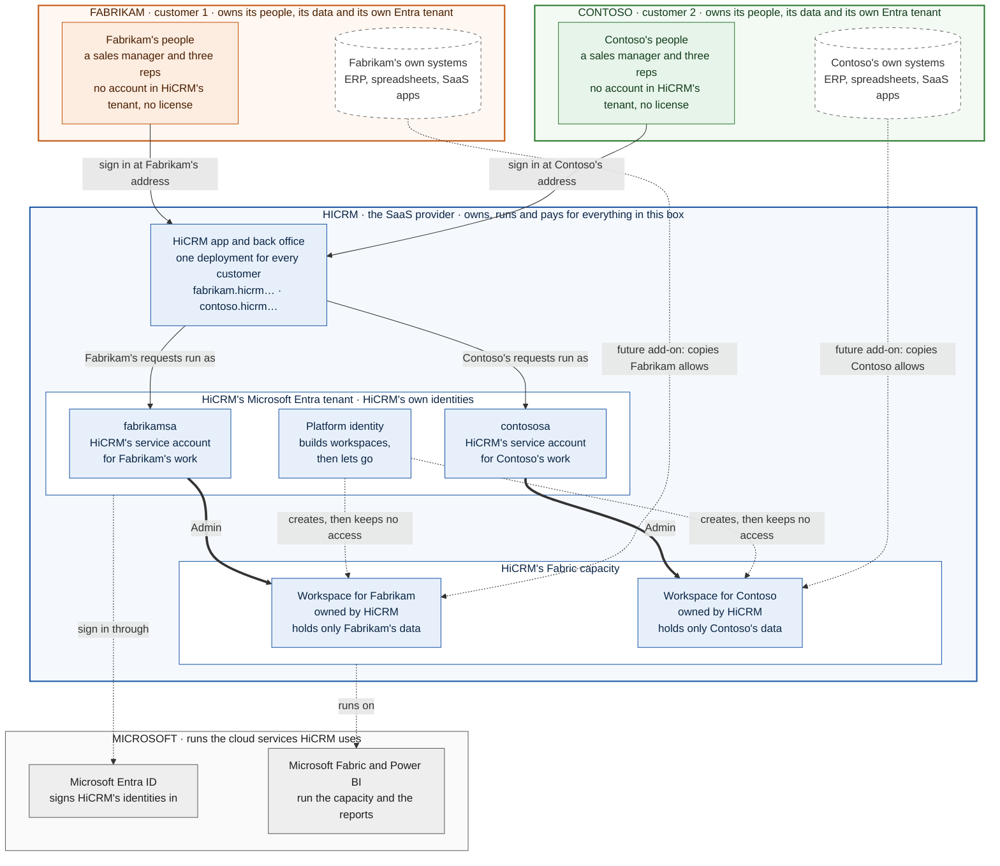
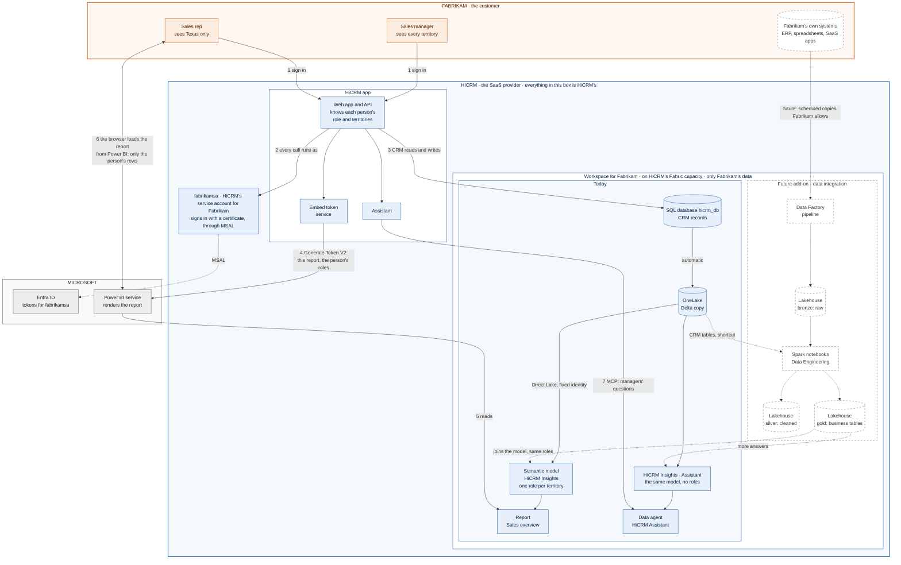
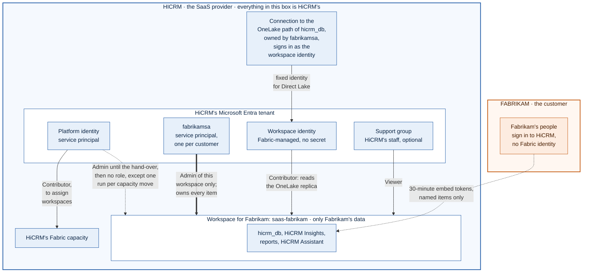
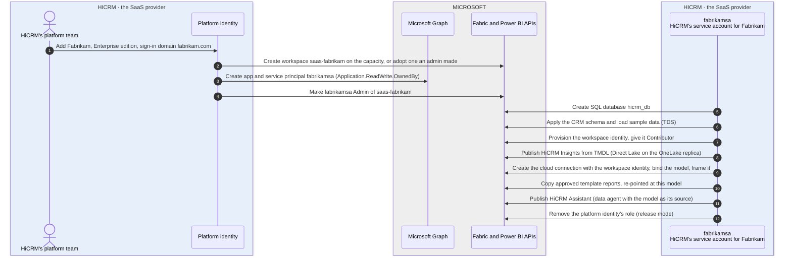
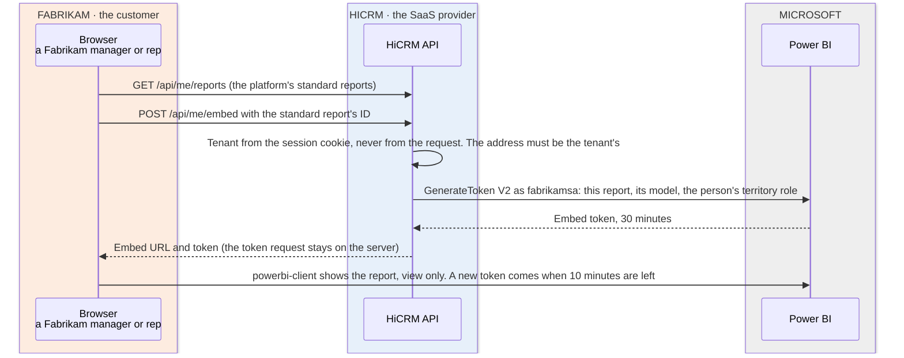
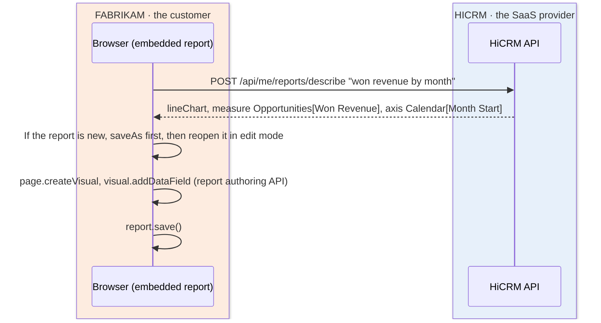
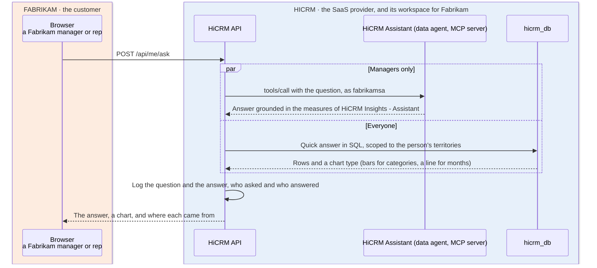

# HiCRM on Microsoft Fabric: architecture

HiCRM is a CRM sold as SaaS. Each customer (the first is **Fabrikam**) gets a Microsoft Fabric workspace that HiCRM
owns and runs for that customer alone. The customer only ever sees HiCRM: accounts, opportunities, activities, a
standard report (building their own is the next phase), and an assistant that answers questions. Fabric, workspaces
and editions never appear in the app.

Everything below is built and was verified against a live tenant (see [What was verified live](#what-was-verified-live)).
HiCRM is the sample for a reusable framework: [FRAMEWORK.md](FRAMEWORK.md) describes the framework, its controls and
the validator that checks them.

## 1. The big picture

**Who's who.** HiCRM is the SaaS provider: it owns and runs everything in blue, including a workspace and a service
account for each customer. Fabrikam (orange) and Contoso (green) are its customers and own only their people and their
data; Microsoft (grey) runs the cloud services. "Fabrikam's workspace" always means the workspace HiCRM runs for
Fabrikam. Dashed parts are the future data integration add-on ([DATA-INTEGRATION.md](DATA-INTEGRATION.md)).

**Who owns what**

**One customer's data, end to end.** Fabrikam is shown; Contoso works the same way, in its own workspace, as
`contososa`. [README.md](README.md#how-it-works) walks through the numbered steps.

Not drawn:
- HiCRM's back office and CLI, where operators sign in. Opening a customer's reports, asking its assistant or loading
  its data is written to that customer's activity log.
- The customer registry, and the identity broker, which signs in as each customer's service account with its credential
  from the encrypted store (Key Vault in production).
- The cloud connection through which the model reads OneLake as the workspace identity (section 2).

- **The CRM is the source of truth.** HiCRM writes to a Fabric SQL database (`hicrm_db`). Fabric replicates every
  table with a primary key to OneLake as Delta, so no pipeline or ETL job sits between the app and the analytics.
- **One semantic model, generated from the schema.** `HiCRM Insights` is a Direct Lake model built from the same
  table definitions as the database (`src/crm/schema.js` produces both the DDL and the TMDL). Reports, the
  describe-a-chart box and the assistant all use its measures, so "Win Rate" means the same thing everywhere.
- **Customers never hold a Fabric identity.** Reports are embedded with short-lived V2 embed tokens that only cover
  their workspace's items ("app owns data"), so Fabrikam's users need no Power BI license.

## 2. Identities and least privilege

| Identity | What it is | Access | Used for |
| --- | --- | --- | --- |
| Platform identity | Service principal (`AZURE_CLIENT_ID`) | Fabric APIs (tenant setting), Contributor on the capacity, Admin of a customer workspace only until the hand-over | Control plane only: create the workspace, assign capacity, make the customer's service account Admin. With `PLATFORM_WORKSPACE_ACCESS=release` (required in production) it then removes its own role, so it holds no standing role in any customer workspace and isn't held to the limit of 1,000 workspaces per identity. Moving a workspace to another capacity is the one later task that needs it; the service account re-adds it for that run only, and the activity log records it. Optionally `Application.ReadWrite.OwnedBy` in Microsoft Graph so it can create service accounts (and only manage those). |
| `fabrikamsa` | Service principal, one per customer | **Admin of `saas-fabrikam` only** | Everything for Fabrikam at runtime and during provisioning after the hand-over: SQL, model, connection, reports, embed tokens, the assistant. A bug that confuses customers can't reach another customer's data: the token itself has no access there. It has no rights on capacities. |
| Workspace identity | Fabric-managed service principal of `saas-fabrikam` | Contributor of `saas-fabrikam` only | The credential of the model's cloud connection (Direct Lake fixed identity). Nobody holds a secret for it. Contributor is the least role that works: Direct Lake on OneLake needs Read and ReadAll, and Viewer has no OneLake data access. |
| Support group | Entra group (`FABRIC_OPS_PRINCIPAL_ID`) | Viewer | Looking at the workspace in the Fabric portal. |
| Operators | People using the back office | None in Fabric | Sign in with `ADMIN_KEY` (required whenever the server is reachable from other machines). Opening a customer's reports, asking their assistant or loading data is written to that customer's activity log. |
| Fabrikam users | Signed in to HiCRM | None in Fabric | Embed tokens for their own reports and model, 30 minutes by default (`EMBED_TOKEN_MINUTES`, 5 to 60). |

Every identity above lives in HiCRM's Entra tenant. What changes when a customer's own Entra tenant takes part (its
people signing in with work accounts, or the data integration add-on reading its systems) is in
[IDENTITIES.md](IDENTITIES.md).

`node scripts/platform-cli.js audit <customer>` (or **Check access** in the back office) compares the workspace with this
table and flags drift: missing or extra roles, people with direct access, items that are gone, a connection that signs
in some other way, the wrong capacity or an old CRM schema. [MULTITENANCY.md](MULTITENANCY.md) has the full review.

**Why `fabrikamsa` is a service principal, not a mailbox-style user `fabrikamsa@<your domain>`.** A user account would
need a password the platform stores and rotates, an exclusion from MFA and Conditional Access (the
resource-owner-password flow can't do MFA and is discouraged), and a Power BI Pro license on capacities smaller than
F64 to own reports. A service principal has none of those problems, is what Fabric and Power BI Embedded recommend for
"app owns data", and can later use workload identity federation (no secret at all). If you need a user-type account
for delegated-only features (for example the Fabric IQ MCP endpoint, or Copilot in the Fabric portal for your support
staff), create it separately; the customer-facing path doesn't need one.

**Getting `fabrikamsa`.** The platform identity has no Microsoft Graph permissions by default, so an Entra admin does a
one-time setup with [scripts/bootstrap-identities.ps1](scripts/bootstrap-identities.ps1):

- `-Customer Fabrikam -Register` creates the app registration and service principal `fabrikamsa` with a certificate
  (the private key goes straight into the platform's encrypted store or Key Vault, and the file is deleted), and
  registers it. `-Credential Federated` makes the app trust the platform's managed identity instead: no secret and no
  certificate exist at all. Tokens are acquired with MSAL Node; a certificate signs a 10-minute assertion (PS256).
- `-GrantPlatformAppCreation -PlatformAppId <id>` grants the platform app `Application.ReadWrite.OwnedBy`, after which
  the platform creates `<customer>sa` for every new customer by itself (`TENANT_IDENTITY_AUTO_CREATE=true`). It uses
  the Graph upsert keyed on the customer (`PATCH /applications(uniqueName='hicrm-tenant-<id>')` with
  `Prefer: create-if-missing`), so a retry after a crash never leaves a second app behind.

`TENANT_IDENTITY_MODE=required` (production) stops provisioning until the service account exists, so nothing is ever
built with the shared identity. `preferred` (development) continues with the platform identity and shows a warning.

## 3. Provisioning a customer

Every step is idempotent and reads state back from Fabric, so a re-run only does what's missing. A create whose
response was lost is found by name on the next attempt instead of being created twice, and a workspace the registry
already knows is never silently re-created (it may hold data an admin can still restore). At most
`PROVISIONING_CONCURRENCY` customers (default 4) provision at once, so onboarding many customers doesn't turn into a
throttling storm. Re-runs are also how
upgrades ship: a new CRM schema version is migrated in place, a new model version (detected by a fingerprint of the
generated TMDL) is pushed with `updateDefinition`, the assistant is republished, and framing retries while the OneLake
replica catches up with schema changes. Customers keep working during an upgrade: once a customer has been ready, the
app keeps serving what already works while a later run is busy or has failed. Removing a customer deletes the
workspace, the connection (connections live outside workspaces) and the service account.

A customer can get a capacity of its own (back office, or `capacity <customer> <id>` in the CLI) for noisy-neighbour
isolation or data residency; everyone else shares `FABRIC_CAPACITY_ID`.

| Edition | CRM | Reports | Build reports, describe a chart | Assistant |
| --- | --- | --- | --- | --- |
| Standard | Yes | View | No | No |
| Professional | Yes | View | Yes | No |
| Enterprise | Yes | View | Yes | Yes |

The **data integration** add-on adds a lakehouse for the customer's own files and web feeds; it's outside this build's
scope but still works. Its future state, with Data Factory pipelines, Spark notebooks and medallion layers, is designed
in [DATA-INTEGRATION.md](DATA-INTEGRATION.md).

## 4. Runtime flows

### Reports: the standard report, embedded

How it works ([EMBEDDING.md](EMBEDDING.md) has every credential, the token request and the best-practice checklist):
- This is Power BI's "embed for your customers" (app owns data). The customer's service account asks for a short
  embed token, and the browser renders the report in an iframe with the Power BI JavaScript client.
- Customers' people need no Power BI license or Entra account. A service principal "doesn't require a Pro license"
  ([source](https://learn.microsoft.com/power-bi/developer/embedded/embed-sample-for-customers)).
- The model reads OneLake through the bound connection's fixed identity, so embed tokens need no per-user data-source
  identity. They carry only the person's row-level security role.
- Only the platform's standard reports open: the generated "Sales overview", or the template workspace's reports.
- **Report use is logged per customer**, because Power BI's activity log names the service account, not the person:
  who viewed or saved which report, how long it took to load and render in their browser, and the embed token and
  correlation IDs that tie each entry to Power BI's records. The person and customer come from the session. Operators
  read it in the back office (the customer → Overview → Report usage) or with `npm run cli -- usage <customer>`; the
  last 500 entries are kept, and each look is recorded in the customer's activity log.

Customers editing reports and building their own (edit and create embed tokens, and the describe-a-chart box below)
is the next phase. It's behind `REPORT_AUTHORING`, and stays covered by the tests. Each person then has their own
report rights, as in Microsoft's App-Owns-Data samples: everyone views; the token allows editing only for people who
may edit, and names a workspace to save to only for people who may also create.

### Describe a chart (next phase, with `REPORT_AUTHORING`)

The parser (`src/crm/insights.js`) maps words to the model's measures and columns using synonyms kept next to the
measures, chooses a sensible visual (time runs as a line on a date axis, stages as a funnel, rankings as bars,
a single number as a card) and never invents a field: every field it returns exists in the model.

### Assistant

**How the agent is called.** The app calls the published agent's MCP server at
`https://api.fabric.microsoft.com/v1/mcp/workspaces/{workspace}/dataagents/{agent}/agent`, with the customer's service
account token: `initialize`, then `tools/list`, then `tools/call` ([source](https://learn.microsoft.com/fabric/data-science/data-agent-mcp-server)).
- MCP is the supported way to call a published agent. The older OpenAI Assistants API route was sunset on
  August 26, 2026.
- No agent user interface is embedded. The assistant panel is HiCRM's own.

**Who gets the agent.**
- Managers' questions go to the agent, which reads the model without roles (see "Why each customer has two semantic
  models" in [MULTITENANCY.md](MULTITENANCY.md)).
- Reps never reach the agent, because it sees every territory. They get quick answers in SQL scoped to their
  territories.

**Charts.**
- Charts come from the same scoped rows, so they follow what each person may see.
- The agent's code interpreter (preview, `DATA_AGENT_CODE_INTERPRETER`) sets `experimental.codeInterpreterEnabled` in
  the agent's definition, so the agent can draw charts itself on a paid F2+ capacity.
- Any image it returns over MCP is shown only if it's a real PNG, JPEG or WebP. On the pilot's trial capacity it
  returned text only.

**When the agent fails.**
- It's paused for 15 minutes (no retry storm), and the reason goes to the back office.
- Data agents are documented for paid F2+ capacities. On the pilot's trial capacity, the endpoint answered
  `FT1 SKU Not Supported` early in the build, worked for a while, then refused the service accounts again (October
  2026), while a person could still use the agent there.
- Either way, the assistant falls back to quick answers.

**When the CRM database is paused or briefly unavailable.**
- SQL database in Fabric is serverless: after 15 minutes without activity it releases its compute, and the next
  connection waits while it resumes ([source](https://learn.microsoft.com/fabric/database/sql/usage-reporting)).
  HiCRM closes a customer's connection pool after the same 15 idle minutes, so a question after a quiet spell opens a
  new connection to a paused database.
- Connecting is retried with backoff (2, 4, 8, 16 and 32 seconds, at most 90 seconds in all), and so are reads that
  fail with an error Microsoft lists as transient for Azure SQL Database
  ([source](https://learn.microsoft.com/azure/azure-sql/database/troubleshoot-common-connectivity-issues)).
- A write that failed after it was sent isn't retried, since it may have been applied.
- Live, before the retry existed, the first question to Fabrikam after its workspace moved between capacities failed
  after 38 seconds, and the next one worked.

### Where questions and answers are kept

| Where | What | Who sees it | How long |
| --- | --- | --- | --- |
| The assistant panel | The person's own conversation | That person | Until the page reloads; it's kept in the browser's memory only |
| HiCRM's question log, in each customer's record (`.data/tenants.json`) | Every question: who asked and their scope; the answer (up to 4,000 characters); who answered (the data agent or a quick answer), why the agent wasn't used and, when nothing could answer, why the quick answer failed; whether a chart or image came with it; the time taken | Operators: back office → the customer → Overview → Assistant → "Show the questions and answers", or `npm run cli -- questions <customer> [--full]`. Each look is recorded in the customer's activity log | The last 200 per customer. Questions asked before answers were kept show no answer |
| Microsoft Purview audit (preview) | A "Copilot Interaction" record for each prompt and each response of a data agent: timestamp, user identity, app and agent details, the text | Purview administrators: Purview portal → DSPM → Activity Explorer, App "Fabric-Data Agent" | 180 days with Audit (Standard), longer with Audit (Premium). Records appear 30 minutes to 2 hours later |
| The data agent's chat in the Fabric portal | Conversations of people who chat with the agent in the portal | Each person, their own | Up to 28 days unless they clear it ([source](https://learn.microsoft.com/fabric/data-science/data-agent-tenant-settings)) |

About these:
- **The app's questions aren't in the Fabric portal.** The customer's service account asks them over MCP, one call per
  question, so they don't appear in anyone's chat with the agent there. The question log is where to read them.
- **Purview needs three switches** ([source](https://learn.microsoft.com/fabric/data-science/data-agent-purview-governance)):
  - Purview Audit on;
  - the DSPM setup task "Secure interactions in Microsoft Copilot experiences";
  - the Fabric tenant setting "Allow Microsoft Purview to secure AI interactions", which is on in the pilot tenant.
- **Not verified:** whether Purview also records questions a service principal asks through MCP. The documentation
  describes interactions by users.
- **In production**, send the question log to a log store with a retention policy instead of keeping it in the
  registry. Answers can contain customer data.

## 5. Why not Fabric IQ MCP or Copilot for the end users

- **Fabric IQ MCP** (`fabriciq.svc.cloud.microsoft`) only accepts delegated user sign-in; service principals and
  application-only tokens aren't supported, and it has no natural-language answering tool of its own. It suits a
  Copilot-style client used by someone with a Fabric identity, not HiCRM's customers. The data agent's MCP endpoint
  accepts service principals, so the assistant uses that.
- **Copilot report creation** isn't available for "app owns data" embedding. The describe-a-chart box gives a similar
  "say what you want" experience with the report authoring API, and the full Power BI editor is there for everything
  else.

## 6. From this MVP to production

`APP_ENV=production` refuses to start without the settings marked below, so an unsafe configuration can't ship by
accident.

| Area | Now (local MVP) | Production |
| --- | --- | --- |
| Customer sign-in | Work email domain, signed cookie | Microsoft Entra External ID (or your existing IdP), roles per user. Production refuses the email-only sign-in unless `ALLOW_DEMO_SIGNIN=true` (staging). |
| Back office | `ADMIN_KEY` sign-in (required off loopback), actions logged per customer | Behind your workforce IdP (Entra ID with Conditional Access and PIM), named operators |
| Platform identity | A certificate (a PEM path), or a client secret for development, asked for at start and never saved | A federated credential trusting the app's managed identity (`MANAGED_IDENTITY_CLIENT_ID`), or a certificate. Production refuses client secrets |
| Service account credentials | Certificates in an AES-256-GCM file keyed by `SECRETS_KEY`, which is asked for at start | Federated credentials (`TENANT_CREDENTIAL=federated`, nothing stored), or certificates in Key Vault (`SECRETS_PROVIDER=keyvault`, enforced) |
| Identity mode | `preferred`, platform keeps workspace access | `required` and `PLATFORM_WORKSPACE_ACCESS=release` (both enforced) |
| Data per user | Territories: row-level security roles in embed tokens, SQL scoped per person, the data agent for managers only | The same, with roles from the customer's identity provider; per-rep ownership rules if needed |
| Capacity | Trial capacity (no Copilot, no code interpreter) | F SKUs per region or tier, dedicated capacity per large customer, autoscale or scheduled pause |
| Customer addresses | `http://<customer>.localhost:3000` (`APP_DOMAIN=localhost`) | `https://<customer>.<APP_DOMAIN>` behind a proxy with a wildcard certificate (`TRUST_PROXY`), optional custom domains |
| Question log | The last 200 questions per customer, in the registry | A log store with a retention policy |
| Limits and sessions | In memory, one server | Shared store (for example Azure Cache for Redis) when there is more than one instance |
| Registry | JSON file | The SaaS app's own database |
| Monitoring | Activity log per customer, `audit` command | Fabric capacity metrics, Azure Monitor alerts on provisioning failures and audit drift, audit logs per service account |

## What was verified live

Against the `saas-fabrikam` workspace on a trial capacity:

- The service principal created `hicrm_db`, applied the schema (now version 2) and loaded 3,694 rows in 4 seconds;
  Fabric replicated the tables to `Tables/dbo/<table>` in OneLake within a minute.
- `HiCRM Insights` deployed from generated TMDL (compatibility level 1702), framed successfully, and was bound to a
  ShareableCloud connection whose credential is the workspace identity (test connection passed, SSO off).
- The data agent over the model answered "top 5 accounts by pipeline" and "win rate by sales rep this year" with the
  model's measures, and the numbers matched SQL over `hicrm_db` exactly.
- A V2 embed token opened the report editor on the model; Save As created a report in the customer's workspace; the
  authoring API added a bar chart, a card and a line chart; the saved report rendered real numbers in view mode.
- A schema upgrade (new `Calendar[Month Start]` column) went through migration, model update, framing (retried once
  while the replica caught up) and assistant republish in one provisioning run.
- After the multitenancy hardening: a re-run with the new code finished in 78 seconds with every step "exists" or "up
  to date"; `audit Fabrikam` read the real workspace roles and connection (0 failing; it flagged the missing
  `fabrikamsa` and a person with direct Admin access); an embed token requested at 04:48:08 expired at 05:18:12, so
  Power BI honours the 30-minute lifetime.
- The data agent now returns `FT1 SKU Not Supported` on the trial capacity (documented: it needs F2 or larger); the
  assistant fell back to quick answers, whose pipeline by stage adds up to the CRM's pipeline value exactly.

With a service account per customer (October 3, 2026), both customers live, details in [BUILDOUT.md](BUILDOUT.md)
section 6:
- `fabrikamsa` and `contososa` were created with `scripts/bootstrap-identities.ps1 -Register`. Provisioning made each
  one Admin of its own workspace. For Fabrikam, whose workspace the platform identity had built, the service account
  got its own connection and took over both models; the platform identity deleted its old connection, then removed
  its own role.
- Each service account lists only its own workspace. For the other customer it gets 403 on the workspace, 401 on its
  items, 404 for an embed token for its report, and "User is not authorized" from its data agent.
- The tenant's admin API lists only the person who created each workspace (Admin), the service account (Admin) and
  the workspace identity (Contributor).
- Removing the platform identity's role took effect late: it could still open `saas-contoso` about an hour after its
  role was removed, then got 403 like everyone else. Microsoft doesn't document a delay.

Not verified live: Microsoft Purview recording questions a service principal asks over MCP, and DAX through the
`executeQueries` API (nothing in the app depends on it).
