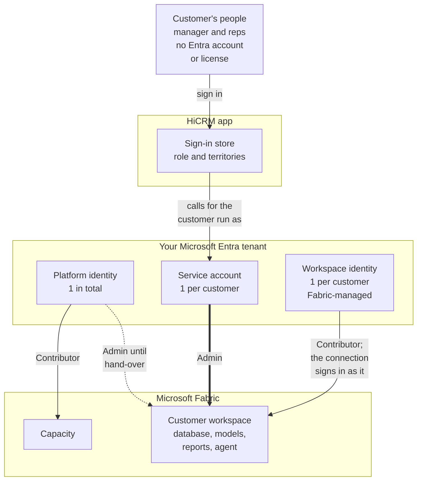

# HiCRM pilot build-out: steps, identities and permissions

The build record for the HiCRM pilot. It covers:

- every step, in order;
- every identity the build uses: where it's created, who creates it and what it may do;
- every permission, tenant setting and secret;
- how many identities come from the customer and how many from the platform.

Section 6 records the reference environment as it was built on 2026-10-03.

Related documents:

| Document | Covers |
| --- | --- |
| [FRAMEWORK.md](FRAMEWORK.md) | The framework, its controls, and validating a deployment |
| [EMBEDDING.md](EMBEDDING.md) | Embedded reports: credentials, token request, row-level security |
| [PILOT.md](PILOT.md) | Running the pilot and the demo story |
| [ARCHITECTURE.md](ARCHITECTURE.md) | The design |
| [MULTITENANCY.md](MULTITENANCY.md) | The security review |
| [DEPLOYMENT-ARCHITECTURES.md](DEPLOYMENT-ARCHITECTURES.md) | Production designs |
| [REPORT-SPEC.md](REPORT-SPEC.md) | The reports |

## 1. Who and what has to exist

**The customer brings people, nothing else.** HiCRM embeds reports with "app owns data", so the customer's people
need no Microsoft Entra account in your tenant, no Power BI or Fabric license, and no admin consent. Everything in
Fabric runs as identities the platform owns.



### Customer side, per customer

| What | How many | Where it lives | Created by |
| --- | --- | --- | --- |
| People who sign in to HiCRM | 4 in the pilot: 1 sales manager (every territory) and 1 sales rep per territory (Texas, New Mexico, Georgia). Any number later | HiCRM's sign-in store: `tenants.json` in the data folder. Passwords are stored as scrypt hashes | The platform team: `npm run setup`, the back office or the CLI |
| Microsoft Entra accounts, Power BI or Fabric licenses, admin consent, tenant settings | **0** | Not applicable | Not applicable |

The customer only provides its email domain and the list of people, each with a role and territories.

### Platform side, once for the whole platform

| What | How many | Where it lives | Needed for |
| --- | --- | --- | --- |
| Fabric administrator (a person) | 1 | Microsoft Entra role **Fabric Administrator** | Tenant settings (section 2) |
| Microsoft Entra admin (a person) | 1 | Entra role **Application Administrator**; **Privileged Role Administrator** only to let the platform create service accounts itself | App registrations for the platform identity and the service accounts |
| Capacity administrator (a person) | 1 | Admin of the Fabric capacity | Giving the platform identity Contributor on the capacity |
| Operator (a person) | 1 or more | HiCRM back office, signed in with `ADMIN_KEY`. No Entra or Fabric role | Running setup, adding people, support |
| Report author (a person, optional) | 1 or more | Power BI Pro or Premium Per User license, plus Contributor on the workspace | Building report pages in the Power BI portal, for example with Copilot |
| Platform identity | 1 service principal | App registration in your Entra tenant | Creating customer workspaces, assigning the capacity, handing each workspace over |
| Security group for service principals | 1 (recommended) | Entra security group | Limiting the service principal tenant settings to HiCRM's identities |
| Support group | 0 or 1 | Entra security group (`FABRIC_OPS_PRINCIPAL_ID`) | Read-only access to customer workspaces |

In a pilot, one person can hold all four admin roles. In `cli` mode the operator's own Azure CLI sign-in replaces the
platform identity, so you create no service principal at all. `cli` mode is for development only, and hasn't been
verified live yet; see section 6.

### Platform side, per customer

A "service account" here is a **service principal** (an app registration), not a user account. It has no password,
mailbox, MFA prompt or Power BI license, and needs none: Microsoft documents that embedding with a service principal
"doesn't require a Pro license", and that app users need no license with "app owns data"
([source](https://learn.microsoft.com/power-bi/developer/embedded/embed-sample-for-customers)).

| What | How many | Where it lives | Created by | Access |
| --- | --- | --- | --- | --- |
| Customer service account `<customer>sa`, for example `fabrikamsa` | 1 (required in production) | App registration and service principal in **your** Entra tenant, not the customer's | An Entra admin with `scripts/bootstrap-identities.ps1`, or the platform once it holds `Application.ReadWrite.OwnedBy` | Admin of that customer's workspace only |
| Workspace identity | 1 | Fabric-managed service principal in your Entra tenant. Nobody holds its secret | Fabric, when provisioning asks for it | Contributor of its own workspace only |
| Workspace and its items | 1 workspace: SQL database, 2 semantic models, reports, data agent | Your Fabric capacity | Provisioning | |
| Cloud connection | 1 | Fabric connections (tenant level, outside the workspace) | Provisioning; the service account owns it | Signs in as the workspace identity, no single sign-on |
| Web address | 1: `https://<customer>.<APP_DOMAIN>` (locally `http://fabrikam.localhost:3000`) | Derived from the customer's name; unique, never a reserved name | When the customer is added | Signs in only that customer's people; a session works only at its own address |
| Logo and accent color | 1 each | The customer's record: an SVG, PNG, JPEG or WebP of 64 KB at most, checked so it can't run script | An operator (back office or `brand`), or the pilot setup | Shown on the sign-in page, in the app and as the tab icon |

### Totals

| | Pilot as built (section 6) | Pilot as designed (2 customers) | Production (N customers) |
| --- | --- | --- | --- |
| Customer people (HiCRM sign-ins) | 8 | 8 | As many as the customers have |
| Customer Entra accounts or licenses | 0 | 0 | 0 |
| Platform service principals you create | 3 (platform identity + 2 service accounts) | 3 (platform identity + 2 service accounts) | 1 + N |
| Fabric-managed workspace identities | 2 | 2 | N |
| Entra groups | 0 | 1 or 2 | 1 or 2 |
| Admin people | 1, holding every role | 1 to 4 | 3 to 4, roles separated |

## 2. One-time platform setup

| # | Step | Who | Why |
| --- | --- | --- | --- |
| 1 | Get a Fabric capacity. Use F2 or larger for real use. A trial runs the CRM, models, reports and embedding, but Copilot in Power BI isn't supported on trials, and data agents are documented for F2 and up | Fabric or Azure admin | Customer workspaces and every Fabric item live on it |
| 2 | Create the security group "HiCRM service principals"; add the platform identity now and every service account later | Entra admin | Scopes the tenant settings below to HiCRM's identities |
| 3 | Turn on the tenant settings in the next table, each for that security group | Fabric administrator | Without them, service principals can't reach Fabric |
| 4 | Register the platform identity: an app registration with a certificate (REQUIREMENTS.md, section 8). In production, a federated credential that trusts the app's user-assigned managed identity, so nothing is secret. Add it to the group | Entra admin (Application Administrator) | The control plane |
| 5 | Give the platform identity **Contributor** on the capacity | Capacity administrator | To create workspaces on the capacity and assign them to it. Without it an admin creates each workspace, makes the platform identity Admin, and setup adopts it (`--workspace Name=<id>`) |
| 6 | Optional: grant the platform app the Microsoft Graph application permission `Application.ReadWrite.OwnedBy` (`bootstrap-identities.ps1 -GrantPlatformAppCreation`), then set `TENANT_IDENTITY_AUTO_CREATE=true` | Privileged Role Administrator | The platform then creates each `<customer>sa` itself, and can only manage the apps it created |
| 7 | Optional: set a support group as `FABRIC_OPS_PRINCIPAL_ID` | Operator | Viewer on every customer workspace |
| 8 | On the operator's machine: Node.js 22.9 or later, `npm install`, then `npm run setup` | Operator | Writes the non-secret settings to `.env` and builds the customers (section 3). Credentials are asked for when needed, never written |

**Tenant settings** (Fabric admin portal > Tenant settings):

| Setting | Section | Default (per Microsoft Learn) | Needed for |
| --- | --- | --- | --- |
| Service principals can call Fabric public APIs (formerly "Allow service principals to use Power BI APIs") | Developer | On for new tenants | Every Fabric and Power BI call by the platform identity and the service accounts: items, the SQL database, semantic models, embed tokens, the data agent |
| Service principals can create workspaces, connections, and deployment pipelines | Developer | **Off** for new tenants | Creating customer workspaces (platform identity) and each model's cloud connection (service account) |
| Embed content in apps | Developer | Not stated | Embed tokens for customers' people |
| Users can use Copilot and other features powered by Azure OpenAI | Copilot and Azure OpenAI Service | On for tenants with paid capacities (F2 or larger) | The data agent, and Copilot in Power BI for report authors |
| Data sent to Azure OpenAI can be processed (and stored) outside your capacity's geographic region | Copilot and Azure OpenAI Service | Not stated | Only when the capacity is outside the US and the EU Data Boundary |
| Semantic Model Execute Queries REST API | Integration | Not stated | Optional. Only for checking numbers with DAX from scripts; the app doesn't use it |
| Define maximum number of Fabric identities in a tenant | Developer | 10,000 identities | Each customer adds one workspace identity |
| Service principals can access read-only admin APIs | Admin API settings | Not stated | Not needed by the app. Optional: lets the validator read these settings (IDN-06); then allow it for a group holding only the platform identity |
| Service principals can access admin APIs used for updates | Admin API settings | Not stated | Never for HiCRM's identities: it would let them change the tenant |

Sources:
- [Developer tenant settings](https://learn.microsoft.com/fabric/admin/service-admin-portal-developer)
- [Admin API tenant settings](https://learn.microsoft.com/fabric/admin/service-admin-portal-admin-api-settings)
- [Data agent tenant settings](https://learn.microsoft.com/fabric/data-science/data-agent-tenant-settings)
- [Copilot for Power BI requirements](https://learn.microsoft.com/power-bi/create-reports/copilot-introduction)
- [Grant tenant-wide admin consent](https://learn.microsoft.com/entra/identity/enterprise-apps/grant-admin-consent)

## 3. Per customer

`npm run setup` adds each customer and runs provisioning. The same steps run from the back office or with
`npm run cli -- add <name> --domain <domain>`.

**Before provisioning, without automatic service accounts:** an Entra admin creates `<customer>sa`. The script creates
the app and service principal and, by default, a certificate (one year): Entra ID keeps its public part, the private
key goes into the platform's encrypted credential store (or Key Vault), and the clear-text file is deleted. With
`-Credential Federated` the app trusts the platform's managed identity instead, and nothing is stored at all;
`-Credential Secret` is for development. The script makes the account Admin of the workspace, registers it with the
platform, and provisions:

```powershell
az login --tenant <tenant id>
./scripts/bootstrap-identities.ps1 -Customer Fabrikam -WorkspaceId <workspace id> -FabricApiGroupId <group id> -Register
```

**Provisioning steps.** Each step is idempotent, so a re-run only does what's missing, and re-runs are how upgrades
ship:

| # | Step | Runs as | What it does | Permission it uses |
| --- | --- | --- | --- | --- |
| 1 | Create the workspace | Platform identity | Creates `saas-<customer>-<id>` on the capacity, or adopts a workspace an admin created | Tenant setting "create workspaces", Contributor on the capacity; it becomes workspace Admin |
| 2 | Assign the Fabric capacity | Platform identity | Assigns the workspace to the shared or the customer's own capacity | Contributor on the capacity, workspace Admin |
| 3 | Set up the customer service account | Platform identity (+ Microsoft Graph when automatic) | Adds `<customer>sa` as Admin | Workspace Admin |
| 4 | Give the support team read access | Platform identity | Adds the support group as Viewer (optional) | Workspace Admin |
| 5 | Create the CRM database | Service account | Creates the SQL database `hicrm_db` | Workspace role |
| 6 | Create or upgrade the CRM tables | Service account, over TDS with a Microsoft Entra token | Applies the schema (version 3: account territories) and the calendar | Its workspace role gives it the database; there are no SQL logins or passwords |
| 7 | Load sample CRM data | Service account | 8 reps, 120 accounts across three territories, deals and activities, dated from the setup day (demo customers only) | Same |
| 8 | Set up the workspace identity | Service account | Provisions it and gives it Contributor | Workspace Admin |
| 9 | Publish HiCRM Insights | Service account | The semantic model from generated TMDL, with roles **All territories**, **Texas**, **New Mexico** and **Georgia** | Workspace role |
| 10 | Connect the model to the CRM data | Service account | Creates the cloud connection (workspace identity, no SSO), takes the model over, binds it and frames it | Tenant setting "create connections" |
| 11 | Create the starter report, or copy template reports | Service account | "Sales overview", bound to HiCRM Insights | Workspace role |
| 12 | Publish the assistant's model | Service account | "HiCRM Insights - Assistant": the same model without roles, on the same connection | Workspace role |
| 13 | Set up the assistant | Service account | The data agent "HiCRM Assistant" over the assistant's model | Tenant setting for Copilot and Azure OpenAI |
| 14 | Release the platform identity | Service account | Removes the platform identity's role (production, `PLATFORM_WORKSPACE_ACCESS=release`) | Workspace Admin |

**Sign-ins.** Setup adds the four people with their role and territories. Each generated password is shown once and
written to `pilot-logins.md` in the data folder; nothing else keeps it. Later changes:

- `npm run cli -- user-access` changes a person's role or territories, and their sessions end.
- `user-reset` gives the person a new password.
- `user-remove` deletes the sign-in.

## 4. Who does what at run time

| Action | Runs as | What limits it |
| --- | --- | --- |
| A person signs in | HiCRM, at their company's own address | Their password; only that company's people sign in there. Their role and territories are read on every request |
| The CRM screens | The customer's service account, over TDS | SQL scoped to the person's territories (`accounts.state IN (...)`). Another territory's record answers "not found" |
| View the standard report | The service account requests a 30-minute V2 embed token for that one report and its model | The token names the person's email and their row-level security roles. Power BI filters every visual. The embedding identity must be workspace Admin or Member ([source](https://learn.microsoft.com/power-bi/guidance/powerbi-implementation-planning-usage-scenario-embed-for-your-customers)). Only the platform's standard reports open; editing and building reports wait for `REPORT_AUTHORING` (next phase) |
| Ask a question (sales manager) | The service account calls the data agent's MCP server, `https://api.fabric.microsoft.com/v1/mcp/workspaces/{workspace}/dataagents/{agent}/agent`; the agent queries the assistant's model | Managers see every territory anyway. A chart of the same question comes from the CRM data |
| Ask a question (sales rep) | The service account queries the CRM database (quick answers, with charts) | SQL scoped to the rep's territories. The data agent never answers reps: it runs as the service account, and Power BI doesn't apply row-level security to a service principal ("Service principals can't be added to an RLS role", [source](https://learn.microsoft.com/fabric/security/service-admin-row-level-security#considerations-and-limitations)) |
| Every question | HiCRM | Logged per customer with its answer (up to 4,000 characters): who, their scope, who answered and why the agent didn't (the last 200). Operators read it in the back office or with `questions`, and that is recorded. Other places chats are kept, such as Purview audit: [ARCHITECTURE.md](ARCHITECTURE.md), "Where questions and answers are kept" |
| Operator support | The operator, through the back office, as the service account | Every look at customer data is written to that customer's activity log |

## 5. Credentials

Nothing secret is kept in the project or in `.env`: whatever is secret is asked for when the app starts, or comes
from the environment where nobody can answer ([REQUIREMENTS.md](REQUIREMENTS.md), section 3).

| Credential | Where it's kept | Rotation |
| --- | --- | --- |
| Platform identity's certificate (development: or a client secret) | A PEM file outside the project, whose path is asked for at start (or `AZURE_CLIENT_CERTIFICATE_PATH`). A secret is asked for with hidden input and never saved. Production: none, a federated credential | Upload a new certificate to the app registration |
| Service account credentials | Certificates in `secrets.json` in the data folder, encrypted with `SECRETS_KEY`; Key Vault in production. Federated service accounts have nothing stored | One year; re-run the bootstrap script, or `npm run cli -- identity-rotate <customer>` for accounts the platform created |
| `SECRETS_KEY` | Asked for at start (chosen the first time), or the environment. Never the data folder | Re-register the service accounts |
| `ADMIN_KEY` | Asked for at start, or made for the run and shown once | Each start |
| `SESSION_SECRET` | Made at each start in development; the environment in production | Each start |
| People's passwords | scrypt hashes in `tenants.json`. Plain text only in the setup output and `pilot-logins.md` | `user-reset` |

## 6. As built (2026-10-03, credentials updated 2026-10-06)

The reference environment for this build. IDs are shortened; the full values are in `tenants.json` in the data
folder (`.data/` here), which git ignores.

**Microsoft Entra ID** (tenant `<tenant-id>`):

| Object | Type | Created by | Notes |
| --- | --- | --- | --- |
| Platform identity: app `<platform-app-id>`, object `<platform-object-id>` | App registration + service principal | An Entra admin, before this build | `sp` mode; its client secret is asked for at start (the app is shared with other work, so it wasn't moved to a certificate). No role in either customer workspace (released) |
| `fabrikamsa`: app `<fabrikam-service-account-app-id>`, service principal `<fabrikam-service-account-object-id>` | App registration + service principal | A Global Administrator's Azure CLI session: `bootstrap-identities.ps1 -Customer Fabrikam -Register` | Admin of `saas-fabrikam` only. Signs in with a certificate (since 2026-10-06, valid one year), kept encrypted in `secrets.json`; its earlier client secret is unused |
| `contososa`: app `<contoso-service-account-app-id>`, service principal `<contoso-service-account-object-id>` | App registration + service principal | The same, for Contoso | Admin of `saas-contoso` only. The same certificate handling |
| Workspace identity of `saas-fabrikam`: app `<fabrikam-workspace-identity-application-id>`, service principal `<fabrikam-workspace-identity-service-principal-id>` | Fabric-managed service principal | Fabric, during provisioning | Contributor of `saas-fabrikam` |
| Workspace identity of `saas-contoso`: app `<contoso-workspace-identity-application-id>`, service principal `<contoso-workspace-identity-service-principal-id>` | Fabric-managed service principal | Fabric, during provisioning | Contributor of `saas-contoso` |

Both customers run with `TENANT_IDENTITY_MODE=required` and `PLATFORM_WORKSPACE_ACCESS=release`, and `SECRETS_KEY` is
kept outside the repository.

The platform app also has roles on seven workspaces that have nothing to do with HiCRM
(MyWorkItems, rtitest, FUAM, MonitoringAdmin, demolatest, FabricChargeback, FabricCapacityMetrics), and no Microsoft
Graph permissions. For least privilege, give HiCRM a dedicated platform app with access to nothing else.

**Fabric:**

- **Workspaces:** `saas-fabrikam` (`<fabrikam-workspace-id>`) and `saas-contoso` (`<contoso-workspace-id>`), both on a trial capacity
  (FT1, `<fabrikam-capacity-id>`). An admin created both and setup adopted them, because the only capacity the platform identity
  can use is a Premium Per User one, which can't host these items. `saas-contoso` was created with the Fabric REST API
  from a Global Administrator's Azure CLI session, which then made the platform app its Admin.
- **Workspace roles**, the same in both, as the tenant's admin API lists them:

  | Principal | Role |
  | --- | --- |
  | The admin who created the workspace (a person) | Admin |
  | The customer's service account | Admin |
  | The workspace identity | Contributor |
  | The platform identity | None: it removed its own role after the hand-over |

- **Items**, in each workspace:
  - `hicrm_db` (SQL database)
  - `HiCRM Insights` (semantic model with 4 roles, 42 measures)
  - `HiCRM Insights - Assistant` (the same model without roles)
  - `Sales overview` (starter report): the one standard report, and the only one customers see
  - `HiCRM Assistant` (data agent): published, with the code interpreter on in the draft and published stages
    (`experimental.codeInterpreterEnabled: true`). Its MCP server is at
    `https://api.fabric.microsoft.com/v1/mcp/workspaces/<workspace>/dataagents/<agent>/agent`; Fabrikam's agent is
    `<fabrikam-data-agent-id>`, Contoso's `<contoso-data-agent-id>`.
    - Keep `DATA_AGENT_CODE_INTERPRETER=true` in the settings: a provisioning run without it turns the tool off again.
  - Left in `saas-fabrikam` from earlier editions: `lh_customer` (lakehouse), `wh_customer` (warehouse) and the report
    "Pipeline check (created by describe-a-chart)". The app no longer lists that report, since it isn't a standard
    report.
- **Connections**, one per customer, each signing in as its workspace identity (ShareableCloud, no SSO):
  `HiCRM OneLake <fabrikam-workspace-id>` (`<fabrikam-model-connection-id>`), owned by `fabrikamsa`, and `HiCRM OneLake <contoso-workspace-id>` (`<contoso-model-connection-id>`), owned by
  `contososa`. The platform identity had made Fabrikam's first connection before the hand-over, and
  deleted it before removing its own role.

**HiCRM sign-ins:**

| Customer | Person | Role | Territories |
| --- | --- | --- | --- |
| Fabrikam | Leah Thompson | Sales manager | Every territory |
| Fabrikam | Drew Collins, Arjun Mehta, Amara Okoye | Sales reps | Texas, New Mexico, Georgia |
| Contoso | Maria Alvarez | Sales manager | Every territory |
| Contoso | Sam Rivera, Priya Nair, Grace Kim | Sales reps | Texas, New Mexico, Georgia |

Their passwords are in `.data/pilot-logins.md`.

**Verified live on 2026-10-03:**

- **Isolation.** Each service account lists only its own workspace. Against the other customer's: the workspace
  answers 403, its items 401, an embed token for its report 404, and its data agent "User is not authorized". The
  platform identity gets 403 on both workspaces, from the Fabric and the Power BI APIs.
- **Release takes time.** The role lists stopped showing the platform identity on `saas-contoso` at 01:21 UTC, but it
  could still open the workspace at about 02:31, and got 403 from 02:34. Microsoft doesn't document this delay. After
  a release, confirm with a call that's denied.
- **Addresses and look.** With `APP_DOMAIN=localhost`, Fabrikam is at `http://fabrikam.localhost:3000` and Contoso at
  `http://contoso.localhost:3000`, each with its own logo and color. At each address: the manager's and a rep's
  sign-in, the embedded "Sales overview" with 30-minute embed tokens, and the rep's answers scoped to Texas. A session
  from one customer gets 401 at the other's address, and Fabrikam's manager can't sign in at Contoso's. Checked on
  2026-10-02: the back office answers 404 at a customer's address, and an unknown host name gets 421.
- **The data agent** refuses both service accounts on this trial capacity (`-32003 FT1 SKU Not Supported`), so
  managers get quick answers, and the question log says why. It had answered over MCP earlier in the build, and a
  person (the admin) could still use it. Data agents are documented for paid F2 and up.
- **The question log** recorded every question: who asked, their scope, the answer and who answered.

**A capacity experiment, reverted.** To get past the FT1 limit, both workspaces were moved to the paid F8 capacity
a paid F8 capacity, which also hosts other teams' workspaces. It was paused minutes later, and the SQL
databases then answered 404 `CapacityNotActive`, so both workspaces went back to the trial capacity. Each move took under 20
seconds, and a provisioning run afterwards brought the registry back in line.

**Tenant settings**, read with the Fabric admin API (again on 2026-10-06):

- On for the entire organization: service principals can call Fabric public APIs; service principals can create
  workspaces, connections and deployment pipelines; allow service principals to create and use profiles; embed content
  in apps; users can use Copilot and other features powered by Azure OpenAI, including processing and storage outside
  the capacity's region; capacities can be designated as Fabric Copilot capacities; Semantic Model Execute Queries
  REST API; allow Microsoft Purview to secure AI interactions.
- On for one security group only (the admin API group), which holds the platform app: service principals can access read-only admin
  APIs, and service principals can access admin APIs used for updates. The app needs neither. The validator uses the
  read-only one to read the tenant settings (IDN-06), and skips that check without it.

Not exercised: the platform identity creating workspaces (it has no rights on a capacity that can host them), and
`cli` mode. The Azure CLI on the build machine is signed in as a Global Administrator, and running the app as that
person would hide permission gaps.

**Gaps against the target design**, all to close before real customers ([MULTITENANCY.md](MULTITENANCY.md) section 5):

- A person has direct Admin on both workspaces; `audit` flags it.
- The service principal tenant settings apply to the entire organization rather than to the group "HiCRM service
  principals" (section 2, steps 2 and 3); the validator flags it (IDN-06).
- Through the admin API group, the platform app may also call the Fabric admin APIs, including those that make changes.
  Take it out of that group; if the tenant-settings check should keep running, give the validator its own identity
  with read-only admin access.
- The platform app has access to unrelated workspaces (above).
- On the trial capacity the data agent refuses the service accounts, and there's no Copilot in Power BI or code
  interpreter. A paid F2 or larger capacity covers all three.
- The platform identity uses a client secret (the service accounts moved to certificates on 2026-10-06). Give it a
  certificate, or a federated credential once the app runs in Azure. The service accounts' unused client secrets can be
  deleted (`az ad app credential delete`).
- The question log lives in the tenant registry. In production, send it to a log store with a retention policy.

## 7. Repeat it from scratch

```powershell
# Demo mode, nothing in Azure: two customers, eight people.
npm install
npm run setup -- --mode demo --yes
npm start                                   # Fabrikam http://fabrikam.localhost:3000, Contoso http://contoso.localhost:3000, back office http://localhost:3000/admin

# Live, with a service principal. The setup asks for its certificate (or secret) and never saves it.
npm run setup -- --mode fabric --auth sp --tenant <tenant id> --client-id <app id>
# The same, adopting workspaces an admin created:
npm run setup -- --mode fabric --auth sp --tenant <tenant id> --client-id <app id> `
  --customer Fabrikam:fabrikam.com --workspace Fabrikam=<workspace id>

npm run preflight                           # tokens, Fabric access, capacities (add --check-create to try a workspace)
npm run cli -- audit Fabrikam               # roles, items, connection, capacity, schema; exit code 1 on failures
npm run cli -- reseed Fabrikam --confirm    # fresh sample data, dated from today
npm run pilot:remove                        # deletes what setup created, including the workspaces
```

### Service accounts and a second customer

Done in this build on 2026-10-03: a Global Administrator's Azure CLI session did steps 1 and 2, then step 3 ran as
shown. To repeat it, three steps need admin rights in your tenant. The platform app can't do them:

1. **A workspace for Contoso** (a Fabric admin, in the portal):
   - Workspaces → New workspace → `saas-contoso` → Advanced → the trial capacity → Apply.
   - Then Manage access → add the platform app as **Admin**, the same as `saas-fabrikam`.
   - This step goes away once the platform app has Contributor on a paid F capacity.
2. **Service accounts** (Privileged Role Administrator or Global Administrator), one of:
   - Grant the platform app the Microsoft Graph application permission `Application.ReadWrite.OwnedBy`, then grant
     admin consent: Entra admin center → App registrations → All applications → the platform app → API permissions →
     Add a permission → Microsoft Graph → Application permissions. The platform then creates `fabrikamsa` and
     `contososa` itself, and can manage only the apps it created.
   - Or run `scripts/bootstrap-identities.ps1 -Customer <name> -WorkspaceId <id> -Register` once per customer, as an
     Application Administrator.
3. **Run with isolation on.** The setup asks for the platform credential and for the key that encrypts the service
   accounts' credentials (choose one the first time, and keep it safe):

   ```powershell
   $env:TENANT_IDENTITY_AUTO_CREATE = 'true'     # step 2, first option
   $env:TENANT_IDENTITY_MODE = 'required'        # no customer ever runs on the platform identity
   $env:PLATFORM_WORKSPACE_ACCESS = 'release'    # the platform keeps no role after the hand-over
   npm run setup -- --workspace Contoso=<saas-contoso id>
   npm run cli -- audit Fabrikam; npm run cli -- audit Contoso
   ```

   Provisioning then, for each customer:
   - creates its service account and makes it Admin of that workspace only;
   - for a workspace the platform app built, like Fabrikam's, gives that account its own OneLake connection and takes
     over both models;
   - has the platform app delete the connection it no longer uses, then remove its own role. The data agent and the
     reports keep working: the agent runs as whoever calls it, now the service account.

   After that, `audit` should show just the service account (Admin) and the workspace identity (Contributor), plus
   the person who created the workspace. Remove that person, or keep them as a documented break-glass admin.

Then walk through the story in [PILOT.md](PILOT.md).
