# Data integration add-on (future state)

HiCRM's core needs no ETL: each customer's CRM lives in a SQL database in Fabric, and Fabric copies its tables to
OneLake automatically, where the semantic model reads them. This add-on, sold on top of an edition ("Data
integration", `--addon integration`), brings a customer's **other** data into the same workspace with Fabric Data
Factory and Data Engineering. Reports and the assistant can then answer questions that combine CRM data with, for
example, invoices, product usage or support tickets.

**Who's who.** HiCRM is the SaaS provider; Fabrikam is one of its customers ([README.md](README.md#whos-who)).
Everything below happens in the workspace HiCRM runs for Fabrikam, and the same again, separately, for each customer.

## Status

| Part | Status |
| --- | --- |
| A lakehouse per customer when the add-on is on (`lh_customer`) | **Built**: provisioning step "Create the lakehouse (data integration)" |
| File uploads and one-off web pulls into lakehouse tables (OneLake, then Load Table) | **Built**: `src/platform/ingest.js`. The data agent picks up the new tables |
| Requests for other connections | **Built**: recorded for HiCRM's team |
| Scheduled copies from the customer's systems with Data Factory pipelines | Future |
| Spark notebooks that clean the data (silver) and shape business tables (gold) | Future |
| Gold tables in the semantic model, under the same row-level security roles | Future |
| On-premises sources through an on-premises data gateway | Future |
| Reading the customer's systems across Entra tenants | Designed: [IDENTITIES.md](IDENTITIES.md#44-the-add-on-reads-the-customers-systems-future) |

## Who owns what

| Part | Owner | Notes |
| --- | --- | --- |
| The source systems: ERP, SaaS apps, files, and Fabrikam's own Fabric if it has one | **Fabrikam**, in its own Entra tenant | Fabrikam decides what HiCRM may read, grants the access, and can withdraw it |
| An on-premises data gateway, for sources on Fabrikam's network | **Fabrikam**, installed by its IT | Registered to HiCRM's tenant by a HiCRM engineer (registering needs a person's account), so HiCRM's connections can use it |
| The connections, pipeline, notebooks, lakehouse and schedules | **HiCRM** | In the workspace HiCRM runs for Fabrikam, owned by `fabrikamsa`, HiCRM's service account for Fabrikam |
| The connector for Fabrikam | **HiCRM**, admitted by **Fabrikam** | A HiCRM app whose service principal in Fabrikam's tenant reads only what Fabrikam grants. Fabrikam can remove it at any time |
| The copied data | **Fabrikam's data**, held by HiCRM | Only in Fabrikam's workspace; Contoso's never meets it |

## How it would work

```mermaid
flowchart LR
  %% The data integration add-on (future), for one customer: Fabrikam. Every item is HiCRM's, in the workspace
  %% HiCRM runs for Fabrikam, and runs as fabrikamsa. Orange: Fabrikam. Blue: HiCRM. Dashed: not built yet.

  subgraph FAB["FABRIKAM · the customer, in its own Entra tenant · decides what HiCRM may read"]
    direction TB
    ERP[("ERP or finance system<br/>on Fabrikam's network")]
    SAAS[("SaaS apps<br/>marketing, support, billing")]
    FILES[("Files<br/>in Fabrikam's Azure storage")]
    FFAB[("Fabrikam's own Fabric<br/>lakehouse or warehouse")]
    GW["On-premises data gateway<br/>installed by Fabrikam's IT,<br/>registered to<br/>HiCRM's tenant"]
  end

  subgraph HI["HICRM · the SaaS provider · everything in this box is HiCRM's"]
    direction LR
    CTRL["HiCRM platform<br/>provisions the items from code,<br/>schedules and watches the runs,<br/>always as fabrikamsa"]
    subgraph WS["Workspace for Fabrikam · on HiCRM's Fabric capacity · only Fabrikam's data"]
      direction LR
      CONN["Fabric connections<br/>owned by fabrikamsa,<br/>signing in to Fabrikam's<br/>tenant as the connector<br/>for Fabrikam"]
      PL["Data Factory pipeline<br/>copy activities on a schedule"]
      subgraph LH["Lakehouse · medallion layers"]
        direction TB
        BR[("bronze<br/>raw copies, as received")]
        SV[("silver<br/>cleaned, typed, deduplicated")]
        GD[("gold<br/>business tables, keyed by account")]
      end
      NB["Spark notebooks<br/>Data Engineering:<br/>clean, join, shape"]
      CRM[("CRM tables in OneLake<br/>from the SQL database, today")]
      SM["Semantic model<br/>Direct Lake, the same territory roles"]
      OUT["Report and data agent<br/>today, now with more data"]
    end
  end

  ERP -->|"on-premises"| GW
  GW --> CONN
  SAAS --> CONN
  FILES --> CONN
  FILES -.->|"or a OneLake shortcut, no copy"| BR
  FFAB -.->|"or shared in place, no copy"| BR
  CONN --> PL
  PL -->|"1 copy"| BR
  BR -->|"2"| NB
  NB -->|"3 cleaned"| SV
  SV --> NB
  CRM -->|"shortcut, read only"| NB
  NB -->|"4 business tables"| GD
  GD -->|"5 joins the model"| SM
  SM --> OUT
  CTRL -.->|"create, schedule, monitor"| PL
  CTRL -.->|"after each load: refresh the model"| SM

  classDef fabrikam fill:#FDECE0,stroke:#C55A11,color:#4A1F00
  classDef hicrm fill:#E7F0FA,stroke:#1F5AA6,color:#0B2545
  classDef future fill:#FFFFFF,stroke:#1F5AA6,stroke-dasharray:5 5,color:#0B2545
  class ERP,SAAS,FILES,FFAB,GW fabrikam
  class CTRL,CRM,SM,OUT hicrm
  class CONN,PL,BR,SV,GD,NB future
  style FAB fill:#FFF7F1,stroke:#C55A11,stroke-width:2px,color:#4A1F00
  style HI fill:#F5F9FE,stroke:#1F5AA6,stroke-width:2px,color:#0B2545
  style WS fill:#FFFFFF,stroke:#1F5AA6,color:#0B2545
  style LH fill:#FFFFFF,stroke:#1F5AA6,stroke-dasharray:5 5,color:#0B2545
```

Orange is what Fabrikam owns; blue is HiCRM's; dashed is not built yet.

1. **Copy.** A Data Factory pipeline copies what Fabrikam allows into the lakehouse's **bronze** layer, raw and as
   received, on a schedule. Files can be OneLake shortcuts instead, read where they are, and data in Fabrikam's own
   Fabric can be shared in place.
2. **Read.** Spark notebooks (Data Engineering) read bronze.
3. **Clean.** They type, deduplicate and check it into **silver**.
4. **Shape.** They join silver with the CRM tables, read through a shortcut to the database's OneLake copy, into
   **gold** business tables keyed by account.
5. **Serve.** The gold tables join the HiCRM Insights semantic model as Direct Lake tables related to Accounts, so the
   same territory roles filter them; the report and the data agent use them. After each load the platform refreshes
   the model and records the run.

Gold could instead be a Fabric Warehouse built with T-SQL ([PLAN.md](PLAN.md), decision D4, still proposed).
Identities, isolation and row-level security work the same either way.

## Identities and isolation

- **Inside HiCRM's tenant, everything runs as the customer's service account.** Provisioning creates the items as
  `fabrikamsa`, and the platform starts and schedules runs as `fabrikamsa`. Fabric's Items API and Job Scheduler API
  support service principals ([notebook APIs](https://learn.microsoft.com/fabric/data-engineering/notebook-public-api)),
  and a service principal can run a pipeline on a schedule or through the API
  ([workspace identity](https://learn.microsoft.com/fabric/data-factory/workspace-identity#prerequisites)).
- **Keep people out of these items.** A notebook started by a pipeline runs as whoever last changed the pipeline, and a
  scheduled run as whoever last changed the schedule ([security context](https://learn.microsoft.com/fabric/data-engineering/how-to-use-notebook#security-context-of-running-notebook)).
  A person who edits them would make the runs theirs. The validator already flags people with workspace access (IDN-04).
- **Two Entra tenants.** The pipeline, the notebooks and `fabrikamsa` are in HiCRM's tenant; Fabrikam's systems are
  in Fabrikam's. The workspace identity can't cross ("Workspace identity isn't supported in B2B or cross-tenant
  scenarios": [workspace identity](https://learn.microsoft.com/fabric/security/workspace-identity#considerations-and-limitations)),
  so it only reads the CRM tables. Data in Fabrikam's own Fabric is shared in place to `fabrikamsa`, with no secret.
  Cloud sources are read through connections that sign in to Fabrikam's tenant as the connector for Fabrikam, a HiCRM
  app that Fabrikam admits and grants read access; on-premises sources through a gateway on Fabrikam's network. Each
  source, the identity it uses and what Fabrikam grants:
  [IDENTITIES.md](IDENTITIES.md#44-the-add-on-reads-the-customers-systems-future).
- **No path to another customer.** `fabrikamsa` has no role in Contoso's workspace, so nothing in Fabrikam's
  workspace can read or write Contoso's, whatever a pipeline or notebook asks for. Contoso's connector is a different
  app, which only Contoso's admins admit.
- **Row-level security covers the new tables only if they relate to Accounts** (an account ID) or carry the territory.
  A gold table without that path would show every rep everything, so each one is checked in the browser, like RLS-03,
  before customers see it. The data agent keeps reading the model's role-free twin, for managers only.

## Capacity and cost

Pipelines and Spark use the same capacity as the reports and the SQL database. Schedule loads off-peak, size the
capacity for them, and give large customers a capacity of their own (`npm run cli -- capacity <customer> <id>`). Keep
bronze short-lived; keep gold as long as the customer's contract says.

## What building it takes

1. **The add-on's resources** (`src/platform/plans.js`): pipelines and notebooks, besides the lakehouse.
2. **Cross-tenant access** ([IDENTITIES.md](IDENTITIES.md)): the customer's Entra tenant ID in its record; a connector
   per customer, created by the platform, with its secret written straight into the connections and rotated; and
   accepting external data shares as the customer's service account.
3. **Provisioning steps**, idempotent and from code like the model and the report: the connections, the pipeline and
   notebook definitions, the schedule (created as `fabrikamsa`), the gold tables in the model definition, and the
   data agent's sources.
4. **The back office:** each customer's sources, run history and failures, and a way to run again.
5. **Controls** in [FRAMEWORK.md](FRAMEWORK.md), with validator checks: the add-on's items are created and run as the
   customer's service account; each connection signs in to that customer's own Entra tenant, as that customer's
   connector; gold tables are filtered by the same roles (in the browser, like RLS-03).
6. **Tests** against the Fabric emulator for each of these.

To verify when it's built, with a second Entra tenant standing in for a customer: the tests listed in
[IDENTITIES.md](IDENTITIES.md#7-checked-and-to-test), and the capacity a typical customer's loads need.
