# HiCRM deployment architectures: hybrid, Azure and fully on-premises

Architecture session, 2 October 2026. Three ways to run HiCRM securely, with everything it has to serve: the app and
its CRM database, databases that customers bring, flat files and unstructured documents (on-premises or in third-party
services), and web sources, plus what's built on top of them: integration pipelines, transformations, reports and data
agents. Every product statement was checked against Microsoft Learn on that date. Preview features are marked, and
the things to prove before committing are listed in [section 7](#7-proofs-of-concept-before-committing).

**Who's who.** "You" and "your" are HiCRM, the SaaS provider that builds and runs the platform. "Customers" are the
companies that subscribe to it, such as Fabrikam and Contoso ([README.md](README.md#whos-who)). The future data
integration add-on, with Data Factory pipelines and Spark notebooks, is designed in
[DATA-INTEGRATION.md](DATA-INTEGRATION.md).

| | Plan 1: hybrid | Plan 2: Azure | Plan 3: all on-premises |
| --- | --- | --- | --- |
| App and control plane | Your datacenter (or the customer's) | Azure Container Apps behind Front Door | Your datacenter (or the customer's) |
| Data, models, reports, agents | Microsoft Fabric | Microsoft Fabric | SQL Server 2025, SSIS, Analysis Services, Power BI Report Server, an agent you build |
| Build your own reports in the browser | Yes | Yes | No: Power BI Desktop only |
| Natural-language agent | Fabric data agent | Fabric data agent | Agent Framework + SQL MCP Server + a local model |
| Best for | Buyers who need the application tier on their premises but accept cloud analytics | The SaaS product | Air-gapped or sovereign buyers who accept no cloud at all |
| Cost of running it | Two operating models; ExpressRoute and DNS work | Lowest | Highest: you operate every layer, and SaaS hosting needs SPLA licensing |

**Recommendation.** Run Plan 2 as the product. Offer Plan 1 to customers that require the application on their own
premises. Treat Plan 3 as a separate edition with fewer features, built only for committed demand.

## 1. What every plan has to secure

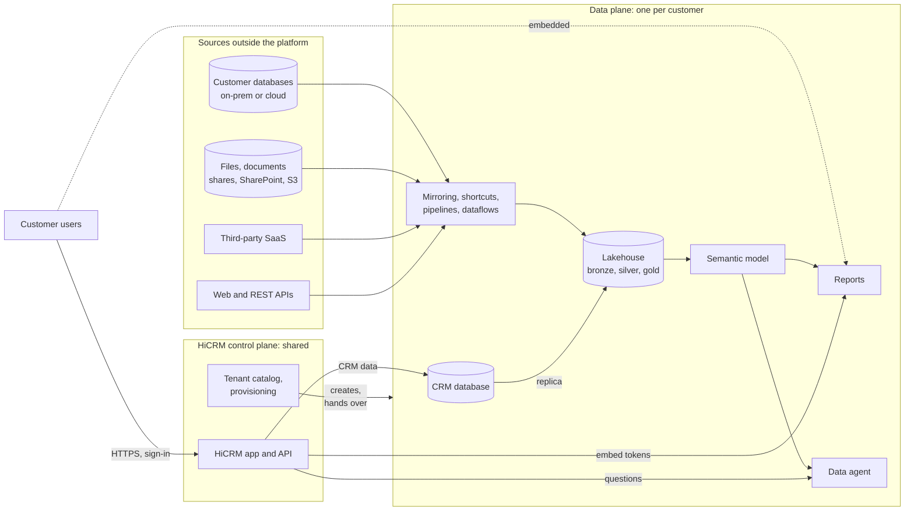

The flows that need protecting are the same in every plan; only the technology changes.

| # | Flow | Protected by |
| --- | --- | --- |
| 1 | Browser to the app | TLS, a web application firewall, sign-in with the customer's identity provider, rate limits per customer and user |
| 2 | App to the CRM database | TLS (TDS), a token or account that can only open this customer's database |
| 3 | App to the reporting service, for an embed token | The customer's own service identity; tokens for named items only, 30 minutes |
| 4 | Browser to the report | The embed token; the app never proxies report data and never hands the browser its own token |
| 5 | App to the data agent | The customer's own service identity, over TLS; the browser never calls the agent |
| 6 | Model to its data | A fixed identity (the workspace identity in Fabric) with read access to this customer's data only |
| 7 | Customer systems to the platform | Connectors at the customer's site that only dial out; credentials decrypted only there |
| 8 | Third-party and web sources | Credentials held in per-customer connections; outbound rules limit where pipelines and notebooks may go |
| 9 | Operators to the back office | Named sign-in with MFA, time-bound elevation, every look at customer data logged |

Principles, from Zero Trust ([segmentation guidance](https://learn.microsoft.com/security/zero-trust/azure-networking-segmentation)):

1. **One identity per customer**, never shared at runtime: a bug that mixes up customers is refused by the data service,
   not just by the app.
2. **No standing access and no secrets** where a managed or federated identity works.
3. **Dial out, never in**: connectors at customer sites open outbound connections only.
4. **Private paths between platform components; public endpoints only where the users are**, and those are gated by
   identity, short-lived and narrowly scoped.
5. **Separable per customer**: data, keys, logs and connections can be exported or destroyed for one customer.
6. **Assume breach**: segment, control egress, audit, and check for drift (`platform-cli audit`).

## 2. Plan 1: HiCRM in your datacenter, Fabric for data and AI

The application tier (web app, API, control plane) runs in a private datacenter; data, models, reports and agents stay
in Fabric. There are two variants: **1A**, a multi-tenant platform you host for many customers whose users come from
the internet; and **1B**, a dedicated install for one customer whose users are on that customer's network.

Four documented facts shape both variants:

- **On-premises data gateways fail to register when Fabric tenant-level Private Link is enabled**; virtual network
  (VNet) data gateways work ([Private links for Fabric tenants](https://learn.microsoft.com/fabric/security/security-private-links-overview#other-considerations-and-limitations)).
- **Blocking public internet access at the tenant level** stops anything that doesn't come through a private endpoint.
  There is no documented way to serve embedded reports to internet users then, and Copilot isn't supported with
  Private Link ([same page](https://learn.microsoft.com/fabric/security/security-private-links-overview)).
- **Workspace-level Private Link can't protect a workspace that holds a semantic model or a SQL database**. It does
  cover lakehouses, notebooks, pipelines, Copy jobs, Dataflow Gen2, several mirrored databases and data agents, and it
  accepts private endpoints from other subscriptions and other Entra tenants after approval
  ([supported scenarios](https://learn.microsoft.com/fabric/security/security-workspace-level-private-links-support),
  [cross-tenant](https://learn.microsoft.com/fabric/security/security-cross-tenant-communication)).
- **The private path from a datacenter to Fabric is ExpressRoute private peering + private endpoints + DNS
  forwarding** ([private endpoints for on-premises clients](https://learn.microsoft.com/fabric/enterprise/powerbi/service-security-private-links-on-premises)).
  ExpressRoute doesn't replace the gateway for on-premises sources ([gateway FAQ](https://learn.microsoft.com/data-integration/gateway/service-gateway-onprem-faq#does-azure-expressroute-eliminate-the-need-for-a-gateway)).

So a shared Fabric tenant that serves internet users and uses on-premises gateways keeps its public endpoints,
protected by identity, and applies private networking per workspace, where the item types allow it. A dedicated
deployment with internal users can go fully private.

### 1A. Multi-tenant platform in your datacenter

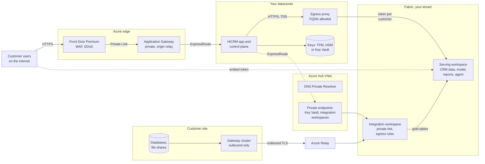

- **Ingress without a public listener in your datacenter**: Front Door Premium (WAF, DDoS) reaches a private
  Application Gateway through Private Link, and the gateway forwards to the app over ExpressRoute
  ([Front Door Private Link origins](https://learn.microsoft.com/azure/frontdoor/private-link#supported-origins)). The
  simpler alternative is a public origin that only accepts the `AzureFrontDoor.Backend` service tag and your
  `X-Azure-FDID` header ([secure the origin](https://learn.microsoft.com/azure/frontdoor/origin-security)).
- **Two workspaces per customer** once customers bring data. The **serving** workspace holds what end users touch: the
  CRM database, the semantic model, reports and the agent. These items can't use workspace-level Private Link, so they
  rely on identity. The **integration** workspace holds pipelines, notebooks, mirrored databases and the lakehouse. It
  gets workspace-level Private Link and outbound access protection, so only your network and the customer's own
  network can reach it, and its code can only reach approved destinations
  ([outbound access protection](https://learn.microsoft.com/fabric/security/workspace-outbound-access-protection-overview)).
  Today HiCRM uses one workspace per customer; the split is the next step.
- **No secrets in the datacenter.** Managed-identity federation needs a user-assigned identity, and Azure Arc-enabled
  servers only have a system-assigned one
  ([Arc managed identity](https://learn.microsoft.com/azure/azure-arc/servers/managed-identity-authentication),
  [trust a managed identity](https://learn.microsoft.com/entra/workload-id/workload-identity-federation-config-app-trust-managed-identity)).
  So each customer's service principal uses a certificate whose private key can't leave its store: a TPM or HSM, or
  Key Vault (Premium, HSM-backed) asked to sign the client assertion by the server's Arc identity. Never client secrets.
- **Keep tenant-level Private Link off** in a tenant whose customers use on-premises gateways. Traffic to Fabric goes
  over TLS to the public endpoints through an egress proxy that only allows the Entra, Fabric, Power BI and SQL
  (`*.database.fabric.microsoft.com:1433`) names.
- **If CRM data must also stay on-premises**, keep the OLTP database on SQL Server 2025 in your datacenter and mirror it
  into the customer's workspace. Mirroring SQL Server 2025 needs Azure Arc, plus an on-premises or VNet data gateway
  when the server is behind a firewall. Fabric then holds only an analytics copy
  ([mirroring SQL Server](https://learn.microsoft.com/fabric/mirroring/sql-server)).

### Securing the reporting and agent traffic

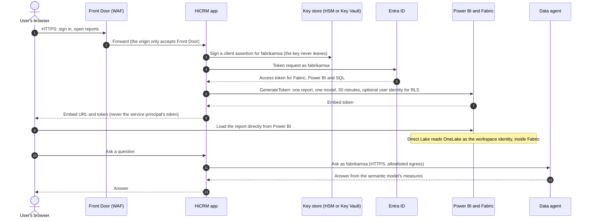

- **Reports**: the browser talks to Power BI directly; the app only mints tokens for named items. For per-user filtering,
  put RLS roles in the model and pass the user as the effective identity. This works with Direct Lake when the
  connection uses a fixed identity with single sign-on off, which is how HiCRM binds its models
  ([Direct Lake security](https://learn.microsoft.com/fabric/fundamentals/direct-lake-security-integration),
  [embed with RLS](https://learn.microsoft.com/power-bi/developer/embedded/cloud-rls)).
- **The agent** runs inside Fabric. The app calls it as the customer's service principal; service-principal access to
  data agents is in **preview**, managed identities aren't supported, and it needs a paid F2 or larger capacity
  ([service principal auth](https://learn.microsoft.com/fabric/data-science/data-agent-service-principal),
  [prerequisites](https://learn.microsoft.com/fabric/data-science/concept-data-agent#prerequisites)). It answers with
  the service principal's view, which is the whole customer. Where some users may only see part of the data, keep the
  agent for roles that may see everything and answer the rest in the app, which applies its own filters.
- **AI data boundary**: data agents use Azure OpenAI. Outside the EU and US boundaries, a tenant setting must allow
  processing outside the capacity's geography, which is a disclosure for those customers
  ([data agent tenant settings](https://learn.microsoft.com/fabric/data-science/data-agent-tenant-settings)).
- **Evidence**: Entra sign-in logs per customer service principal, Fabric audit events, HiCRM's per-customer activity
  log, and the `audit` command for role drift.

### 1B. Dedicated, fully private install

For one enterprise customer whose users are on their own network, everything can be private. Use a Fabric tenant
dedicated to that deployment, ideally the customer's own, with HiCRM consented as a multi-tenant app. Enable tenant-level
Private Link and block public access. Use VNet data gateways instead of on-premises gateways.

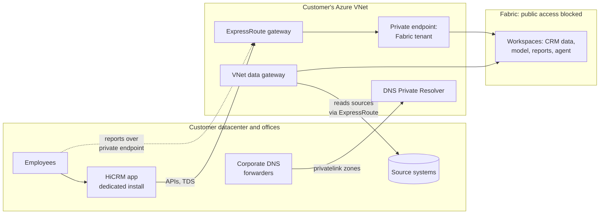

Embedded reports load privately because the browsers resolve Power BI names to the private endpoint. Required zones:
`privatelink.analysis.windows.net`, `privatelink.pbidedicated.windows.net` and `privatelink.prod.powerquery.microsoft.com`
([set up tenant-level private links](https://learn.microsoft.com/fabric/security/security-private-links-use)). VNet data
gateways support Dataflow Gen2, pipelines, Copy job, mirroring and semantic models
([VNet data gateway](https://learn.microsoft.com/data-integration/vnet/overview)). Reaching on-premises sources from
one over ExpressRoute is standard routing, but prove it for each workload (section 7).

### Bringing customer data in (Plans 1 and 2)

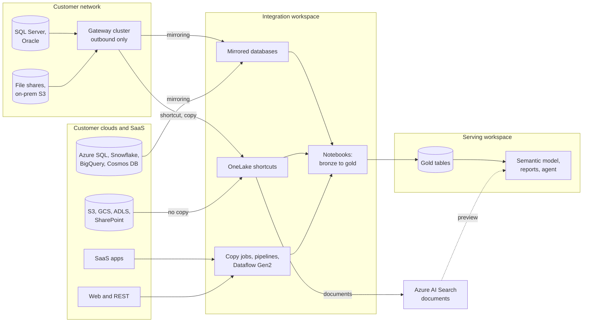

| Source | Preferred path | Notes |
| --- | --- | --- |
| On-premises SQL Server 2016-2025, Oracle | Mirroring through the customer's gateway | Near real time, no pipelines to run ([mirroring](https://learn.microsoft.com/fabric/mirroring/overview)) |
| Azure SQL, SQL MI, PostgreSQL, Cosmos DB, Snowflake, BigQuery, SAP | Mirroring | Private Azure sources: VNet data gateway or managed private endpoints |
| Files and documents: S3, S3-compatible, GCS, ADLS, Dataverse, OneDrive and SharePoint, on-premises shares | OneLake shortcuts (on-premises ones through the gateway) | No copy ([shortcuts](https://learn.microsoft.com/fabric/onelake/onelake-shortcuts), [on-premises](https://learn.microsoft.com/fabric/onelake/create-on-premises-shortcut)) |
| Third-party SaaS, web and REST | Copy job, pipelines or Dataflow Gen2 | Credentials in connections owned by the customer's service principal; outbound rules limit destinations |
| Unstructured documents for the agent | OneLake, indexed by Azure AI Search | AI Search indexes OneLake directly ([indexer](https://learn.microsoft.com/azure/search/search-how-to-index-onelake-files)); a data agent over a search index is **preview** ([AI Search source](https://learn.microsoft.com/fabric/data-science/data-agent-ai-search-index)) |

The gateway dials out to Azure Relay over TLS (1.3 by default). It needs no inbound ports. Source credentials are
encrypted in the cloud and decrypted only on the gateway. Run gateways as clusters of two or more machines for high
availability ([gateway in depth](https://learn.microsoft.com/data-integration/gateway/service-gateway-onprem-indepth),
[clusters](https://learn.microsoft.com/data-integration/gateway/service-gateway-high-availability-clusters)). A gateway
in a customer's network registers to your tenant through whoever signs in during setup, and that must be a person's
account. Have one of your engineers sign in with a per-customer installer account, in a session with the customer's IT,
and let the customer's service principal own the connections. Most of these sources sit in the customer's own Entra
tenant: which identity reaches each one, and what the customer grants, is in
[IDENTITIES.md](IDENTITIES.md#44-the-add-on-reads-the-customers-systems-future).

## 3. Plan 2: Azure, the recommended SaaS deployment

The same Fabric design, with the app tier in an Azure landing zone. This is what the Well-Architected Framework's
[SaaS guidance](https://learn.microsoft.com/azure/well-architected/saas/design-methodology) and the
[multitenant architecture guide](https://learn.microsoft.com/azure/architecture/guide/multitenant/overview) describe: a
pooled, stateless app tier in front of data isolated per tenant, deployed as stamps.

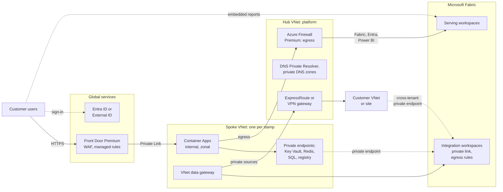

- **Ingress**: Front Door Premium with WAF managed rules reaches an internal Container Apps environment through
  Private Link, so the app has no public listener. Premium is needed for Private Link to origins. Front Door (classic)
  retires on 31 March 2027 ([supported origins](https://learn.microsoft.com/azure/frontdoor/private-link#supported-origins),
  [pricing tiers](https://learn.microsoft.com/azure/frontdoor/understanding-pricing#pricing-model-comparison)).
  Monitoring sits outside the diagram: Azure Monitor, Defender for Cloud and Microsoft Sentinel for every resource,
  and Azure Policy at management-group scope. The provisioning job runs in the same spoke and sends its traffic out
  through the firewall.
- **Compute**: Azure Container Apps suits a small team: zone redundancy is chosen when the environment is created
  (two or more replicas), user-assigned managed identity is native, and it's a Front Door Private Link origin. AKS adds
  control the app doesn't need ([choose a container service](https://learn.microsoft.com/azure/architecture/guide/choose-azure-container-service),
  [Container Apps reliability](https://learn.microsoft.com/azure/reliability/reliability-container-apps)).
- **Network**: hub and spoke (Virtual WAN pays off at many regions and branches). All egress goes through Azure
  Firewall with FQDN rules: Entra, Fabric and Power BI (service tag `PowerBI` covers both), SQL, and approved customer
  endpoints. Private DNS zones live in the hub and are filled by policy
  ([hub-spoke vs Virtual WAN](https://learn.microsoft.com/azure/networking/design-guide/virtual-wan#how-to-choose),
  [DNS at scale](https://learn.microsoft.com/azure/cloud-adoption-framework/ready/azure-best-practices/private-link-and-dns-integration-at-scale),
  [Fabric service tags](https://learn.microsoft.com/fabric/security/security-service-tags)).
- **Customer connectivity, cheapest first**: a gateway at the customer's site (outbound only); a private endpoint from
  the customer's VNet into their own integration workspace (cross-tenant, approved by you); a VNet data gateway for
  private Azure sources; a dedicated VPN or ExpressRoute only for large accounts, since per-customer links scale badly
  (overlapping address ranges, routing) ([Private Link in multitenant solutions](https://learn.microsoft.com/azure/architecture/guide/multitenant/service/private-link)).

### Identity without secrets

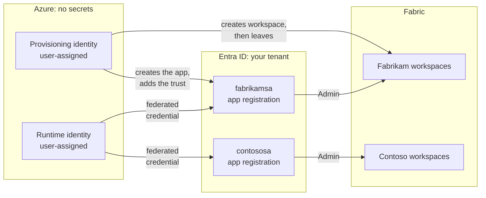

- Each customer's app registration gets a **federated identity credential that trusts the app's user-assigned managed
  identity**. The app exchanges its managed-identity token for that customer's token, with no secret or certificate
  anywhere. This is GA, works only with user-assigned identities, and allows 20 federated credentials per app
  ([trust a managed identity](https://learn.microsoft.com/entra/workload-id/workload-identity-federation-config-app-trust-managed-identity)).
  The resulting caller is an ordinary service principal, so it also works for data agents, which don't accept managed
  identities. Inside Fabric, each workspace's identity (Fabric-managed, also without a secret) is the fixed identity
  through which Direct Lake reads OneLake.
- **Split the control plane**: the provisioning identity creates workspaces and app registrations (Graph
  `Application.ReadWrite.OwnedBy`) and holds no data access; the runtime identity can only exchange tokens. Limit token
  issuance for the per-customer service principals to your firewall's egress addresses with
  [Conditional Access for workload identities](https://learn.microsoft.com/entra/identity/conditional-access/workload-identity)
  (Workload ID Premium).
- One runtime identity can still act for every customer: that's the nature of a pooled app tier. Per-customer service
  principals protect against bugs that mix customers up. For customers that need more, give them a dedicated app
  (Container App or stamp) whose own managed identity is the only one their app registration trusts.
- **Key Vault** (RBAC, private endpoint, purge protection; one vault per environment and tier, not per customer) holds
  only what can't be federated: third-party API keys, for example
  ([Key Vault and Private Link](https://learn.microsoft.com/azure/key-vault/general/private-link-service)).
- **Users**: a multi-tenant Entra app registration for customers who have Entra ID; External ID for the rest. Azure AD
  B2C is closed to new customers since 1 May 2025
  ([identity approaches](https://learn.microsoft.com/azure/architecture/guide/multitenant/approaches/identity)).
  Keep one service principal per customer rather than Power BI service principal profiles: profiles only work with
  Power BI APIs, not with data agents or OneLake
  ([multitenancy with Power BI embedding](https://learn.microsoft.com/power-bi/guidance/develop-scalable-multitenancy-apps-with-powerbi-embedding)).

### Stamps and tiers

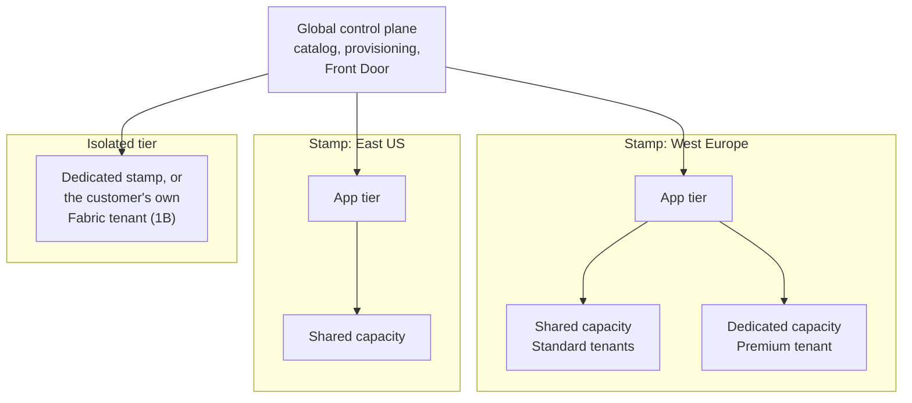

A stamp is one region's app tier and Fabric capacities. A customer is placed by residency and tier: shared capacity
(Standard), dedicated capacity with customer-managed keys and private connectivity (Premium), or a dedicated stamp or
tenant (Isolated) ([deployment stamps](https://learn.microsoft.com/azure/architecture/patterns/deployment-stamp),
[tenancy models](https://learn.microsoft.com/azure/architecture/guide/multitenant/considerations/tenancy-models)).

### Best practices by Well-Architected pillar

| Pillar | Do this |
| --- | --- |
| Security | Front Door Premium WAF and Private Link origin. Managed identities and federated credentials only. Private endpoints for every PaaS dependency, with public access disabled by policy. Firewall egress allowlist with IDPS. Workspace outbound access protection and workspace-level Private Link on integration workspaces. Customer-managed keys per workspace for Premium (GA; semantic models aren't on the supported list) ([CMK](https://learn.microsoft.com/fabric/security/workspace-customer-managed-keys)). Conditional Access for Fabric (continuous access evaluation isn't supported) ([Conditional Access](https://learn.microsoft.com/fabric/security/security-conditional-access)). Defender for Cloud (CSPM, Containers, Key Vault, Storage, Resource Manager) feeding Sentinel. |
| Reliability | Zone-redundant Container Apps and Redis; Key Vault is zone-redundant automatically. Active-passive second region per stamp behind Front Door. Turn on Fabric's per-capacity disaster recovery: replication is asynchronous and must be re-armed after a failover ([OneLake DR](https://learn.microsoft.com/fabric/onelake/onelake-disaster-recovery)). Idempotent provisioning rebuilds a stamp, and the assistant falls back when the agent is down. |
| Cost optimization | Shared capacity per stamp for small tenants and dedicated capacity sold as a tier. Private endpoints are billed per hour and per GB, so use them where they isolate something ([cost](https://learn.microsoft.com/azure/private-link/private-link-cost-optimization)). Pause non-production capacities. |
| Operational excellence | Bicep for stamps; Fabric items from generated definitions, as today. Canary stamp first. Schedule `platform-cli audit` and alert on failures. Policy as code. |
| Performance efficiency | App, capacity and the customer's data in the same region. Direct Lake (no import refresh). Per-customer rate limits held in Redis, shared by all replicas. Capacity metrics and surge protection. |

**Guardrails as policy**, assigned at management-group scope:

- Deny public network access, per resource type (there's no single built-in), for Key Vault, Storage, Container
  Registry, App Configuration, Redis and SQL.
- Deny `privatelink.*` zones outside the hub, with DeployIfNotExists zone groups.
- Diagnostics to Log Analytics; allowed regions per stamp (residency).
- The Microsoft cloud security benchmark network controls NS-1 to NS-10
  ([MCSB network security](https://learn.microsoft.com/security/benchmark/azure/mcsb-v2-network-security)).
- Fabric tenant settings, which aren't Azure Policy:
  - service principals allowed only through a security group;
  - publish to web and external sharing off;
  - cross-geo AI processing decided per region;
  - workspace IP firewall rules (**preview**) only for admin-only workspaces
    ([advanced networking](https://learn.microsoft.com/fabric/admin/service-admin-portal-advanced-networking)).

## 4. Plan 3: everything on-premises, Microsoft products only

Fabric has no on-premises edition, so Plan 3 rebuilds each capability from SQL Server 2025 and Windows Server. That is
possible for the CRM, integration, semantic models, viewing reports and an agent. Two things can't be done with
Microsoft products today: unlicensed users **creating reports in the browser**, and a **packaged natural-language agent
over a semantic model**.

| Fabric capability | Closest Microsoft on-premises equivalent | Gap |
| --- | --- | --- |
| SQL database (CRM) | SQL Server 2025 (GA 18 Nov 2025; Standard now 32 cores, 256 GB and full Resource Governor) | None for OLTP; you operate it |
| OneLake and shortcuts | SQL Server + PolyBase over S3-compatible storage (Parquet, CSV, Delta read-only), file shares | No single lake, no zero-copy shortcuts |
| Direct Lake semantic model | Analysis Services 2025 Tabular (import or DirectQuery) | Import copies data and refreshes; DirectQuery loads the OLTP |
| Embedded reports, built in the browser | Power BI Report Server: view and interact, RLS, paginated reports | **No browser authoring** (Power BI Desktop only), no dashboards, Q&A, Copilot, Direct Lake or composite models |
| Pipelines, Dataflow Gen2 | SSIS 2025 | Visual Studio tooling; Microsoft's Oracle connector and the Attunity CDC components were removed |
| Spark notebooks | None | Big Data Clusters retired on 28 Feb 2025 |
| Data agent, Copilot | Built: Agent Framework + SQL MCP Server + a local model | No packaged product for natural language over a model |

Sources: [what's new in SQL Server 2025](https://learn.microsoft.com/sql/sql-server/what-s-new-in-sql-server-2025),
[PolyBase](https://learn.microsoft.com/sql/relational-databases/polybase/overview),
[Report Server vs the service](https://learn.microsoft.com/power-bi/report-server/compare-report-server-service),
[SSIS 2025](https://learn.microsoft.com/sql/integration-services/what-s-new-in-integration-services-in-sql-server-2025),
[Big Data Clusters retirement](https://learn.microsoft.com/lifecycle/announcements/sql-server-2019-big-data-clusters-retirement).
Since SQL Server 2025, on-premises reporting is consolidated into Power BI Report Server: there is no new SSRS, and SSRS
2022 gets security fixes until 11 January 2033 ([consolidation FAQ](https://learn.microsoft.com/sql/reporting-services/reporting-services-consolidation-faq)).

### Four ways to run it

| Option | What it is | Needs Azure? | Use when |
| --- | --- | --- | --- |
| **3A Classic** | Windows Server 2025 Hyper-V failover clusters; SQL Server 2025 with SSIS, Analysis Services and Power BI Report Server | No | Air-gapped, simplest to buy and run |
| **3B Azure Local + Arc** | Azure Local clusters; Arc VMs and AKS enabled by Arc; Arc-enabled SQL Server for Defender, Purview, Entra sign-in and pay-as-you-go licensing | Yes: continuous outbound HTTPS | Data must stay on-premises; management may use the cloud |
| **3C Disconnected** | Azure Local disconnected operations: local portal, ARM, Key Vault and Policy (GA); AKS in disconnected mode is **preview** | No, at run time | Sovereign or classified sites |
| **3D Bridge** | 3B plus SQL Server 2025 mirroring to Fabric | Yes | On-premises system of record; analytics may move to the cloud later |

Two 2025 changes matter here. Arc data services dropped the indirectly connected mode in September 2025, so SQL Managed
Instance enabled by Arc can no longer run air-gapped
([connectivity modes](https://learn.microsoft.com/azure/azure-arc/data/connectivity)). Azure Local disconnected
operations are GA for the core control plane ([overview](https://learn.microsoft.com/azure/azure-local/manage/disconnected-operations-overview)).

### Architecture

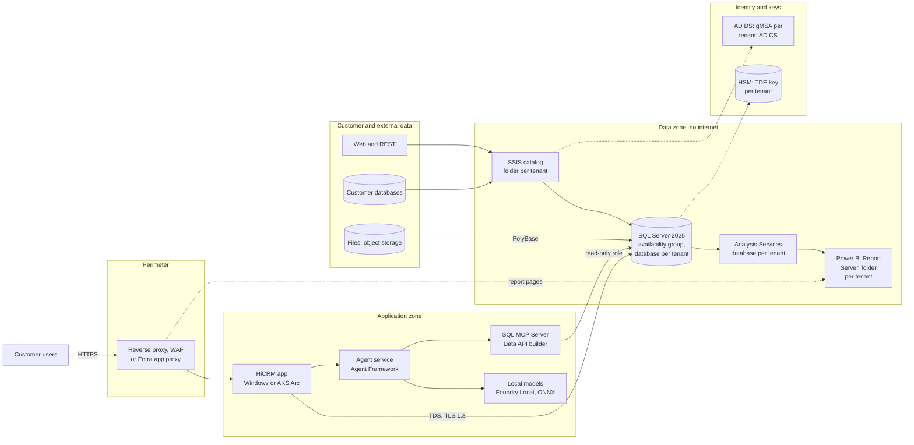

- **Segmentation**: a perimeter, an application zone, a data zone with no internet egress, and an identity zone.
  Microsoft has no on-premises WAF appliance, so the perimeter is either a third-party WAF, or Microsoft Entra
  application proxy, which is outbound-only but needs a connection to Entra (3B)
  ([publish Report Server with application proxy](https://learn.microsoft.com/power-bi/report-server/microsoft-entra-application-proxy)).
  AD FS with Web Application Proxy still ships in Windows Server 2025, but Microsoft steers new work to Entra
  ([AD FS guidance](https://learn.microsoft.com/windows-server/identity/ad-fs/ad-fs-decommission)).
- **Encryption in transit**: TDS 8.0 strict encryption (TLS 1.3) for every SQL connection, HTTPS with AD CS
  certificates elsewhere ([TDS 8.0](https://learn.microsoft.com/sql/relational-databases/security/networking/tds-8)).
  At rest: TDE with a key per tenant database, protected by an HSM through EKM; Always Encrypted with secure enclaves
  for sensitive columns; ledger tables for tamper evidence; SQL Server Audit.
- **Data in**: SSIS for customer databases, flat files and REST, run by SQL Agent under a per-tenant proxy. PolyBase
  for Parquet, CSV and Delta on S3-compatible storage. `sp_invoke_external_rest_endpoint` for simple web calls from
  T-SQL ([REST endpoint](https://learn.microsoft.com/sql/relational-databases/system-stored-procedures/sp-invoke-external-rest-endpoint-transact-sql)).
  SQL Server 2025's change event streaming only sends to Azure, so it doesn't apply off-cloud.

### Reports and the agent on-premises

- **Reports**: Power BI Report Server shows Power BI and paginated reports in an iframe (`?rs:embed=true`). Users sign in
  with Windows or Kerberos, or through a **custom authentication extension**, which is supported for Report Server. One
  can trust HiCRM's own sign-in, so customers' users need no domain accounts. A folder per tenant with role assignments
  and RLS in the models (`USERNAME()`) keep tenants apart
  ([embed](https://learn.microsoft.com/power-bi/report-server/quickstart-embed),
  [custom security extensions](https://learn.microsoft.com/sql/reporting-services/extensions/security-extension/how-to-install-custom-security-extensions),
  [authentication](https://learn.microsoft.com/sql/reporting-services/security/authentication-with-the-report-server)).
- **Build your own reports**: not in the browser. Either give customers' power users Power BI Desktop for Report
  Server and the Publisher role on their folder, or let HiCRM draw charts itself from the Analysis Services model
  (HiCRM's demo mode already draws charts from query results).
- **Licensing for reports**: SQL Server 2025 Standard or Enterprise core licenses now include Power BI Report Server,
  with no Software Assurance needed ([licensing](https://learn.microsoft.com/power-bi/report-server/get-started#licensing-power-bi-report-server)).
- **The agent is something you build**:
  - The model: SQL Server 2025 stores vectors (GA; the DiskANN vector index is **preview**) and creates embeddings
    with `CREATE EXTERNAL MODEL` pointing at a local ONNX Runtime or Ollama endpoint (GA)
    ([CREATE EXTERNAL MODEL](https://learn.microsoft.com/sql/t-sql/statements/create-external-model-transact-sql)).
  - The tools: SQL MCP Server in Data API builder 2.0 (GA) exposes curated, read-only views with a per-tenant
    configuration ([Data API builder](https://learn.microsoft.com/azure/data-api-builder/overview)).
  - Orchestration: Microsoft Agent Framework, reported GA in April 2026 (verify against Learn).
  - The language model: an open-weight model (Phi-4, MIT licence, or gpt-oss, Apache 2.0) served by Foundry Local on
    Azure Local (**preview**, gated) or ONNX Runtime ([Foundry Local](https://learn.microsoft.com/azure/foundry-local/what-is-foundry-local)).
  - Documents: Agentic Retrieval in Foundry Local, the successor to Edge RAG (**preview**, Azure Local), covers document
    collections only ([deploy overview](https://learn.microsoft.com/azure/azure-arc/agents-tools-foundry-local/deploy-overview)).
  - Isolation: the language model is shared and keeps no data. Isolation lives in the tools and retrieval, which always
    run against the tenant's own database with a read-only role.

### Multitenancy on-premises

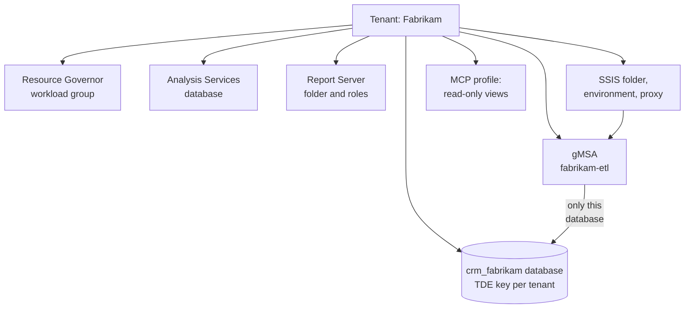

You rebuild by hand what a Fabric workspace gives each customer. The patterns are Microsoft's
[multitenant SaaS database tenancy patterns](https://learn.microsoft.com/azure/azure-sql/database/saas-tenancy-app-design-patterns),
applied to SQL Server:

- **Database per tenant** on shared instances (pooled stamps) or a dedicated instance (premium). Contained availability
  groups move a tenant together with its logins and jobs
  ([contained AGs](https://learn.microsoft.com/sql/database-engine/availability-groups/windows/contained-availability-groups-overview)).
  For very small tenants, a shared database with RLS on `SESSION_CONTEXT` works, as defence in depth
  ([RLS](https://learn.microsoft.com/sql/relational-databases/security/row-level-security)).
- **Identity**: background work runs under a group managed service account per tenant (or a Windows Server 2025
  delegated managed service account), which can only open that tenant's database. The app's own account may only
  execute each tenant's API procedures. With Arc (3B), SQL Server 2025 accepts Entra sign-in, so the per-customer
  service principals of Plans 1 and 2 carry over unchanged
  ([dMSA](https://learn.microsoft.com/windows-server/identity/ad-ds/manage/delegated-managed-service-accounts/delegated-managed-service-accounts-overview)).
- **Noisy neighbours**: Resource Governor per tenant (in Standard edition now as well). A separate Analysis Services
  instance for large tenants, because Analysis Services can't cap memory per database.
- **Semantic layer**: a database per tenant isolates best; one model with dynamic RLS uses less memory across many
  small tenants ([roles and row filters](https://learn.microsoft.com/analysis-services/tabular-models/roles-ssas-tabular)).
- **Offboarding**: drop the databases, folders and accounts, and destroy the tenant's TDE key once backups expire
  (crypto-shredding).

**Licensing for hosting.** If you host Plan 3 for many customers, SQL Server and Windows Server come under SPLA.
Partner and analyst reports say SPLA can't be used on the large public clouds ("Listed Providers") from 1 October 2025;
on your own hardware it still applies. Neither that date nor Power BI Report Server's coverage under SPLA is confirmed
in Microsoft's public documentation, so check both with a licensing specialist
([SPLA](https://www.microsoft.com/licensing/licensing-programs/spla-program)). A customer installing HiCRM on their own
premises licenses SQL Server 2025 themselves, which includes Report Server.

## 5. How multitenancy is solved in each plan

| Layer | Plan 1: hybrid | Plan 2: Azure | Plan 3: on-premises |
| --- | --- | --- | --- |
| Tenant boundary | Fabric workspaces per customer (serving and integration) | Same | Databases per customer (SQL Server, Analysis Services); folders in Report Server and SSIS |
| Runtime identity | Service principal per customer, certificate key in a TPM, HSM or Key Vault | Service principal per customer, federated to the app's managed identity: no secrets | gMSA per tenant for background work; the app account limited to API procedures; Entra service principals with Arc |
| End users | External ID or the customer's Entra ID; embed tokens, RLS with effective identity | Same | HiCRM sign-in through a Report Server custom authentication extension; RLS on `USERNAME()` |
| Network | Front Door to your datacenter; egress allowlist; private link on integration workspaces; customer gateways dial out | Front Door Private Link to Container Apps; firewall egress; private endpoints; cross-tenant private endpoints | Zoned network; data zone has no internet; customer links per site |
| Noisy neighbours | Capacity per tier; per-customer rate limits | Same, plus stamps | Resource Governor per tenant; separate instances for big tenants |
| Keys | Microsoft-managed; customer-managed per workspace for Premium | Same | TDE key per tenant database in an HSM |
| Agent | Fabric data agent as the customer's service principal (preview) | Same | Your agent; shared local model, tenant-scoped tools and retrieval |
| Offboarding | Delete workspaces, connection and service principal (automated today) | Same | Drop databases, folders and accounts; destroy the tenant's key |
| Evidence | Activity log, `audit`, Entra sign-in logs, Fabric audit | Same, in Sentinel | SQL Server Audit, Report Server execution log, Windows events |

The rule is the same everywhere: **share the stateless parts** (app tier, language model, capacity for small tenants),
**isolate everything that holds or can reach a customer's data** (identity, storage, connections, keys, logs), and make
the tier a setting rather than a different product.

## 6. Choosing

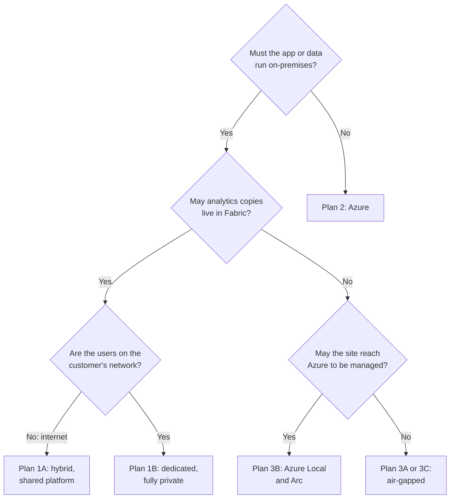

- **Plan 2 is the product.** It has every feature, the least to operate, and the strongest identity story: no secrets
  at all.
- **Plan 1 sells to customers who need the app tier on their premises.** 1A shares your platform; 1B goes fully private
  for one enterprise, ideally on their own Fabric tenant.
- **Plan 3 is a different edition**, without browser report authoring and with an agent you build and operate. Build it
  only for committed demand and price in the operations, and SPLA when you host it.

## 7. Proofs of concept before committing

1. A Direct Lake model in a serving workspace reading gold tables in a private-link integration workspace (through a
   shortcut and managed private endpoint); otherwise, a pipeline that publishes gold tables into the serving workspace.
2. A gateway in a customer's network registered to your tenant: who installs it, who owns it, how it's patched.
3. Data agent access by service principal (preview): its GA timing and limits, keeping the quick-answer fallback.
4. On-premises certificate signing: the Arc server identity asking Key Vault to sign client assertions, or keys in a
   TPM.
5. A VNet data gateway reaching on-premises sources over ExpressRoute (Plan 1B).
6. A Report Server custom authentication extension trusting HiCRM sign-in, with RLS in Power BI reports (Plan 3).
7. Licensing: Power BI Report Server under SPLA, and SPLA versus customer-owned licences (Plan 3).

## Sources

Checked on 2 October 2026; status as published then.

- **Fabric security**: [security white paper](https://learn.microsoft.com/fabric/security/white-paper-landing-page),
  [security fundamentals](https://learn.microsoft.com/fabric/security/security-fundamentals),
  [inbound protection](https://learn.microsoft.com/fabric/security/security-inbound-overview),
  [tenant-level private links](https://learn.microsoft.com/fabric/security/security-private-links-overview),
  [workspace-level private links](https://learn.microsoft.com/fabric/security/security-workspace-level-private-links-overview),
  [outbound access protection](https://learn.microsoft.com/fabric/security/workspace-outbound-access-protection-overview),
  [managed private endpoints](https://learn.microsoft.com/fabric/security/security-managed-private-endpoints-overview),
  [trusted workspace access](https://learn.microsoft.com/fabric/security/security-trusted-workspace-access) (GA on
  paid capacities, same tenant only),
  [customer-managed keys](https://learn.microsoft.com/fabric/security/workspace-customer-managed-keys).
- **Gateways**: [on-premises gateway in depth](https://learn.microsoft.com/data-integration/gateway/service-gateway-onprem-indepth),
  [gateway FAQ](https://learn.microsoft.com/data-integration/gateway/service-gateway-onprem-faq),
  [VNet data gateway](https://learn.microsoft.com/data-integration/vnet/overview).
- **Embedding and agents**: [embed for your customers](https://learn.microsoft.com/power-bi/guidance/powerbi-implementation-planning-usage-scenario-embed-for-your-customers),
  [embed with RLS](https://learn.microsoft.com/power-bi/developer/embedded/cloud-rls),
  [data agent concepts](https://learn.microsoft.com/fabric/data-science/concept-data-agent),
  [data agent with a service principal](https://learn.microsoft.com/fabric/data-science/data-agent-service-principal).
- **Azure architecture**: [Well-Architected SaaS workloads](https://learn.microsoft.com/azure/well-architected/saas/design-methodology),
  [multitenant guide](https://learn.microsoft.com/azure/architecture/guide/multitenant/overview),
  [Private Link in multitenant solutions](https://learn.microsoft.com/azure/architecture/guide/multitenant/service/private-link),
  [Private Link and DNS at scale](https://learn.microsoft.com/azure/cloud-adoption-framework/ready/azure-best-practices/private-link-and-dns-integration-at-scale),
  [secure Private Link](https://learn.microsoft.com/azure/private-link/secure-private-link),
  [disaster recovery for multi-region](https://learn.microsoft.com/azure/well-architected/design-guides/disaster-recovery).
- **On-premises**: [SQL Server 2025 GA](https://techcommunity.microsoft.com/blog/SQLServer/sql-server-2025-is-now-generally-available/4470570),
  [Analysis Services 2025](https://learn.microsoft.com/analysis-services/what-s-new-in-sql-server-analysis-services),
  [Azure Local](https://learn.microsoft.com/azure/azure-local/overview/hyperconverged-overview),
  [disconnected AI containers](https://learn.microsoft.com/azure/ai-services/containers/disconnected-containers).
