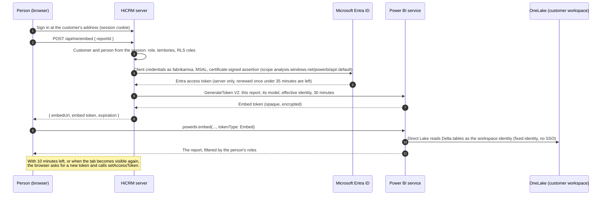

# Embedded reports: how "app owns data" works here

How a customer's people see Power BI reports inside HiCRM: what's embedded, which credential is used at each step, how
row-level security (RLS) decides what each person sees, and how all of it lines up with Microsoft's guidance and its
App-Owns-Data samples (section 10). The framework's controls for embedding (EMB-01 to EMB-06) and RLS (RLS-01 to RLS-05)
are in [FRAMEWORK.md](FRAMEWORK.md#6-controls). `npm run validate -- --live --browser` checks them against a running
deployment.

## 1. Quick answers (checked live on 2026-10-06)

| Question | Answer |
| --- | --- |
| Is the report a Power BI embedded report? | Yes. "Sales overview" is a Power BI report (PBIR) in each customer's own Fabric workspace. The app embeds it with the Power BI JavaScript client (`powerbi-client` 2.25.0) and an **embed token**. Microsoft calls this pattern [Power BI embedded analytics: embed for your customers](https://learn.microsoft.com/power-bi/developer/embedded/embedded-analytics-power-bi), also known as **app owns data**. It runs on a Fabric (F) capacity rather than an Azure Power BI Embedded (A) SKU, because the same workspace also holds a SQL database and a data agent, which A SKUs can't host. |
| How is the report published to the app? | Provisioning creates it from a generated PBIR definition with the Fabric Items API, bound to the customer's semantic model. The app finds it with the Power BI REST API ("Get Reports In Group"), and only standard reports (the ones the platform created) are offered. |
| What credentials are used? | The browser holds only a 30-minute embed token. The server creates it with the customer's own service principal (`fabrikamsa`, `contososa`), which signs in to Microsoft Entra ID with a certificate through MSAL (a federated credential in production; no client secrets outside development). People need no Entra account and no license. Section 3 lists every hop. |
| How is RLS done? | The report's semantic model has roles: one per territory, plus "All territories" for managers. Each embed token names the person (`username`) and their roles, taken from the server's session and never from the browser. Power BI applies the roles; Direct Lake reads OneLake as the workspace identity (a fixed identity). Section 5 has the details. |
| Is RLS really enforced? | Yes, in the rendered report. Opening "Sales overview" as each person and exporting the "Pipeline by state" visual showed the Fabrikam and Contoso managers three states each, and the Texas reps Texas only, with numbers matching each customer's database. A report filter asking for every state still showed the reps Texas only: filters can't widen RLS (control RLS-03). |
| Does the data agent work? Is it calling the right MCP server? | The app calls the documented endpoint, `https://api.fabric.microsoft.com/v1/mcp/workspaces/{workspace}/dataagents/{agent}/agent`, as the customer's service principal. The endpoint reaches the published agent: a made-up agent ID gets `-32601 The entity could not be found`, and the real ones get `-32003 FT1 SKU Not Supported`. On the trial capacity it refuses to run for anyone, since data agents need a paid F2 or larger capacity ([prerequisites](https://learn.microsoft.com/fabric/data-science/data-agent-mcp-server#prerequisites)). Until then managers get quick answers from the database (controls AI-01 to AI-03). |

## 2. The flow



Steps 3 to 7 run on the server. The browser never sees the Entra token, the service principal's credential or the token
request (control EMB-04).

## 3. Credentials at each hop

| # | From → to | Credential | Issued by | Lifetime | Where it's kept |
| --- | --- | --- | --- | --- | --- |
| 1 | Person → HiCRM | Session cookie after sign-in (`__Host-` prefixed over HTTPS, HttpOnly, SameSite). It's bound to the customer's address and checked on every request | HiCRM | Until sign-out or expiry | The browser |
| 2 | HiCRM → Entra ID | The customer service principal's client ID and a **client assertion**: a 10-minute JWT that MSAL signs with the account's **certificate** (PS256, `x5t#S256`). In production, a **federated credential**: the assertion is a token of the app's managed identity, so nothing secret exists. Client secrets are for development | Entra ID | Certificate: one year. Assertion: 10 minutes | The certificate's private key: encrypted at rest, AES-256-GCM file with `SECRETS_KEY` (pilot), Azure Key Vault (production). Federated: nothing |
| 3 | HiCRM → Power BI REST | **Entra access token** for `https://analysis.windows.net/powerbi/api/.default`, as the customer service principal | Entra ID | About 60 to 90 minutes | Server memory. Refreshed when less than the embed lifetime plus 5 minutes is left, because an embed token never outlives the Entra token used to create it ([source](https://learn.microsoft.com/power-bi/developer/embedded/generate-embed-token#considerations-and-limitations)) |
| 4 | Browser → Power BI | **Embed token** from Generate Token V2: one report, its model, view only, with the person's effective identity | Power BI | 30 minutes (`EMBED_TOKEN_MINUTES`, 5 to 60) | Browser memory. It's encrypted, so the browser can't decode or change it ([security white paper](https://learn.microsoft.com/power-bi/guidance/white-paper-powerbi-security)) |
| 5 | Power BI → OneLake | The semantic model's **cloud connection**, which signs in as the customer's **workspace identity** (fixed identity), with SSO off | Fabric | Managed by Fabric | Nowhere: no secret is stored ([fixed identity](https://learn.microsoft.com/fabric/fundamentals/direct-lake-fixed-identity)) |
| 6 | HiCRM → data agent (MCP) | Entra access token for `https://api.fabric.microsoft.com/.default`, as the customer service principal | Entra ID | About 60 to 90 minutes | Server memory |
| 7 | HiCRM → SQL database | Entra access token for Azure SQL, as the customer service principal (Entra-only authentication) | Entra ID | About 60 to 90 minutes | Server memory |

**The service account is a service principal, not a user.** Each customer has one Entra app registration and service
principal (`<customer>sa`), which is Admin of that customer's workspace and of nothing else. It has no mailbox, MFA
prompt or license, and needs none. Microsoft recommends a service principal over a "master user" for production
([embed for your customers](https://learn.microsoft.com/power-bi/guidance/powerbi-implementation-planning-usage-scenario-embed-for-your-customers)).
Section 9 explains why it's one per customer rather than one service principal with profiles.

## 4. The token request

What the server sends to `POST https://api.powerbi.com/v1.0/myorg/GenerateToken` for a Texas rep (identifiers shortened):

```json
{
  "reports": [{ "id": "<fabrikam-starter-report-id>" }],
  "datasets": [{ "id": "<fabrikam-semantic-model-id>" }],
  "identities": [{ "username": "drew.collins@fabrikam.com", "roles": ["Texas"], "datasets": ["<fabrikam-semantic-model-id>"] }],
  "lifetimeInMinutes": 30
}
```

| Field | Why |
| --- | --- |
| `reports`, `datasets` | Exactly the report being opened and the model it reads. The report must be in the customer's own workspace and be a standard report; the server checks the ID the browser sent (EMB-03) |
| no `allowEdit`, no `targetWorkspaces` | View only. They're added per person, and only where report authoring is on (`REPORT_AUTHORING`, off by default): `allowEdit` for people who may edit (Save), and `targetWorkspaces` only for people who may also create (Save as, New report). That's the permission model of Microsoft's [App-Owns-Data Starter Kit](https://github.com/PowerBiDevCamp/App-Owns-Data-Starter-Kit) (EMB-06) |
| `identities` | The effective identity: who is viewing and which roles apply. A service principal must always send one for a model with RLS ([source](https://learn.microsoft.com/power-bi/developer/embedded/generate-embed-token#row-level-security)) |
| `lifetimeInMinutes` | 30 by default. It can only shorten the token |

A manager's token is the same, with `"roles": ["All territories"]`. Someone who covers Texas and Georgia gets
`["Texas", "Georgia"]`, and Power BI shows the union of the two.

**Report permissions per person.** Everyone who signs in may view the customer's reports. Operators grant "Can edit"
and "Can create" per person (back office, or `npm run cli -- user-access <customer> <email> --reports edit,create`).
The server enforces them on every token request. In the browser, the Power BI JavaScript client gets the same
permissions: `Read` to view, `ReadWrite` to edit, and `All` to edit and create. Changing a person's permissions ends
their sessions, so an open report never keeps rights they no longer have.

## 5. Row-level security

**The roles are in the semantic model.** "HiCRM Insights" is generated as TMDL, with one role per territory and one for
managers:

```tmdl
role Texas
	modelPermission: read

	tablePermission Accounts = 'Accounts'[State] = "Texas"
```

```tmdl
role 'All territories'
	modelPermission: read
```

The filter is on Accounts; relationships carry it to contacts, opportunities and activities. The model is Direct Lake
on OneLake, bound to a cloud connection that uses the workspace identity with SSO off. Microsoft "strongly recommends"
this fixed identity when the model has RLS ([Direct Lake overview](https://learn.microsoft.com/fabric/fundamentals/direct-lake-overview#comparison-of-storage-modes)).
Users can then query the model without being able to query the database underneath
([security integration](https://learn.microsoft.com/fabric/fundamentals/direct-lake-security-integration#permission-requirements)).

**The roles come from the server.** In "app owns data", the username in an embed token can be any text: Power BI
trusts the application ([RLS guidance](https://learn.microsoft.com/power-bi/guidance/rls-guidance#validate-roles)).
So HiCRM works out the roles from the signed-in person's record on the server, never from the request. The rules:

| Rule | Where | Control |
| --- | --- | --- |
| Power BI says which models need an identity (`isEffectiveIdentityRequired`), and only those get one | `src/platform/reporting.js` | RLS-01 |
| A model that needs roles, with no roles for the person, gets no token at all | `src/platform/reporting.js` | RLS-01 |
| Someone limited to some territories never gets a token for a model without roles, which would show everything | `src/platform/reporting.js` | RLS-02 |
| The CRM screens and quick answers apply the same territories in SQL | `src/crm/repository.js` | RLS-04 |
| The data agent reads a twin model without roles, so it's offered only to people who see every territory | `src/platform/assistant.js` | AI-02 |

**Static roles here, dynamic roles when you need them.** With static roles, as here, the token's username doesn't
change what anyone sees; the roles do. One role per territory is simple to audit, and is enough while territories are
the unit of access. For per-person rules (for example, "my own deals"), use dynamic security: one role whose filter
compares a column with `USERNAME()`. That returns the effective identity's username, which the server sets to a value
it trusts ([Embed a report with RLS](https://learn.microsoft.com/power-bi/developer/embedded/cloud-rls)). Or pass a
value in `customData` and filter with `CUSTOMDATA()`. Without an effective identity, `USERNAME()` returns the service
principal's ID, not the person's
([RLS with Power BI](https://learn.microsoft.com/fabric/security/service-admin-row-level-security#considerations-and-limitations-for-dynamic-rls)).

**No relationship functions over secured tables.** `USERELATIONSHIP` (and `CROSSFILTER`) return an error when a role
filters a table they touch ([remarks](https://learn.microsoft.com/dax/userelationship-function-dax#remarks)), so a
measure like that breaks for every rep. "# Accounts Owned" used to turn on the inactive Accounts-to-Sales-Reps
relationship; it now filters by owner with `TREATAS`, which gave the same numbers for every rep in both live models,
and a test keeps such functions out of the model.

**Checked in the rendered report.** Microsoft advises that when embedding with a service principal, you "always test
with actual embed tokens that include EffectiveIdentity" ([source](https://learn.microsoft.com/fabric/security/service-admin-row-level-security#considerations-and-limitations-for-dynamic-rls)),
because the portal's "Test as role" doesn't simulate embedding. The validator does that (control RLS-03): it gets the
tokens the app would issue, opens the report in Edge or Chrome, exports the "Pipeline by state" visual, and compares
it with the same question asked of the database. Then it applies a report filter asking for every territory and exports
the visual again: row-level security holds only if no filter can show a person more. Results on 2026-10-06:

| Person | Roles in the token | The report showed | The database |
| --- | --- | --- | --- |
| Fabrikam manager (Leah Thompson) | All territories | Georgia $2,828,500 · Texas $2,229,000 · New Mexico $455,000 | Same |
| Fabrikam rep (Drew Collins) | Texas | Texas $2,229,000; with a filter for every state, still Texas only | Same |
| Contoso manager (Maria Alvarez) | All territories | Georgia $2,151,000 · Texas $2,145,500 · New Mexico $712,000 | Same |
| Contoso rep (Sam Rivera) | Texas | Texas $2,145,500; with a filter for every state, still Texas only | Same |

## 6. Token lifetime and refresh

- **Short-lived.** Embed tokens last 30 minutes (`EMBED_TOKEN_MINUTES`, 5 to 60), and Power BI honors it: a token
  requested at 04:48:08 expired at 05:18:12.
- **Created with an Entra token that outlives it.** For security reasons, an embed token expires no later than the
  Entra token used to create it. Reusing a cached Entra token near its end would hand out shorter embed tokens. So the
  server gets a fresh Entra token when the cached one has less than the embed lifetime plus 5 minutes left
  (`embedTokenValidityMs` in `src/fabric/client.js`).
- **Refreshed in place.** As in [Microsoft's refresh sample](https://learn.microsoft.com/javascript/api/overview/powerbi/refresh-token),
  the browser checks every 30 seconds, and again whenever the tab becomes visible (timers stall while a device sleeps).
  When a token is due, it asks the server for a new one and calls `setAccessToken`, without reloading the report
  (`public/embed-token.js`, used by `public/app.js` and `public/admin/admin.js`).
  - A token is due with 10 minutes left, as in the sample. Shorter tokens are due with a third of their lifetime left,
    because `EMBED_TOKEN_MINUTES` can be as low as 5. Before this, a 10-minute token would have been refreshed every
    30 seconds. Microsoft's App-Owns-Data Starter Kit uses 10-minute tokens.
  - The browser counts the time left from when the token arrived (`expiresInSeconds`, from the server's clock).
    A device clock that's wrong therefore neither refreshes late nor refreshes over and over.
  - Checked live in Edge: with the page's clock moved 21 minutes ahead, the app fetched exactly one new token and kept
    the report open. A later visibility check didn't fetch another.
- **Re-authorized each time.** Every refresh goes through the same server checks: the session, the customer, the
  report and the person's current roles. A rep moved to another territory gets the new roles at the next refresh, and
  their session is ended at once anyway.

## 7. Capacity, licenses and tenant settings

| What | Needed | Source |
| --- | --- | --- |
| A capacity | Yes. Embedding for customers in production needs an A, EM, P or F SKU. This framework uses F because the workspace also holds Fabric items (SQL database, data agent). Free "embed trial" tokens on shared capacity are for development only, and show a banner | [Capacity and SKUs](https://learn.microsoft.com/power-bi/developer/embedded/embedded-capacity) |
| Licenses for the people who view | None. With "app owns data" they're the application's users, not Power BI users | [Embed for your customers](https://learn.microsoft.com/power-bi/developer/embedded/embedded-analytics-power-bi) |
| Licenses for the service principals | None | [Service principal](https://learn.microsoft.com/power-bi/developer/embedded/embed-service-principal) |
| Tenant setting "Service principals can call Fabric public APIs" | Yes, limited to a security group with the platform's service principals | [Developer settings](https://learn.microsoft.com/fabric/admin/service-admin-portal-developer) |
| Tenant setting "Embed content in apps" | Yes | Same |
| Tenant settings "Service principals can access read-only admin APIs" and "…admin APIs used for updates" | No. The application never calls admin APIs. The validator reads the tenant settings through the read-only one if the platform identity has it, in a group of its own; no HiCRM identity should have the one for updates (IDN-06) | [Admin API settings](https://learn.microsoft.com/fabric/admin/service-admin-portal-admin-api-settings) |
| Workspace role for the identity that creates embed tokens | Member or Admin of the workspace holding the report and model. Each customer service principal is Admin of its own workspace | [Embed for your customers](https://learn.microsoft.com/power-bi/guidance/powerbi-implementation-planning-usage-scenario-embed-for-your-customers) |

## 8. Best-practice checklist

| Practice | Status in HiCRM | Source |
| --- | --- | --- |
| Use a service principal, not a master user | Done: one per customer | [Embed for your customers](https://learn.microsoft.com/power-bi/guidance/powerbi-implementation-planning-usage-scenario-embed-for-your-customers) |
| Generate embed tokens on the server; never send an Entra token to the browser | Done (EMB-01, EMB-04) | [Security white paper](https://learn.microsoft.com/power-bi/guidance/white-paper-powerbi-security) |
| Use Generate Token V2 with the exact reports and models | Done (EMB-01) | [Generate an embed token](https://learn.microsoft.com/power-bi/developer/embedded/generate-embed-token) |
| Least privilege in the token: view only, no workspace unless authoring | Done (EMB-01) | Same |
| Grant editing and creating per person: Save with edit; Save as and New report only with create | Done (EMB-06): off until report authoring is turned on | [App-Owns-Data Starter Kit](https://github.com/PowerBiDevCamp/App-Owns-Data-Starter-Kit) |
| After "Save as" or a new report, open the saved report with a token that names it | Done (EMB-06): off until report authoring is turned on | Same |
| Short lifetime; refresh with `setAccessToken` before expiry, also when the tab becomes visible | Done (EMB-02), for any lifetime from 5 to 60 minutes | [Refresh the access token](https://learn.microsoft.com/javascript/api/overview/powerbi/refresh-token) |
| Create embed tokens with an Entra token that outlives them | Done (EMB-02) | [Considerations](https://learn.microsoft.com/power-bi/developer/embedded/generate-embed-token#considerations-and-limitations) |
| Log report use yourself: Power BI's activity log names the service principal, not the person | Done (OPS-06): views and saves, load and render times, token and correlation IDs | [App-Owns-Data Starter Kit](https://github.com/PowerBiDevCamp/App-Owns-Data-Starter-Kit#designing-a-custom-telemetry-layer) |
| Isolate customers by workspace | Done (ISO-01, ISO-02) | [Multitenancy](https://learn.microsoft.com/power-bi/developer/embedded/embed-multi-tenancy) |
| Always send an effective identity for models with RLS, built from the authenticated session | Done (RLS-01, RLS-02) | [Security features](https://learn.microsoft.com/power-bi/developer/embedded/embedded-row-level-security) |
| Test RLS with real embed tokens | Done (RLS-03, `npm run validate -- --live --browser`) | [RLS with Power BI](https://learn.microsoft.com/fabric/security/service-admin-row-level-security#considerations-and-limitations-for-dynamic-rls) |
| Direct Lake with RLS: fixed-identity connection, SSO off | Done (RLS-05) | [Direct Lake security](https://learn.microsoft.com/fabric/fundamentals/direct-lake-security-integration) |
| Restrict frames and pin the client library (CSP, Subresource Integrity) | Done (EMB-05) | [Content Security Policy (MDN)](https://developer.mozilla.org/docs/Web/HTTP/CSP) |
| Limit the service principal tenant settings to a security group | **To do**: in the pilot tenant both settings apply to the entire organization (IDN-06 warns). Create a group such as "HiCRM service principals" with the platform identity and every service account, and apply the settings to it only. The Starter Kit calls its group "Power BI Apps" | [Developer settings](https://learn.microsoft.com/fabric/admin/service-admin-portal-developer) |
| Give no HiCRM identity the admin APIs used for updates | **To do**: in the pilot tenant the platform identity is in a security group that is allowed both admin API settings (IDN-06 warns). Take it out; give it a group of its own for the read-only setting only if the validator should keep reading tenant settings | [Admin API settings](https://learn.microsoft.com/fabric/admin/service-admin-portal-admin-api-settings) |
| Use certificates or federated credentials instead of client secrets | Done for the customer service accounts (certificates, live since 2026-10-06; federated supported). The platform identity supports both, and production refuses secrets; the pilot's platform app still uses a secret (IDN-05 warns) | [Service principal](https://learn.microsoft.com/power-bi/developer/embedded/embed-service-principal), [trust a managed identity](https://learn.microsoft.com/entra/workload-id/workload-identity-federation-config-app-trust-managed-identity) |
| Acquire tokens with MSAL, not hand-written OAuth calls | Done: MSAL Node for every service principal | [MSAL overview](https://learn.microsoft.com/entra/identity-platform/msal-overview) |
| Keep relationship functions out of measures over secured tables | Done: `TREATAS` instead of `USERELATIONSHIP`, enforced by a test | [USERELATIONSHIP remarks](https://learn.microsoft.com/dax/userelationship-function-dax#remarks) |
| Speed up embedding with `powerbi.bootstrap` or `powerbi.preload` | **Not yet**: the report embeds when the Reports tab opens. The usage log shows about 11 seconds to load and 14 to render on the trial capacity in headless Edge, so this is the next optimization to measure | [Performance best practices](https://learn.microsoft.com/power-bi/developer/embedded/embedded-performance-best-practices) |
| Watch capacity load with the Fabric Capacity Metrics app; size or scale the capacity | **To do** for production | [Capacity planning](https://learn.microsoft.com/power-bi/developer/embedded/embedded-capacity-planning) |

## 9. Alternatives, and when to use them

| Option | What it is | Use it when | Why it's not the default here |
| --- | --- | --- | --- |
| Service principal **profiles** | One service principal with a profile per customer (`X-PowerBI-Profile-Id`); up to 100,000 profiles, 1,000 workspaces each | Power BI-only content at large scale. Microsoft recommends profiles past about 1,000 application users and many workspaces | Profiles work with the Power BI REST API, SDK and XMLA endpoint only ([limitations](https://learn.microsoft.com/power-bi/developer/embedded/embed-multi-tenancy#considerations-and-limitations)). They can't own or isolate Fabric items: the SQL database, the cloud connection and the data agent use Fabric REST APIs |
| **RLS-based isolation** | All customers in one model; a role per customer | Many small customers with the same schema, where cost matters more than isolation | One mistake in a role or a token shows one customer another's data. Workspace isolation lets Fabric enforce the boundary ([comparison](https://learn.microsoft.com/power-bi/developer/embedded/embed-multi-tenancy#row-level-security)) |
| **User owns data** (embed for your organization) | People sign in with their own Entra accounts | Internal apps for people who have Power BI licenses | Customers' people would need Entra accounts and, on most capacities, licenses |
| **Fabric Embed** (preview) | Embeds Fabric items for signed-in Fabric users | Real-Time Dashboards for Fabric users | It supports Real-Time Dashboards only, and no app-owns-data tokens ([limitations](https://learn.microsoft.com/fabric/embed/what-is-fabric-embed#limitations-for-microsoft-fabric-embed)) |
| **Publish to web** | Public, anonymous links | Public data only | Never use it for customer data |

## 10. Compared with Microsoft's App-Owns-Data samples

Three samples from the Power BI Dev Camp show how Microsoft recommends building "app owns data" embedding:

- the [App-Owns-Data Starter Kit](https://github.com/PowerBiDevCamp/App-Owns-Data-Starter-Kit): a multitenant admin app, web API, single-page clients and telemetry;
- [AppOwnsDataWithRLS](https://github.com/PowerBiDevCamp/AppOwnsDataWithRLS): an authorization model built on row-level security;
- [NetCore-AppOwnsData](https://github.com/PowerBiDevCamp/NetCore-AppOwnsData): a minimal .NET starter.

HiCRM follows the same practices, with a few deliberate differences for a Fabric-native app:

| Practice | In the samples | In HiCRM |
| --- | --- | --- |
| Service principal, client credentials on the server; Entra tokens never reach the browser | All three | Same, with one service principal per customer (EMB-01, EMB-04) |
| Treat a cached Entra token as expired when it can't cover a whole embed token | Starter Kit `TokenManager` (`ExpiresOn` minus the embed lifetime) | Same, plus 5 minutes (EMB-02) |
| Generate Token V2: `allowEdit` only for people who may edit; `targetWorkspaces` only for people who may create | Starter Kit `PowerBiServiceApi`. The RLS sample allows editing to members of one Entra group | Same, per person (EMB-06) |
| One token for every report and model in the workspace | Starter Kit and .NET sample | One token per report: least privilege, and there's one standard report. Use a multi-resource token when people switch between many reports |
| Browser permissions match the token: `Read`, `ReadWrite`, `Copy`, `All` | Starter Kit client (the RLS sample uses `All` even to view) | `Read` to view, `ReadWrite` to edit, `All` to edit and create |
| Roles from the person's identity; no roles, no token | RLS sample: Entra group claims to roles, an error page without roles | Roles from the person's record on the server; no roles, no token (RLS-01). In production, take them from the identity provider's claims |
| Refresh the token before it expires | Starter Kit: the React client refreshes 2 minutes before expiry, checking every second by the device clock; the TypeScript client only logs the time left | As in Microsoft's refresh sample: checks every 30 seconds and when the tab becomes visible, and refreshes 10 minutes ahead (a third of the lifetime for short tokens), timed from when the token arrived, so a wrong device clock doesn't matter (EMB-02) |
| After "Save as" or a new report, open it with a token that names it | Starter Kit: both clients get a new token, then open the new report | Same: the saved report opens with a token of its own, in edit mode for people who may edit, and later refreshes ask for it (EMB-06) |
| A custom database for tenants, users and permissions | Starter Kit: `Tenants`, `Users` (`CanEdit`, `CanCreate`), `ActivityLog` | The tenant registry: people with role, territories and report permissions, plus activity, question and usage logs. A JSON file in the prototype, a database in production |
| A custom telemetry layer: who viewed, edited, copied or created what; load and render times; correlation and token IDs | Starter Kit `ActivityLog`, because Power BI's activity log names the service principal | Same (OPS-06). Who and which customer come from the session; the Starter Kit stores what the client sends |
| Onboarding: workspace, capacity, content, data source credentials, refresh | Starter Kit admin app: imports a PBIX and patches a SQL password into the dataset | Workspace, capacity, items from code (TMDL, PBIR), and no stored credential: Direct Lake reads as the workspace identity (RLS-05) |
| Service principal profiles | Starter Kit: a profile per customer | A service principal per customer, because profiles can't own Fabric items such as the SQL database, the connection or the data agent (section 9) |
| A security group for the service principal tenant settings | Starter Kit setup: "Power BI Apps" | Recommended and checked (IDN-06); the pilot tenant still applies the settings to everyone |
| A dedicated capacity for testing, not embed trial tokens | Starter Kit setup | A Fabric trial capacity in the pilot; a paid F SKU in production (OPS-05) |
| People sign in with an identity provider; the web API validates their tokens | Starter Kit: Microsoft Entra ID with MSAL and `RequiredScope` | Named sign-ins and a server session in the prototype; Microsoft Entra External ID in production |
| Export a report to PDF, PowerPoint or PNG | Starter Kit `ExportFile` | Not built. With RLS, pass the same effective identity in the export request (`powerBIReportConfiguration.identities`) |
| A mobile layout on narrow screens | Starter Kit client (`LayoutType.MobilePortrait`) | Not built: the generated report has no mobile layout yet |
