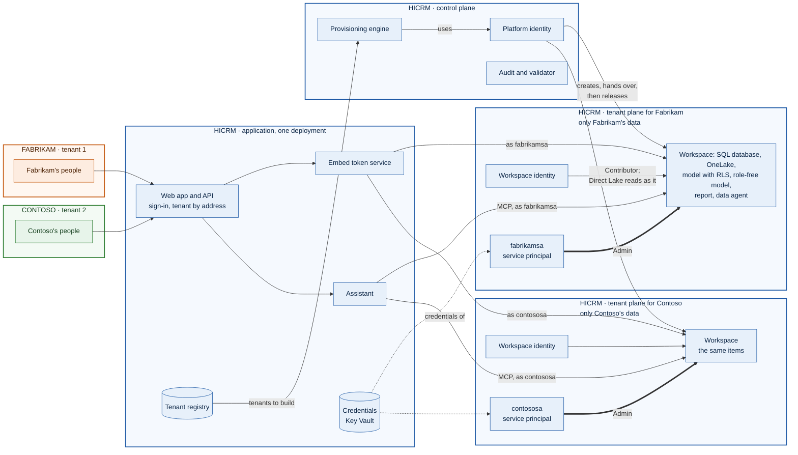

# A framework for multitenant applications on Microsoft Fabric

One application, many customers ("tenants"). Each tenant gets its own data, reports and AI on Microsoft Fabric,
isolated by Fabric itself rather than by application code alone. The tenants' people sign in to the application and
need no Microsoft Entra account and no Power BI license.

**Who's who in the sample.** HiCRM is the provider: it owns and runs the application, the Microsoft Entra tenant and
every identity in it, the capacity, and a workspace for each tenant. Its tenants, Fabrikam and Contoso, are customer
companies that own only their people and their data. "Tenant" in this document always means such a customer, never a
Microsoft Entra tenant: the whole deployment uses one Entra tenant, the provider's ([README.md](README.md#whos-who)).

This repository is the framework, plus a sample built on it: **HiCRM**, a small CRM whose customers each have a SQL
database, a semantic model with row-level security, an embedded Power BI report and a data agent. The framework
defines its rules as **controls** (section 6) and checks them with one command:

```powershell
npm run validate                         # against the Fabric emulator: two tenants, nothing leaves the machine
npm run validate -- --live --browser     # against this deployment, read-only, including what each person sees
```

| Section | Covers |
| --- | --- |
| [1. What the framework gives you](#1-what-the-framework-gives-you) | The parts, at a glance |
| [2. Principles](#2-principles) | The eight rules every decision follows |
| [3. Reference architecture](#3-reference-architecture) | Control plane, application, tenant planes |
| [4. Building blocks](#4-building-blocks) | Each part, its code, and what's specific to HiCRM |
| [5. Design decisions](#5-design-decisions) | The defaults, and when to choose otherwise |
| [6. Controls](#6-controls) | 34 controls, and how each is checked |
| [7. Validating a deployment](#7-validating-a-deployment) | The validator, the tests, and the latest results |
| [8. Tenant lifecycle](#8-tenant-lifecycle) | From onboarding to removal |
| [9. Adopting the framework](#9-adopting-the-framework-for-your-application) | Replacing HiCRM with your application |
| [10. Known limits](#10-known-limits) | What the framework doesn't do yet |
| [Appendix A](#appendix-a-latest-live-validation) | The latest live scorecard |

Related documents:
- [REQUIREMENTS.md](REQUIREMENTS.md): the roles, identities, credentials, tenant settings and workspace rules a deployment
  needs.
- [EMBEDDING.md](EMBEDDING.md): how the embedded reports, their credentials and row-level security work.
- [ARCHITECTURE.md](ARCHITECTURE.md): HiCRM's design.
- [MULTITENANCY.md](MULTITENANCY.md): the security review.
- [BUILDOUT.md](BUILDOUT.md): the build record, with every identity and permission.
- [DEPLOYMENT-ARCHITECTURES.md](DEPLOYMENT-ARCHITECTURES.md): production designs.
- [DATA-INTEGRATION.md](DATA-INTEGRATION.md): the future data integration add-on (Data Factory, Spark notebooks, a
  lakehouse).

## 1. What the framework gives you

- **A tenant registry and addresses.** Each tenant has a record, a web address (`https://<tenant>.<APP_DOMAIN>`), a
  logo and a color. A session works only at its own tenant's address.
- **An identity per tenant.** Each tenant has its own Entra service principal, which is Admin of that tenant's
  workspace and of nothing else. Every call made for the tenant runs as it.
- **A provisioning engine.** It builds a tenant's workspace and items from code, idempotently. The platform identity
  then hands the workspace over to the tenant's service principal and gives up its own access. Upgrades ship by
  running provisioning again.
- **A data plane per tenant.** A SQL database in Fabric, replicated to OneLake, read by Direct Lake semantic models
  through a fixed identity.
- **Embedded reports, with the app owning the data.** Short-lived embed tokens, created on the server, with each
  person's row-level security roles and report rights (view, edit, create), following Microsoft's guidance and its
  App-Owns-Data samples ([EMBEDDING.md](EMBEDDING.md)).
- **An AI assistant.** The tenant's data agent, called through its MCP endpoint, for people who may see every row,
  plus scoped answers from the database for everyone else.
- **Operations.** A drift audit, activity, question and report usage logs, rate limits, and operator sign-in with every look at
  tenant data recorded.
- **Controls and a validator.** 34 controls, each checked against the emulator, against live Fabric, in a browser, or
  by the automated tests.

## 2. Principles

| # | Principle | In practice |
| --- | --- | --- |
| P1 | **Isolate by construction** | One workspace per tenant, holding its database, models, reports and agent. A bug that confuses tenants meets a refusal from Fabric, not another tenant's data |
| P2 | **One identity per tenant** | Each tenant's calls run as its own service principal, which can reach only its own workspace |
| P3 | **A least-privilege control plane** | The platform identity creates and hands over, then keeps no standing role in any tenant workspace |
| P4 | **The app owns the data** | People never hold Entra tokens. The browser gets short-lived embed tokens for one report, with roles decided on the server |
| P5 | **Defense in depth for each person** | Row-level security in the model, the same scope in the application's SQL, and the AI only for people who may see every row |
| P6 | **No stored data credentials** | Models read OneLake as the workspace identity, through a cloud connection with no secret |
| P7 | **Everything as code, safe to repeat** | Items are generated from definitions, with fingerprints. Every step can run again, and a failed run can resume |
| P8 | **Verify, don't assume** | Each rule is a control with an automated check. A removed role counts only once a call is refused |

## 3. Reference architecture



- **Control plane.** The platform identity, the provisioning engine, the audit and the validator. It builds tenants
  and checks them, but holds no standing access to them.
- **Application.** One deployment serves every tenant. It works out the tenant from the address, and the person from
  the session. Each call for a tenant runs as that tenant's service principal.
- **Tenant planes.** One Fabric workspace per tenant, on a shared or a dedicated capacity. Each holds the tenant's
  items and has its own workspace identity. The provider owns and runs each workspace; the tenant owns only the data
  in it.

## 4. Building blocks

| Block | What it does | Framework code | HiCRM-specific code (replace for your app) |
| --- | --- | --- | --- |
| Tenant registry | Tenant records: edition, status, provisioning steps, Fabric IDs, logs | `src/platform/store.js` | None |
| Addresses and branding | Address to tenant; logo and color; host-bound sessions | `src/platform/tenancy.js`, `branding.js`, `sessions.js` | None |
| People and scope | Named sign-ins, each with a role and a scope | `src/platform/users.js` | The scope values: territories (`src/crm/schema.js`) |
| Identity broker | A service principal per tenant; its credential (federated, certificate, or a development secret); tokens through MSAL; credentials asked for at runtime, never read from project files | `src/platform/identities.js`, `secrets.js`, `src/auth/tokens.js`, `credential-types.js`, `certificates.js`, `runtime-secrets.js`, `scripts/bootstrap-identities.ps1` | None |
| Fabric client and emulator | Fabric and Power BI REST, long-running operations, retries. The emulator holds every identity to its workspace roles | `src/fabric/client.js`, `src/fabric/mock.js` | None |
| Provisioning engine | Workspace, capacity, service principal, items, connection, hand-over, release; upgrades by fingerprint | `src/platform/provisioner.js`, `agent.js`, `templates.js` | The item definitions: model, report, sample data (`src/crm/model.js`, `report.js`, `seed.js`) |
| Data access | A connection pool per tenant, signed in as the tenant's service principal; retries for transient faults | `src/crm/index.js`, `src/crm/stores.js` (generic) | Schema and queries (`src/crm/schema.js`, `repository.js`) |
| Embedded reports | V2 embed tokens with effective identity; per-person view, edit and create rights; refresh | `src/platform/reporting.js`, `users.js`, `public/embed-token.js`, `public/app.js` | The standard report and the roles (`src/crm/report.js`, `rolesFor`) |
| Assistant | The data agent over MCP; scoped answers; the question log | `src/platform/assistant.js`, `src/fabric/mcp.js` | Quick answers (`src/crm/insights.js`) |
| Audit and validation | Drift audit per tenant; report usage log; controls; validator; browser check, including a filter that tries to widen row-level security; a pre-publish check for credentials and environment IDs | `src/platform/audit.js`, `usage.js`, `validation.js`, `browser.js`, `scripts/validate.js`, `src/util/publishing.js`, `scripts/check-publish.js` | The probes (`src/crm/workload.js`) |
| Edge protection | Content Security Policy, Subresource Integrity, rate limits, operator sign-in | `src/app.js`, `src/http/*`, `src/platform/operators.js` | None |

**The workload contract.** The framework core (`src/auth`, `src/fabric`, `src/http`, `src/platform`) reaches the
sample only through `src/crm/workload.js`. `test/framework.test.js` fails if a core module imports anything else
from `src/crm`. Section 9 lists what the contract exports.

## 5. Design decisions

| Decision | Framework default | Choose otherwise when | Guidance |
| --- | --- | --- | --- |
| How tenants are isolated | **A workspace per tenant** | Many tiny tenants with one schema, where cost matters more than isolation: one shared model with a role per tenant | Microsoft recommends workspace-based isolation ([generate embed token](https://learn.microsoft.com/power-bi/developer/embedded/generate-embed-token#securing-your-data)) |
| Which identity works for a tenant | **An Entra service principal per tenant** | Only Power BI content, at large scale: service principal profiles. They don't cover Fabric REST APIs, so they can't own a SQL database or a data agent | [Profiles: limitations](https://learn.microsoft.com/power-bi/developer/embedded/embed-multi-tenancy#considerations-and-limitations) |
| Where the platform keeps access | **Released after hand-over** (`PLATFORM_WORKSPACE_ACCESS=release`) | Development only: `keep` | An identity can be in at most 1,000 workspaces ([profiles](https://learn.microsoft.com/power-bi/developer/embedded/embed-multi-tenancy#design-aspects)) |
| Capacity | **A shared F SKU per region**, with dedicated capacity for large or noisy tenants | Development: a trial (no data agents) | [Capacity planning](https://learn.microsoft.com/power-bi/developer/embedded/embedded-capacity-planning) |
| Operational store | **SQL database in Fabric**, replicated to OneLake automatically | Analytical ingestion: Lakehouse or Warehouse (the data integration add-on) | [SQL database in Fabric](https://learn.microsoft.com/fabric/database/sql/overview) |
| Semantic model | **Direct Lake on OneLake, with a fixed identity** | Small models with complex calculations: Import. Live data: DirectQuery | [Direct Lake overview](https://learn.microsoft.com/fabric/fundamentals/direct-lake-overview) |
| Row-level security | **Static roles per scope value**, chosen on the server | Per-person rules: one dynamic role with `USERNAME()` or `CUSTOMDATA()`, fed by the effective identity | [Embed a report with RLS](https://learn.microsoft.com/power-bi/developer/embedded/cloud-rls) |
| Embedding | **App owns data** (embed for your customers) | Internal users with licenses: user owns data | [Embedded analytics](https://learn.microsoft.com/power-bi/developer/embedded/embedded-analytics-power-bi) |
| AI | **The data agent over MCP**, on a role-free twin model, for people who see every row; scoped SQL answers for everyone else | Never point the agent at the model with roles: a service principal can't query it as a person | [Data agent MCP](https://learn.microsoft.com/fabric/data-science/data-agent-mcp-server) |
| Sign-in for tenants' people | Named sign-ins in the prototype | Production: Microsoft Entra External ID, or the application's own identity provider | [External ID](https://learn.microsoft.com/entra/external-id/customers/overview-customers-ciam) |
| Credentials | **Federated** (the app registrations trust the app's user-assigned managed identity: nothing to store or rotate); **certificates** where there's no managed identity, kept encrypted or in Key Vault; client secrets only in development. Tokens through MSAL. Whatever is secret is asked for at runtime | Kubernetes: a workload identity token file (`AZURE_FEDERATED_TOKEN_FILE`). Managed identities can't call data agents or the Power BI embedding APIs directly, so app registrations stay | [Service principal](https://learn.microsoft.com/power-bi/developer/embedded/embed-service-principal) |

## 6. Controls

Each control is a rule the framework promises. `src/platform/validation.js` holds the same catalog, and the validator
checks each control in one or more ways:

- **validator**: against a running platform, read-only. That's the emulator by default, or live Fabric with `--live`.
- **browser**: in Microsoft Edge or Google Chrome, with the embed tokens the application would issue (`--live --browser`).
- **tests**: by the automated tests (`npm test`). Their protections are mutation-checked: switching one off makes a
  test fail ([MULTITENANCY.md](MULTITENANCY.md) section 4).

| Control | Requirement | Checked by | Guidance |
| --- | --- | --- | --- |
| ISO-01 | Each tenant has its own workspace, database, models, report, data agent, connection and identities | validator; tests | [Multitenancy](https://learn.microsoft.com/power-bi/developer/embedded/embed-multi-tenancy) |
| ISO-02 | A tenant's identity is refused at every other tenant's workspace, items, models, reports and data agent | validator; tests | |
| ISO-03 | Sessions work only at their own tenant's address, and unknown host names are refused | tests | |
| ISO-04 | Customers never see Fabric errors, IDs or account names | tests | |
| IDN-01 | Each tenant has its own service principal, Admin of its own workspace and nothing else | validator; tests | [Service principal](https://learn.microsoft.com/power-bi/developer/embedded/embed-service-principal) |
| IDN-02 | The platform identity keeps no standing access to tenant workspaces, confirmed by a refused call | validator; tests | |
| IDN-03 | The workspace identity is Contributor of its own workspace and the models' only data credential | validator; tests | [Workspace identity](https://learn.microsoft.com/fabric/security/workspace-identity) |
| IDN-04 | No person has standing access to a tenant workspace, other than documented break-glass access | validator; tests | |
| IDN-05 | Service principals sign in with a federated credential or a certificate (client secrets only in development); stored credentials are encrypted at rest, in date and rotatable | validator; tests | [Certificates over secrets](https://learn.microsoft.com/power-bi/developer/embedded/embed-service-principal), [trust a managed identity](https://learn.microsoft.com/entra/workload-id/workload-identity-federation-config-app-trust-managed-identity) |
| IDN-06 | The service principal tenant settings apply only to a security group of the platform's service principals, and none of them can call the Fabric admin APIs that make changes | validator; tests | [Developer settings](https://learn.microsoft.com/fabric/admin/service-admin-portal-developer), [admin API settings](https://learn.microsoft.com/fabric/admin/service-admin-portal-admin-api-settings) |
| DAT-01 | Each tenant's database accepts that tenant's identity and refuses every other tenant's | validator (live); tests | |
| DAT-02 | Transient database faults, such as resuming after auto-pause, are retried; writes never run twice | tests | [SQL database billing](https://learn.microsoft.com/fabric/database/sql/usage-reporting) |
| DAT-03 | Database connection pools are bounded per tenant, and idle ones close | tests | |
| EMB-01 | Embed tokens are generated on the server by the tenant's identity with Generate Token V2, for one report and its model, view only | validator; tests | [Generate an embed token](https://learn.microsoft.com/power-bi/developer/embedded/generate-embed-token) |
| EMB-02 | Embed tokens are short-lived, created with a Microsoft Entra token that outlives them, and refreshed before they expire | validator; tests | [Refresh the access token](https://learn.microsoft.com/javascript/api/overview/powerbi/refresh-token) |
| EMB-03 | Only standard reports in the tenant's own workspace are embedded, and IDs from the browser are checked | tests | |
| EMB-04 | The browser gets an embed token and URL only: never a Microsoft Entra token, a secret or the token request | tests | [Security white paper](https://learn.microsoft.com/power-bi/guidance/white-paper-powerbi-security) |
| EMB-05 | Frames are limited to Power BI, and the Power BI client library is pinned with Subresource Integrity | tests | |
| EMB-06 | Editing and creating reports are granted per person; only people who may create get a token that names the workspace (Save as, New report) | tests | [App-Owns-Data Starter Kit](https://github.com/PowerBiDevCamp/App-Owns-Data-Starter-Kit) |
| RLS-01 | Reports read a model with row-level security, and every embed token names the viewer and their roles from the server's session | validator; tests | [Security features](https://learn.microsoft.com/power-bi/developer/embedded/embedded-row-level-security) |
| RLS-02 | People limited by row-level security never get a token for a model without it | validator; tests | |
| RLS-03 | The rendered report shows each person only their rows, and its numbers match the database | browser | [RLS with Power BI](https://learn.microsoft.com/fabric/security/service-admin-row-level-security) |
| RLS-04 | The app's own data access applies the same scope as the report | validator; tests | |
| RLS-05 | Direct Lake reads OneLake through a fixed-identity cloud connection with single sign-on off | validator; tests | [Direct Lake security](https://learn.microsoft.com/fabric/fundamentals/direct-lake-security-integration) |
| AI-01 | The data agent is called at its published MCP endpoint, as the tenant's identity | validator; tests | [Data agent MCP](https://learn.microsoft.com/fabric/data-science/data-agent-mcp-server) |
| AI-02 | The agent reads the role-free model, so only people who may see every row reach it | validator; tests | |
| AI-03 | The agent answers on the tenant capacity; when it cannot, the app falls back and records why | validator; tests | |
| AI-04 | Questions and answers are logged per tenant, bounded, and reading them is audited | validator; tests | [Purview for data agents](https://learn.microsoft.com/fabric/data-science/data-agent-purview-governance) |
| OPS-01 | Provisioning is idempotent and recovers from a failure at any step | tests | |
| OPS-02 | The drift audit passes for every tenant | validator; tests | |
| OPS-03 | Operators sign in, and every look at tenant data is recorded | tests | |
| OPS-04 | Rate limits apply per tenant and per user | tests | |
| OPS-05 | Tenants run on an active capacity that supports every workload: a paid F2 or larger for data agents | validator | [Prerequisites](https://learn.microsoft.com/fabric/data-science/data-agent-mcp-server#prerequisites) |
| OPS-06 | Report use is logged per tenant: who viewed or saved what, load and render times, and the token and correlation IDs | validator; tests | [App-Owns-Data Starter Kit](https://github.com/PowerBiDevCamp/App-Owns-Data-Starter-Kit) |

## 7. Validating a deployment

**Three levels, from fastest to most complete:**

| Command | What it checks | Needs |
| --- | --- | --- |
| `npm test` | Every control with "tests": 163 tests in about three minutes, all in-process, against the emulator. The emulator enforces workspace roles, so isolation is tested, not assumed | Node.js |
| `npm run validate` | Every "validator" control, against two tenants built in the emulator with the production settings (their own service principals, the platform identity released). Use it in CI | Node.js |
| `npm run validate -- --live --browser` | The same checks against this deployment's tenants and live Fabric. It also signs in to each tenant's database as each tenant, opens the standard report as a manager and a limited person, and compares what they see with the database | The deployment's settings (as for the server), Microsoft Edge or Google Chrome |

The live validator only reads: it lists, opens and asks, and changes nothing in Fabric or in the registry. It asks
each data agent one question. Options: `--tenant <name>` limits it to some tenants; `--json <file>` and
`--markdown <file>` save the results. The exit code is 1 when a control fails, so it can gate a release pipeline.

**What each result means:**

| Result | Meaning |
| --- | --- |
| PASS | Checked and met |
| WARN | Met with a reservation to review, such as a person with Admin rights or a trial capacity |
| FAIL | Not met. The evidence says why |
| SKIP | Not checkable in this mode (for example, SQL in the emulator, or the browser check without `--browser`) |
| TESTS | Checked by `npm test`, which the validator names but doesn't run |

**Latest results (2026-10-06):**

| Where | Result |
| --- | --- |
| `npm test` | All 163 tests pass |
| `npm run validate` (emulator) | All 23 validator controls pass, except the 2 skipped there by design (DAT-01 SQL, RLS-03 browser); 11 by tests |
| `npm run validate -- --live --browser` | 18 pass, 4 to review, 1 failing; 11 by tests. Both customers' service accounts sign in with certificates, and no report filter widened row-level security. Details in Appendix A |

The live run's open items, all about the environment rather than the framework:

| Control | Result | What it means | What to do |
| --- | --- | --- | --- |
| AI-03 | FAIL | The data agents refuse to run on the trial capacity (`FT1 SKU Not Supported`). Managers get quick answers from the database instead | Move the workspaces to a paid F2 or larger capacity |
| IDN-04 | WARN | The administrator who created the workspaces is still Admin of both | Remove them, or document them as break-glass access through a PIM-eligible group |
| IDN-05 | WARN | The platform identity signs in with a client secret (the pilot reuses an existing app registration). The customer service accounts use certificates | Give the platform app a certificate (`AZURE_CLIENT_CERTIFICATE_PATH`), or a federated credential once the app runs in Azure |
| IDN-06 | WARN | The service principal tenant settings (Fabric APIs, profiles, embedding) apply to the whole organization. The platform identity is in a group allowed the admin APIs, including those that make changes | A Fabric administrator limits the settings to a security group holding the platform and tenant service principals, and takes the platform identity out of the admin API group (or gives it a group of its own for the read-only admin APIs only) |
| OPS-05 | WARN | The trial capacity can't host data agents | The same as AI-03 |

## 8. Tenant lifecycle

| Stage | What happens | Who | Controls |
| --- | --- | --- | --- |
| Onboard | Registry record: name, edition, sign-in domains, address, logo | Operator (back office, CLI or `npm run setup`) | ISO-03 |
| Identity | The tenant's service principal: created by the platform (with `Application.ReadWrite.OwnedBy`) or by an Entra admin (`scripts/bootstrap-identities.ps1`) | Platform or Entra admin | IDN-01, IDN-05 |
| Provision | Workspace and capacity; the service principal made Admin; database, schema and sample data; workspace identity; models and connection; report; data agent | Provisioning engine | ISO-01, RLS-05, AI-02 |
| Hand over | The service principal owns the connection and takes over the models | Provisioning engine | IDN-03 |
| Release | The platform identity removes its own role. A refused call confirms it, since removal can take about an hour to apply | Provisioning engine; validator | IDN-02 |
| Operate | People sign in; reports, CRM and assistant run as the tenant's identity; audit and validation run on a schedule | Application; operators | EMB-*, RLS-*, AI-*, OPS-02 |
| Upgrade | Provisioning again: changed definitions (by fingerprint) are pushed; what works keeps working meanwhile | Provisioning engine | OPS-01 |
| Offboard | The workspace, the connection and (if the platform created it) the service principal are deleted | Provisioning engine | |

## 9. Adopting the framework for your application

1. **Keep the core**: `src/auth`, `src/fabric`, `src/http`, `src/platform`, and the scripts.
2. **Replace `src/crm` with your workload**, keeping the exports of `src/crm/workload.js`:

   | Export | What the framework uses it for |
   | --- | --- |
   | `createCrmService`, `createFabricSqlStore` | A tenant's database: pooled connections, signed in as the tenant's service principal, with retries |
   | `CRM_SCHEMA_VERSION` | The drift audit compares it with each tenant's schema |
   | `TERRITORIES` | The values a person's scope can take: here, the territories |
   | `rolesFor`, `ALL_TERRITORIES_ROLE` | A person's scope, turned into the model's row-level security roles |
   | `MODEL_NAME`, `ASSISTANT_MODEL_NAME`, `buildSemanticModelDefinition`, `agentTables` | The semantic model with roles, its role-free twin, and the tables the data agent sees |
   | `STARTER_REPORT_NAME`, `buildStarterReportDefinition` | The standard report every tenant gets |
   | `sampleSeedOf`, `pilotPersonas` | Sample data and people for pilots |
   | `QUICK_EXAMPLES` | What the assistant suggests when it can't answer |
   | `RLS_PROBE`, `AGENT_PROBE_QUESTION` | What the validator opens and asks to prove row-level security and the agent |

3. **Rename what still says CRM**: some step names and the customer API routes (`src/routes/customer.js`) are
   HiCRM's.
4. **Set up the tenant** as in [REQUIREMENTS.md](REQUIREMENTS.md): tenant settings, a capacity, the platform identity,
   and a service principal per tenant, each with a certificate or a federated credential.
5. **Validate**: `npm test` and `npm run validate`, then `npm run validate -- --live --browser` against your
   deployment.

## 10. Known limits

- **AI for people limited by row-level security.** A data agent runs as the service principal that calls it, so it
  can't apply a person's roles. The framework sends only people who may see every row to the agent, and answers
  everyone else from the database. Revisit this when data agents accept an effective identity.
- **Fabric Embed** (preview) can't embed Fabric items for application users ("app owns data"), so reports stay Power
  BI reports.
- **Sign-in** is a local prototype. Production uses Microsoft Entra External ID or the application's identity provider.
- **One deployment.** The registry is a JSON file, and rate limits are in memory. Scaling out needs a database, a
  shared store and a durable provisioning queue ([DEPLOYMENT-ARCHITECTURES.md](DEPLOYMENT-ARCHITECTURES.md)).
- **Credentials.** Certificates and federated credentials are supported for every service principal, and production
  refuses client secrets. Federated credentials need the app hosted in Azure with a user-assigned managed identity; they
  were tested with a stand-in for the managed identity, not live. Certificates were tested live.
- **The browser check** (RLS-03) needs live Power BI and Edge or Chrome. The agent checks need a capacity that runs
  data agents.

## Appendix A: Latest live validation

Generated with `npm run validate -- --live --browser --markdown <file>` against the pilot (Fabrikam and Contoso, on
the trial capacity).

### Framework validation, live: Fabrikam, Contoso (2026-10-06 20:58 UTC)

| Control | Requirement | Result | Evidence |
| --- | --- | --- | --- |
| ISO-01 | Each tenant has its own workspace, database, models, report, data agent, connection and identities | **PASS** | Fabrikam, Contoso: each has its own workspace, database, reports model, agent model, standard report, data agent, connection, service principal, workspace identity. |
| ISO-02 | A tenant's identity is refused at every other tenant's workspace, items, models, reports and data agent | **PASS** | Fabrikam's identity is refused at Contoso's workspace, items, semantic models, embed token for its report, data agent.<br>Contoso's identity is refused at Fabrikam's workspace, items, semantic models, embed token for its report, data agent. |
| ISO-03 | Sessions work only at their own tenant's address, and unknown host names are refused | **TESTS** | npm test: `tenancy.test.js`, `signins.test.js`, `isolation.test.js` |
| ISO-04 | Customers never see Fabric errors, IDs or account names | **TESTS** | npm test: `isolation.test.js` |
| IDN-01 | Each tenant has its own service principal, Admin of its own workspace and nothing else | **PASS** | fabrikamsa sees one workspace, Fabrikam's, and is its Admin.<br>contososa sees one workspace, Contoso's, and is its Admin. |
| IDN-02 | The platform identity keeps no standing access to tenant workspaces, confirmed by a refused call | **PASS** | The platform identity is refused at Fabrikam's workspace (HTTP 403).<br>The platform identity is refused at Contoso's workspace (HTTP 403). |
| IDN-03 | The workspace identity is Contributor of its own workspace and the models' only data credential | **PASS** | Fabrikam: Contributor<br>Contoso: Contributor |
| IDN-04 | No person has standing access to a tenant workspace, other than documented break-glass access | **WARN** | Fabrikam: An administrator (User) has Admin. Remove it unless it's deliberate break-glass access.<br>Contoso: An administrator (User) has Admin. Remove it unless it's deliberate break-glass access. |
| IDN-05 | Service principals sign in with a federated credential or a certificate (client secrets only in development); stored credentials are encrypted at rest, in date and rotatable | **WARN** | Fabrikam: fabrikamsa signs in for Fabrikam only, with a certificate valid until 2027-10-06.<br>Contoso: contososa signs in for Contoso only, with a certificate valid until 2027-10-06.<br>Stored credentials are encrypted at rest (AES-256-GCM, keyed by SECRETS_KEY, which is asked for at start or comes from the environment, never from the data folder). Production uses Key Vault.<br>The platform identity signs in with a client secret. Use a certificate (AZURE_CLIENT_CERTIFICATE_PATH) or a federated credential (MANAGED_IDENTITY_CLIENT_ID); production refuses secrets. |
| IDN-06 | The service principal tenant settings apply only to a security group of the platform's service principals, and none of them can call the Fabric admin APIs that make changes | **WARN** | "Service principals can call Fabric public APIs" applies to the entire organization. Limit it to a security group holding the platform identity and every tenant's service principal.<br>"Service principals can create workspaces, connections, and deployment pipelines" applies to the entire organization. Limit it to a security group holding the platform identity and every tenant's service principal.<br>The platform identity reads these settings through "Service principals can access read-only admin APIs" (the admin API group). It's optional: without it, check them in the admin portal.<br>"Service principals can access admin APIs used for updates" applies to the admin API group. The platform identity reads these settings through the admin API group, so it can also call the Fabric admin APIs that make changes, such as updating tenant settings. It needs none: take it out of the admin API group, and give it a group of its own for "Service principals can access read-only admin APIs" if the validator should keep reading them. |
| DAT-01 | Each tenant's database accepts that tenant's identity and refuses every other tenant's | **PASS** | Fabrikam: its own identity reads its database (120 accounts).<br>Contoso: its own identity reads its database (120 accounts).<br>Fabrikam's identity is refused by Contoso's database (Login failed for user '<token-identified principal>'.Reason: Validation of user's permiss…).<br>Contoso's identity is refused by Fabrikam's database (Login failed for user '<token-identified principal>'.Reason: Validation of user's permiss…). |
| DAT-02 | Transient database faults, such as resuming after auto-pause, are retried; writes never run twice | **TESTS** | npm test: `crm.test.js` |
| DAT-03 | Database connection pools are bounded per tenant, and idle ones close | **TESTS** | npm test: `robustness.test.js` |
| EMB-01 | Embed tokens are generated on the server by the tenant's identity with Generate Token V2, for one report and its model, view only | **PASS** | Fabrikam, manager: fabrikamsa got a token for "Sales overview" and its model only, view only.<br>Fabrikam, rep: fabrikamsa got a token for "Sales overview" and its model only, view only.<br>Contoso, manager: contososa got a token for "Sales overview" and its model only, view only.<br>Contoso, rep: contososa got a token for "Sales overview" and its model only, view only. |
| EMB-02 | Embed tokens are short-lived, created with a Microsoft Entra token that outlives them, and refreshed before they expire | **PASS** | Fabrikam, manager: 30-minute token (expires 21:28 UTC).<br>Fabrikam, rep: 30-minute token (expires 21:28 UTC).<br>Contoso, manager: 30-minute token (expires 21:29 UTC).<br>Contoso, rep: 30-minute token (expires 21:29 UTC). |
| EMB-03 | Only standard reports in the tenant's own workspace are embedded, and IDs from the browser are checked | **TESTS** | npm test: `customer-app.test.js`, `standard-report.test.js`, `isolation.test.js` |
| EMB-04 | The browser gets an embed token and URL only: never a Microsoft Entra token, a secret or the token request | **TESTS** | npm test: `customer-app.test.js`, `robustness.test.js` |
| EMB-05 | Frames are limited to Power BI, and the Power BI client library is pinned with Subresource Integrity | **TESTS** | npm test: `admin-api.test.js`, `robustness.test.js` |
| EMB-06 | Editing and creating reports are granted per person; only people who may create get a token that names the workspace (Save as, New report) | **TESTS** | npm test: `personas.test.js` |
| RLS-01 | Reports read a model with row-level security, and every embed token names the viewer and their roles from the server's session | **PASS** | Fabrikam: "Sales overview" reads HiCRM Insights, which requires the viewer's identity and roles.<br>Fabrikam, manager leah.thompson@fabrikam.com: effective identity with role All territories.<br>Fabrikam, rep drew.collins@fabrikam.com: effective identity with role Texas.<br>Contoso: "Sales overview" reads HiCRM Insights, which requires the viewer's identity and roles.<br>Contoso, manager maria.alvarez@contoso.com: effective identity with role All territories.<br>Contoso, rep sam.rivera@contoso.com: effective identity with role Texas. |
| RLS-02 | People limited by row-level security never get a token for a model without it | **PASS** | Fabrikam: no standard report reads HiCRM Insights - Assistant, the model without row-level security.<br>Contoso: no standard report reads HiCRM Insights - Assistant, the model without row-level security. |
| RLS-03 | The rendered report shows each person only their rows, and its numbers match the database | **PASS** | Fabrikam, manager leah.thompson@fabrikam.com: shows Georgia 2828500, Texas 2229000, New Mexico 455000, as the database does. A report filter for every state still shows Georgia, Texas, New Mexico.<br>Fabrikam, rep drew.collins@fabrikam.com: shows Texas 2229000, as the database does. A report filter for every state still shows Texas.<br>Contoso, manager maria.alvarez@contoso.com: shows Georgia 2151000, Texas 2145500, New Mexico 712000, as the database does. A report filter for every state still shows Georgia, Texas, New Mexico.<br>Contoso, rep sam.rivera@contoso.com: shows Texas 2145500, as the database does. A report filter for every state still shows Texas. |
| RLS-04 | The app's own data access applies the same scope as the report | **PASS** | Fabrikam, manager (every territory): sees Georgia, Texas, New Mexico.<br>Fabrikam, rep (Texas): sees Texas.<br>Contoso, manager (every territory): sees Georgia, Texas, New Mexico.<br>Contoso, rep (Texas): sees Texas. |
| RLS-05 | Direct Lake reads OneLake through a fixed-identity cloud connection with single sign-on off | **PASS** | Fabrikam: HiCRM OneLake <fabrikam-workspace-id> <fabrikam-service-account-app-id>: workspace identity, no single sign-on, no stored secret<br>Contoso: HiCRM OneLake <contoso-workspace-id>: workspace identity, no single sign-on, no stored secret |
| AI-01 | The data agent is called at its published MCP endpoint, as the tenant's identity | **PASS** | Fabrikam: https://api.fabric.microsoft.com/v1/mcp/workspaces/<fabrikam-workspace-id>/dataagents/<fabrikam-data-agent-id>/agent reached the published agent as fabrikamsa, and the capacity refused to run it.<br>Contoso: https://api.fabric.microsoft.com/v1/mcp/workspaces/<contoso-workspace-id>/dataagents/<contoso-data-agent-id>/agent reached the published agent as contososa, and the capacity refused to run it. |
| AI-02 | The agent reads the role-free model, so only people who may see every row reach it | **PASS** | Fabrikam: the published agent reads the role-free model.<br>Fabrikam: none of the 6 logged question(s) from people limited to territories reached the agent.<br>Contoso: the published agent reads the role-free model.<br>Contoso: none of the 5 logged question(s) from people limited to territories reached the agent. |
| AI-03 | The agent answers on the tenant capacity; when it cannot, the app falls back and records why | **FAIL** | Fabrikam: MCP initialize error -32003: FT1 SKU Not Supported. Data agents need a paid F2 or larger capacity (or P1 with Fabric); until then the app gives quick answers.<br>Contoso: MCP initialize error -32003: FT1 SKU Not Supported. Data agents need a paid F2 or larger capacity (or P1 with Fabric); until then the app gives quick answers. |
| AI-04 | Questions and answers are logged per tenant, bounded, and reading them is audited | **PASS** | Fabrikam: 15 question(s) logged (at most 200), 10 with their answers.<br>Contoso: 10 question(s) logged (at most 200), 10 with their answers. |
| OPS-01 | Provisioning is idempotent and recovers from a failure at any step | **TESTS** | npm test: `robustness.test.js`, `provisioner.test.js` |
| OPS-02 | The drift audit passes for every tenant | **PASS** | Fabrikam: audit 9 pass, 2 to review, 0 failing.<br>Contoso: audit 9 pass, 2 to review, 0 failing. |
| OPS-03 | Operators sign in, and every look at tenant data is recorded | **TESTS** | npm test: `robustness.test.js`, `standard-report.test.js` |
| OPS-04 | Rate limits apply per tenant and per user | **TESTS** | npm test: `robustness.test.js` |
| OPS-05 | Tenants run on an active capacity that supports every workload: a paid F2 or larger for data agents | **WARN** | Fabrikam: capacity <fabrikam-capacity-id> isn't visible to the platform identity, but the data agent named its SKU, FT1: a trial, fine for development. Production needs a paid F SKU, and data agents need F2 or larger.<br>Contoso: capacity <fabrikam-capacity-id> isn't visible to the platform identity, but the data agent named its SKU, FT1: a trial, fine for development. Production needs a paid F SKU, and data agents need F2 or larger. |
| OPS-06 | Report use is logged per tenant: who viewed or saved what, load and render times, and the token and correlation IDs | **PASS** | Fabrikam: 6 entries (at most 500): 6 views, 6 with load and render times, 6 with token and correlation IDs.<br>Contoso: 6 entries (at most 500): 6 views, 6 with load and render times, 6 with token and correlation IDs. |

18 pass, 4 to review, 1 failing, 0 skipped; 11 verified by the automated tests.
