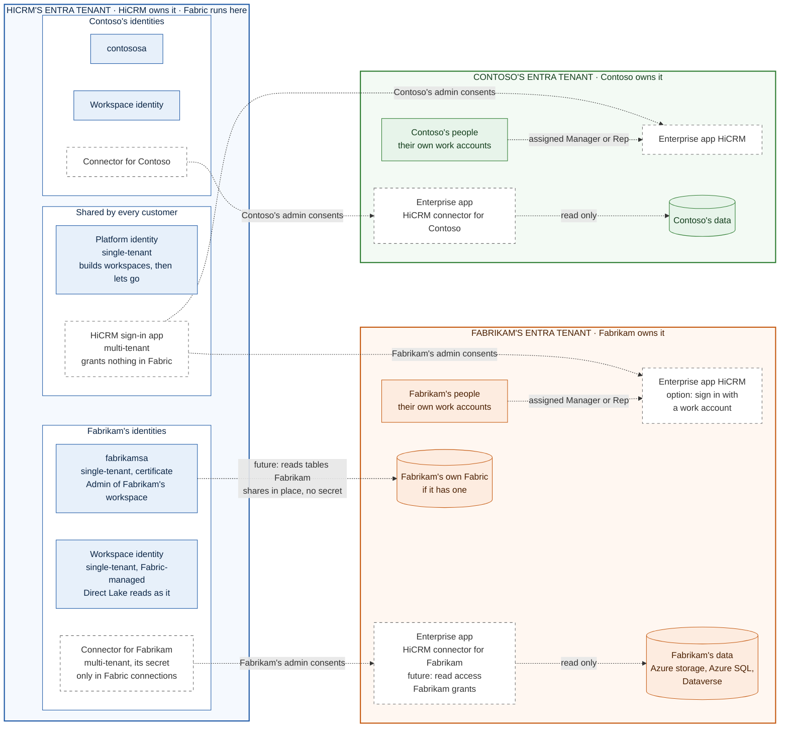
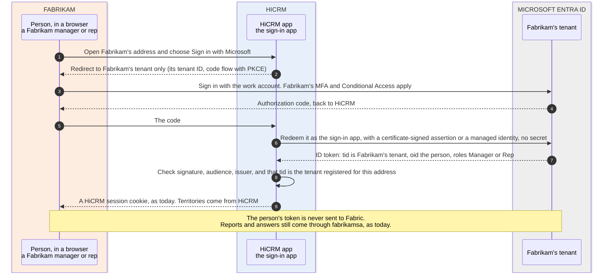
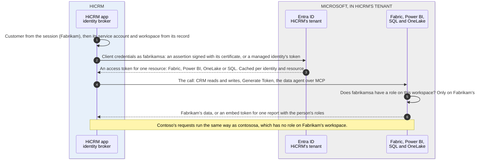

# Identities and authentication across Microsoft Entra tenants

Every company here has its own Microsoft Entra tenant: HiCRM, the SaaS provider, and each customer, such as Fabrikam
and Contoso. Fabric, every customer's workspace and every identity HiCRM's code signs in as live in **HiCRM's** tenant.
Fabrikam's tenant holds Fabrikam's people and Fabrikam's own systems; Contoso's holds Contoso's. This document lists
every identity, the tenant it lives in and who controls it, and shows how each sign-in works:

- today, built and running;
- when a customer's people sign in with their work accounts (an option, not built);
- when the data integration add-on reads a customer's own systems ([DATA-INTEGRATION.md](DATA-INTEGRATION.md), not
  built).

Two words to keep apart. An **Entra tenant** is a Microsoft Entra directory. A **customer** is a company that
subscribes to HiCRM; the code and [FRAMEWORK.md](FRAMEWORK.md) call a customer a "tenant" too
([who's who](README.md#whos-who)). In this document, "tenant" always means an Entra tenant.

| Section | Covers |
| --- | --- |
| [1. Quick answers](#1-quick-answers) | The short version |
| [2. The Entra tenants](#2-the-entra-tenants) | What each tenant holds, and a map of every identity |
| [3. Every identity](#3-every-identity) | Where it lives, who creates it, how it signs in, what it can reach |
| [4. How each sign-in works](#4-how-each-sign-in-works) | People, HiCRM calling Fabric, and the add-on reading a customer's data |
| [5. Who does what, on each side](#5-who-does-what-on-each-side) | The admin roles, in HiCRM's tenant and in the customer's |
| [6. Rules](#6-rules) | What keeps the tenants apart |
| [7. Checked, and to test](#7-checked-and-to-test) | What was checked live, what comes from Microsoft Learn, what needs a second tenant |

## 1. Quick answers

| Question | Answer |
| --- | --- |
| How many Entra tenants are there? | One per company: HiCRM's, Fabrikam's and Contoso's. Today HiCRM uses only its own: the customers' people sign in with HiCRM sign-ins, and no customer system is read. A customer's tenant takes part only if the customer opts in |
| Which identities does HiCRM use today? | All in its own tenant: the platform identity, one service account per customer (`fabrikamsa`, `contososa`) and each workspace's identity |
| How does HiCRM sign in to Fabric? | As the customer's own service account, through MSAL, with a certificate (a federated credential in production). Never with a person's token |
| Does anything of a customer's get access in HiCRM's tenant? | No: no guest accounts and no roles. The customers' people never hold a token that Fabric accepts |
| Does HiCRM get access in a customer's tenant? | Only if the customer opts in, only what the customer grants, and the customer can take it back at any time: sign-in for its people, or read access to named data |
| How would the add-on read Fabrikam's data? | Data in Fabrikam's own Fabric: Fabrikam shares it in place to `fabrikamsa`, with no secret. Azure storage, Azure SQL and Dataverse: a Fabric connection signs in to Fabrikam's tenant as the **connector for Fabrikam**, a HiCRM app that Fabrikam admits and gives read access. On-premises systems: a data gateway on Fabrikam's network |
| What can't cross tenants? | Workspace identities, organizational accounts for storage in another tenant, and virtual network data gateways. Azure SQL documents that service principals from another tenant fail, so it's tested first (section 7) |

## 2. The Entra tenants

| | HiCRM's Entra tenant | Fabrikam's Entra tenant | Contoso's Entra tenant |
| --- | --- | --- | --- |
| Owned and run by | HiCRM | Fabrikam | Contoso |
| Holds | Fabric: the capacity and a workspace per customer. The platform identity, a service account and a workspace identity per customer, and HiCRM's staff | Fabrikam's people and groups, its Azure subscriptions, Microsoft 365 and Dynamics 365, and its own Fabric if it has one | The same, for Contoso |
| HiCRM's identities in it | All of HiCRM's own | Only if Fabrikam opts in: the service principals of HiCRM's sign-in app and of the connector for Fabrikam, with what Fabrikam grants them | The same, with Contoso's own connector |
| The customers' identities in it | None: no guests and no roles | Fabrikam's own | Contoso's own |

Blue: HiCRM's tenant. Orange: Fabrikam's. Green: Contoso's. Solid: built and running today. Dashed: the work-account
option and the data integration add-on, not built. "Admin consents" means an admin of the customer's tenant admits one
of HiCRM's multi-tenant apps, which creates its service principal (an "enterprise application") in that tenant.

## 3. Every identity

| Identity | Lives in | Kind | Created by | Signs in with | Can reach | Status |
| --- | --- | --- | --- | --- | --- | --- |
| Platform identity | HiCRM's tenant | Single-tenant app registration | An Entra admin | A certificate (or a client secret in development); in production, a federated credential trusting a managed identity | Fabric APIs; Contributor on the capacity; a customer's workspace until the hand-over | Built |
| `fabrikamsa`, `contososa` | HiCRM's tenant | Single-tenant app registration, one per customer | An Entra admin, or the platform | A certificate kept encrypted by the platform, or a federated credential | Admin of its own customer's workspace, and nothing else | Built |
| Workspace identity | HiCRM's tenant | Single-tenant service principal, managed by Fabric | Fabric | Fabric holds its credential | Contributor of its own workspace. The semantic models read OneLake as it | Built |
| HiCRM's operators | HiCRM's back office | People | HiCRM | The back-office key | The back office, where every look at a customer's data is logged | Built |
| HiCRM's support staff | HiCRM's tenant | A security group | HiCRM | Their HiCRM accounts | Viewer of the customers' workspaces, optional | Built |
| Customers' people, today | No Entra tenant: HiCRM's sign-in store | Email and password | HiCRM's setup and operators | Passwords of 15 characters or more, stored hashed with scrypt | HiCRM at their company's address. Nothing in Fabric | Built |
| Customers' people, with work accounts | Their own company's tenant | Work accounts | The customer | Their company's sign-in, with its MFA and Conditional Access | HiCRM at their company's address. Nothing in Fabric | Option, not built |
| HiCRM sign-in app | HiCRM's tenant, plus a service principal in each customer tenant that admits it | Multi-tenant app registration, one for every customer | HiCRM | A certificate, or HiCRM's managed identity as a federated credential | Sign-in only: `openid`, `profile`, `email`, and the app roles Manager and Rep | Option, not built |
| Connector for Fabrikam, and one for each other customer with the add-on | HiCRM's tenant, plus a service principal in Fabrikam's tenant only | Multi-tenant app registration, one per customer | HiCRM's platform | A client secret held only by Fabrikam's Fabric connections | What Fabrikam grants it in Fabrikam's tenant, read-only. Nothing in HiCRM's | Add-on, not built |
| On-premises data gateway | Fabrikam's network, registered to HiCRM's tenant | A gateway | Fabrikam's IT installs it; a HiCRM engineer registers it | Read-only accounts Fabrikam creates in its systems, encrypted for the gateway | Fabrikam's on-premises systems | Add-on, not built |
| Integration users in SaaS apps | The SaaS app, for example Salesforce | App users | Fabrikam | OAuth, held by the connection | What the app grants them | Add-on, not built |

## 4. How each sign-in works

### 4.1 People sign in, today

Fabrikam's people sign in at Fabrikam's address with an email address and a password that HiCRM issued: at least 15
characters, stored hashed with scrypt. The session cookie (HttpOnly, SameSite=Lax, and Secure over HTTPS) works only at
that address. No Entra tenant is involved, and the people receive nothing that Fabric accepts: their reports come as
embed tokens that HiCRM creates (section 4.3).

### 4.2 People sign in with their work accounts (option, not built)

For customers that want single sign-on, HiCRM can let their people sign in with their work accounts, in their own
tenant.

- **One sign-in app for every customer.** A multi-tenant app registration in HiCRM's tenant that asks for sign-in only
  (`openid`, `profile`, `email`). It grants nothing in Fabric, so one app can serve every customer.
- **Fabrikam admits it once.** A Cloud Application Administrator or Application Administrator in Fabrikam's tenant
  grants admin consent, which creates the app's service principal there
  ([multi-tenant apps](https://learn.microsoft.com/entra/identity-platform/howto-convert-app-to-be-multi-tenant),
  [who can consent](https://learn.microsoft.com/entra/identity/enterprise-apps/grant-admin-consent)). They set
  **Assignment required** and assign people or groups to the app roles Manager and Rep
  ([assignment](https://learn.microsoft.com/entra/identity-platform/howto-restrict-your-app-to-a-set-of-users)).
- **Only Fabrikam's tenant signs in at Fabrikam's address.** HiCRM records Fabrikam's tenant ID with the customer,
  sends people to that tenant only, and accepts an ID token only if its issuer and `tid` are Fabrikam's, as Microsoft's
  guidance for multi-tenant apps requires
  ([issuer](https://learn.microsoft.com/entra/identity-platform/howto-convert-app-to-be-multi-tenant#update-your-code-to-handle-multiple-issuer-values)).
  A Contoso account is refused at Fabrikam's address.
- **Fabrikam's policies apply.** Fabrikam's MFA and Conditional Access run at every sign-in, and a disabled account
  can't sign in again.
- **No secret.** HiCRM redeems the code as the sign-in app with a certificate, or with its managed identity as a
  federated credential, which Entra supports across tenants
  ([secretless, across tenants](https://learn.microsoft.com/entra/identity/managed-identities-azure-resources/secretless-authentication#accesses-microsoft-entra-protected-resources-across-tenants)).
- **Nothing changes for Fabric.** The person's token stays with HiCRM. Reports and answers still come through
  `fabrikamsa` (section 4.3), and territories are still kept in HiCRM.
- **Why not guest accounts.** Inviting Fabrikam's people into HiCRM's tenant would put them in the directory that holds
  Fabric and every customer's workspace, where one wrong role assignment would reach a workspace. Multi-tenant sign-in
  leaves them in their own tenant.

### 4.3 HiCRM calls Fabric (today)

- **One identity per customer, chosen from the session.** HiCRM takes the customer from the session, never from the
  request, and uses that customer's service account and workspace.
- **MSAL client credentials.** The service account signs a 10-minute assertion with its certificate, or presents a
  managed identity's token in production. HiCRM's tenant returns a token for one resource: Fabric
  (`api.fabric.microsoft.com`), Power BI (`analysis.windows.net/powerbi/api`), OneLake (`storage.azure.com`) or SQL
  (`database.windows.net`). Tokens are cached per identity and resource.
- **Fabric checks the workspace role.** `fabrikamsa` is Admin of Fabrikam's workspace and of nothing else, so a request
  that mixes up customers is refused.
- **People get embed tokens, never Entra tokens.** Generate Token V2, called as `fabrikamsa`, returns a token for one
  report with the person's row-level security roles ([EMBEDDING.md](EMBEDDING.md)).
- **The data agent** is called over MCP with `fabrikamsa`'s Fabric token.
- **Inside Fabric,** the semantic model reads OneLake as the workspace identity, through a cloud connection that holds
  no secret.
- **Contoso** works the same way, as `contososa`. The platform identity only builds workspaces, then lets go.

### 4.4 The add-on reads the customer's systems (future)

The pipeline, the notebooks and `fabrikamsa` are in HiCRM's tenant; the data is in Fabrikam's. What crosses depends on
where the data is:

| Where Fabrikam's data is | How HiCRM reads it | Identity in Fabrikam's tenant | What Fabrikam grants | Notes |
| --- | --- | --- | --- | --- |
| Fabrikam's own Fabric: a lakehouse, warehouse or mirrored database | External data sharing: in place, read-only, no copy and no secret | None. Fabrikam shares to `fabrikamsa`, named by its object ID and HiCRM's tenant ID | A share of named tables or folders | Fabrikam turns on **External data sharing**, and HiCRM **Users can accept external data shares**. `fabrikamsa` accepts the share into Fabrikam's lakehouse as a shortcut, and Fabrikam can revoke it at any time. Data may be read across regions ([external data sharing](https://learn.microsoft.com/fabric/governance/external-data-sharing-overview), [create a share](https://learn.microsoft.com/rest/api/fabric/core/external-data-shares-provider/create-external-data-share)) |
| Azure Data Lake Storage or Blob storage | A OneLake shortcut (no copy) or a pipeline copy | The connector for Fabrikam | Storage Blob Data Reader on one container | Or a read-only SAS token for the container, with an expiry date. Storage in another tenant needs a service principal or a SAS token ([shortcuts](https://learn.microsoft.com/fabric/onelake/create-adls-shortcut#limitations)) |
| Dynamics 365 or Dataverse | A pipeline copy with the Dataverse connector | The connector for Fabrikam, as an application user | A read-only security role | Dataverse documents this pattern for multi-tenant apps ([Dataverse](https://learn.microsoft.com/power-apps/developer/data-platform/use-multi-tenant-server-server-authentication)) |
| Azure SQL Database | A pipeline copy | The connector for Fabrikam, as a database user | `SELECT` on a schema | Test first: Azure SQL documents that "service principals can't authenticate across tenants' boundaries" ([Azure SQL](https://learn.microsoft.com/azure/azure-sql/database/authentication-aad-service-principal#limitations)). If it refuses the connector, use a service principal that Fabrikam creates in its own tenant, or a read-only SQL login |
| SharePoint or OneDrive files | Fabrikam copies them to its Azure storage (above), or people upload them in HiCRM (built) | None | Nothing | For pipelines, Fabric's SharePoint connector documents organizational accounts and workspace identities only ([connector](https://learn.microsoft.com/fabric/data-factory/connector-sharepoint-online-list-overview)), and a workspace identity can't cross tenants. The connections API also lists a service principal: test it before relying on it |
| On-premises databases, ERP and files | A pipeline copy through an on-premises data gateway (section 4.5) | None in Entra | A read-only account in each source system | |
| SaaS apps such as Salesforce | A pipeline copy with the app's connector | None in Entra | An integration user in the app | Salesforce connections take OAuth only (checked live): the integration user signs in once, when the connection is created |

Reading Fabrikam's Azure storage, step by step:

- **Two identities in one run.** `fabrikamsa` runs the pipeline and writes the copy into Fabrikam's lakehouse, in
  HiCRM's tenant. The connection signs in to Fabrikam's tenant as the connector for Fabrikam. A Fabric connection holds
  its own credential, so `fabrikamsa` itself never needs access in Fabrikam's tenant.
- **Why a connector, and not one of HiCRM's existing identities:**
  - The workspace identity is a single-tenant app (checked live), and "Workspace identity isn't supported in B2B or
    cross-tenant scenarios" ([workspace identity](https://learn.microsoft.com/fabric/security/workspace-identity#considerations-and-limitations)).
    It keeps reading the CRM tables, which are in HiCRM's tenant.
  - `fabrikamsa` could be made multi-tenant, but a Fabric connection takes a client secret for a service principal: no
    certificate and no federated credential (checked live). HiCRM keeps its own identities free of secrets.
  - A separate connector also limits what a leaked secret opens: the read access Fabrikam granted, never Fabrikam's
    workspace.
- **One connector per customer.** Contoso's connector is a different app, which only Contoso's admins admit. Entra has
  no setting that limits which tenants can admit a multi-tenant app, but admitting it grants nothing: access comes only
  from what each tenant's own admins assign. Each connection names its customer's tenant ID, and a control will check
  it.
- **The secret.** HiCRM's platform creates it on the connector app, writes it straight into the connection and keeps no
  copy; Fabric's API never returns it. It's rotated before it expires: a new secret, the connection updated, the old
  secret deleted. A Key Vault reference could hold it instead, and Fabric would read the latest version at run time
  ([Key Vault references](https://learn.microsoft.com/fabric/data-factory/azure-key-vault-reference-overview)), but the
  reference itself signs in with a person's account or another service principal's secret (checked live): it moves the
  secret rather than removing it.
- **If Fabrikam won't admit outside apps,** Fabrikam creates a service principal in its own tenant, grants it the same
  read access and hands its secret over once; HiCRM puts it straight into the connection. Fabrikam then rotates it.
- **If HiCRM's own code ever reads Fabrikam's tenant directly** (not through Fabric), the connector can trust HiCRM's
  managed identity instead of using a secret, as the sign-in app does.
- **Notebooks hold no credentials for Fabrikam's tenant.** They read what the pipeline copied and the CRM tables, all
  in Fabrikam's workspace, as `fabrikamsa`.
- **Fabrikam sees and controls it.** Every token issued to the connector shows in Fabrikam's sign-in logs. Deleting the
  enterprise application or a role assignment stops HiCRM at once; so does revoking a share.

### 4.5 On-premises systems, through a gateway (future)

- Fabrikam's IT installs an on-premises data gateway on a machine in Fabrikam's network. It connects out to Azure Relay
  ([communication](https://learn.microsoft.com/data-integration/gateway/service-gateway-communication)).
- It's registered to **HiCRM's** tenant, where the connections that use it are. Registering needs a person's account:
  `Add-DataGatewayCluster` "must be run with a user based credential"
  ([PowerShell](https://learn.microsoft.com/powershell/module/datagateway/add-datagatewaycluster)). So a HiCRM engineer
  completes the registration, signed in with a HiCRM account kept for Fabrikam's gateways, in a session with
  Fabrikam's IT. Fabrikam gets no HiCRM account.
- If Fabrikam limits which tenants its machines may register gateways to (`AllowedRegistrationTenants`), it adds
  HiCRM's tenant ID for this machine
  ([tenant registration](https://learn.microsoft.com/data-integration/gateway/service-gateway-tenant-registration)).
- Fabrikam creates a read-only account in each source system. Its password is encrypted with the gateway's public key
  when it's entered, and the gateway re-encrypts it with its own key before it's stored, so "the Power BI service never
  has access to the unencrypted data"
  ([security white paper](https://learn.microsoft.com/power-bi/guidance/white-paper-powerbi-security)).
- `fabrikamsa` creates the gateway's connections through the Fabric API, once it has permission on the gateway
  ([Create Connection](https://learn.microsoft.com/rest/api/fabric/core/connections/create-connection)).
- A virtual network data gateway can't stand in for it: those can't be created across tenants
  ([virtual network gateways](https://learn.microsoft.com/data-integration/vnet/create-data-gateways)).

## 5. Who does what, on each side

| Who | Where | Does | For |
| --- | --- | --- | --- |
| An Entra admin, or HiCRM's platform with `Application.ReadWrite.OwnedBy` | HiCRM's tenant | Creates the platform identity and a service account per customer; for the options, the sign-in app (once) and a connector per customer | Today, and the options |
| HiCRM's platform | HiCRM's tenant | Rotates the connectors' secrets, straight into the connections | Add-on |
| A Fabric administrator | HiCRM's tenant | Turns on **Users can accept external data shares**, for the service accounts' group only | Add-on, data in a customer's Fabric |
| A HiCRM engineer | HiCRM's tenant | Registers a customer's gateway, in a session with the customer's IT | Add-on, on-premises sources |
| An operator | HiCRM's back office | Records the customer's tenant ID | The options |
| A Cloud Application Administrator or Application Administrator | Fabrikam's tenant | Admits HiCRM's sign-in app and assigns people to Manager and Rep; admits the connector for Fabrikam, which asks for no API permissions | The options |
| An Owner, User Access Administrator or Role Based Access Control Administrator | Fabrikam's storage account | Gives the connector Storage Blob Data Reader on one container | Add-on, storage |
| The server's Microsoft Entra admin | Fabrikam's Azure SQL database | Creates a database user for the connector and grants `SELECT` | Add-on, Azure SQL |
| A System Administrator | Fabrikam's Dataverse environment | Adds the connector as an application user with a read-only security role | Add-on, Dataverse |
| A Fabric administrator, then someone with Read and Reshare on the item | Fabrikam's Fabric | Turns on **External data sharing**, then shares named tables to `fabrikamsa` | Add-on, data in Fabrikam's Fabric |
| Fabrikam's IT | Fabrikam's network | Installs the gateway, and creates read-only accounts in the source systems | Add-on, on-premises sources |

## 6. Rules

1. **Nothing of a customer's gets a role in HiCRM's tenant or in Fabric.** No guests, no workspace roles, and people's
   tokens never reach Fabric.
2. **HiCRM holds only what a customer admits and grants:** service principals of HiCRM's apps, with read access to
   named data. The customer can remove either at any time.
3. **One connector per customer,** admitted only in that customer's tenant, with its secret only in that customer's
   connections.
4. **HiCRM's own identities hold no secrets:** certificates today, federated credentials in production. The connector's
   secret exists only because Fabric connections need one.
5. **The customer's tenant ID is part of its record,** and every sign-in and connection is checked against it.
6. **Every crossing is logged where it's granted:** in the customer's sign-in and audit logs for its tenant, and in
   Fabric's and HiCRM's logs for HiCRM's.

## 7. Checked, and to test

**Checked live** in the pilot's tenant, on 2026-10-07:
- The workspace identity and both service accounts are single-tenant apps (`signInAudience` is `AzureADMyOrg`). The
  workspace identity is tagged `Microsoft Fabric Identity`.
- Fabric cloud connections take these credential types: Anonymous, Basic, Key, KeyPair, OAuth2, ServicePrincipal,
  SharedAccessSignature and WorkspaceIdentity. None is a certificate or a federated credential. By source:
  - Azure Data Lake Storage: Key, OAuth2, SharedAccessSignature, ServicePrincipal, WorkspaceIdentity;
  - SQL: Basic, OAuth2, ServicePrincipal, WorkspaceIdentity;
  - Dataverse: OAuth2, ServicePrincipal, WorkspaceIdentity;
  - SharePoint lists: Anonymous, OAuth2, ServicePrincipal, WorkspaceIdentity;
  - Salesforce: OAuth2;
  - Azure Key Vault references: OAuth2, ServicePrincipal.

  Source: `GET /v1/connections/supportedConnectionTypes`, as the platform identity.
- A service principal credential names the principal's tenant ID and takes a secret, or a Key Vault reference to one
  ([Create Connection](https://learn.microsoft.com/rest/api/fabric/core/connections/create-connection)).

**From Microsoft Learn**, with the links in section 4:
- workspace identities don't cross tenants, and neither does
  [trusted workspace access](https://learn.microsoft.com/fabric/security/security-trusted-workspace-access);
- storage in another tenant needs a service principal or a SAS token;
- external data sharing works in place, with service principals as recipients;
- who can grant admin consent, and how a multi-tenant app validates the issuer;
- managed identities work as federated credentials across tenants;
- Dataverse takes multi-tenant apps as application users;
- Azure SQL's limit on service principals from another tenant;
- how gateways are registered and how their credentials are protected;
- virtual network data gateways can't cross tenants.

**Not tested here.** Nothing above crosses tenants yet, because the pilot has one Entra tenant. With a second tenant
standing in for a customer, test these first:
1. A pipeline copy from storage in the second tenant, through a connection that signs in as a connector.
2. Azure SQL in the second tenant, with the connector.
3. An external data share from the second tenant, accepted by a service account.
4. Work-account sign-in from the second tenant, and its refusal at another customer's address.
