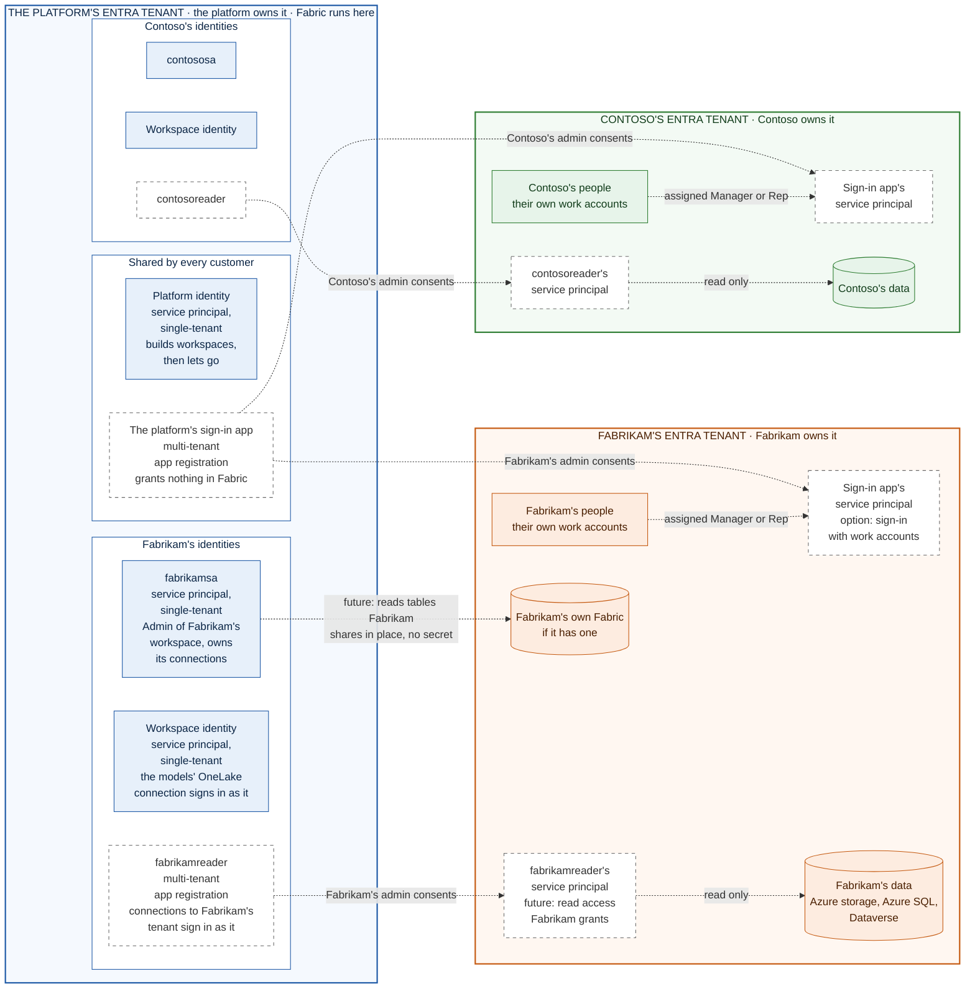
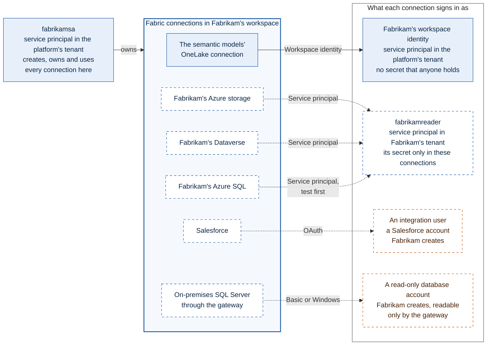
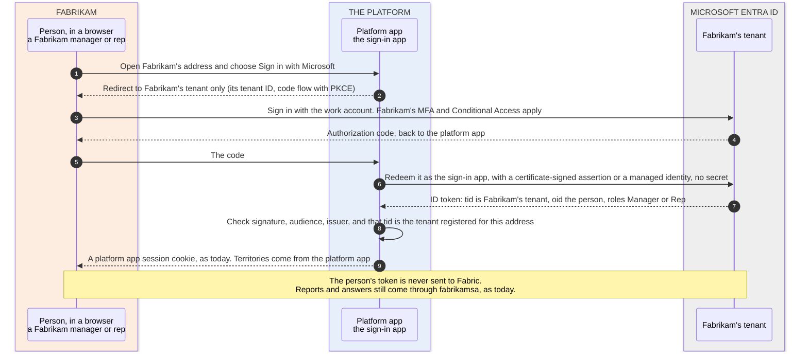
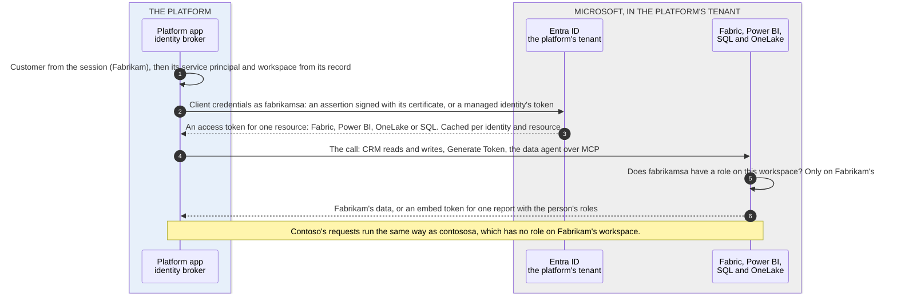
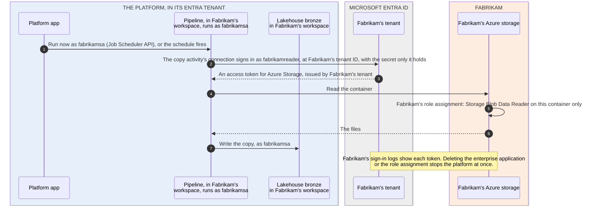

# Identities and authentication across Microsoft Entra tenants

Every company here has its own Microsoft Entra tenant: the platform, the SaaS provider, and each customer, such as
Fabrikam and Contoso. Fabric, every customer's workspace and every identity the platform's code signs in as live in
**the platform's** tenant. Fabrikam's tenant holds Fabrikam's people and Fabrikam's own systems; Contoso's holds
Contoso's. This document lists every identity and whether it's a service principal, says for each Fabric connection who
owns it and who it signs in as, and shows how each sign-in works:

- today, built and running;
- when a customer's people sign in with their work accounts (an option, not built);
- when the data integration add-on reads a customer's own systems ([DATA-INTEGRATION.md](DATA-INTEGRATION.md), not
  built).

Terms used here:
- An **Entra tenant** is a Microsoft Entra directory. A **customer** is a company that subscribes to the platform; the
  code and [FRAMEWORK.md](FRAMEWORK.md) call a customer a "tenant" too ([who's who](README.md#whos-who)). Here, "tenant"
  always means an Entra tenant.
- A **service principal** is the identity an app signs in as. An app registration lives in one tenant, its home, and
  has a service principal there. A multi-tenant app also gets a service principal (an "enterprise application") in
  each other tenant whose admin consents to it, and that tenant's admins grant roles to that service principal.
- A **Fabric connection** holds the address of a data source and a credential. Who owns a connection and who it signs
  in as are different identities (section 4). A Fabric *connector*, such as the Dataverse connector, is only the kind
  of source a connection reaches.

| Section | Covers |
| --- | --- |
| [1. Quick answers](#1-quick-answers) | The short version |
| [2. The Entra tenants](#2-the-entra-tenants) | What each tenant holds, and a map of every identity |
| [3. Every identity](#3-every-identity) | Whether it's a service principal, where it lives, how it signs in, what it can reach |
| [4. Connections: who owns each one, and who it signs in as](#4-connections-who-owns-each-one-and-who-it-signs-in-as) | Every Fabric connection, today and with the add-on, and where its credential is kept |
| [5. How each sign-in works](#5-how-each-sign-in-works) | People, the platform app calling Fabric, and the add-on reading a customer's data |
| [6. Who does what, on each side](#6-who-does-what-on-each-side) | The admin roles, in the platform's tenant and in the customer's |
| [7. Rules](#7-rules) | What keeps the tenants apart |
| [8. Checked, and to test](#8-checked-and-to-test) | What was checked live, what comes from Microsoft Learn, what needs a second tenant |

## 1. Quick answers

| Question | Answer |
| --- | --- |
| How many Entra tenants are there? | One per company: the platform's, Fabrikam's and Contoso's. Today the platform uses only its own: the customers' people sign in with platform app sign-ins, and no customer system is read. A customer's tenant takes part only if the customer opts in |
| Which identities does the platform use today? | Service principals, all in its own tenant: the platform identity, one service principal per customer (`fabrikamsa`, `contososa`) and each workspace's identity. None is a person's account. The app's messages and back office call the per-customer one its "service account" |
| How does the platform app sign in to Fabric? | As the customer's own service principal, through MSAL, with a certificate (a federated credential is also supported). Never with a person's token |
| Which connections are there today? | One per customer: the semantic models' OneLake connection. `fabrikamsa` owns it, and it signs in as Fabrikam's workspace identity, a service principal whose credential nobody holds. The platform app itself uses no connection: it calls Fabric with `fabrikamsa`'s own tokens |
| Does anything of a customer's get access in the platform's tenant? | No: no guest accounts and no roles. The customers' people never hold a token that Fabric accepts |
| Does the platform get access in a customer's tenant? | Only if the customer opts in, only what the customer grants, and the customer can take it back at any time: sign-in for its people, or read access to named data |
| How would the add-on read Fabrikam's data? | Through more connections, all owned by `fabrikamsa`. Those to Azure storage, Azure SQL and Dataverse sign in to Fabrikam's tenant as `fabrikamreader`: an app owned by the platform, one per customer, whose service principal Fabrikam admits into its tenant and gives read access. Data in Fabrikam's own Fabric needs no connection: Fabrikam shares it in place to `fabrikamsa`. On-premises systems: through a gateway on Fabrikam's network |
| What can't cross tenants? | Workspace identities, organizational accounts for storage in another tenant, and virtual network data gateways. Azure SQL documents that service principals from another tenant fail, so it's tested first (section 8) |

## 2. The Entra tenants

| | The platform's Entra tenant | Fabrikam's Entra tenant | Contoso's Entra tenant |
| --- | --- | --- | --- |
| Owned and run by | The platform | Fabrikam | Contoso |
| Holds | Fabric: the capacity and a workspace per customer. The platform identity, a service principal and a workspace identity per customer, and the platform's staff | Fabrikam's people and groups, its Azure subscriptions, Microsoft 365 and Dynamics 365, and its own Fabric if it has one | The same, for Contoso |
| The platform's identities in it | All of the platform's own | Only if Fabrikam opts in: the service principals of the platform's sign-in app and of `fabrikamreader`, with what Fabrikam grants them | The same, with `contosoreader` |
| The customers' identities in it | None: no guests and no roles | Fabrikam's own | Contoso's own |

Blue: the platform's tenant. Orange: Fabrikam's. Green: Contoso's. Solid: built and running today. Dashed: the
work-account option and the data integration add-on, not built. "Admin consents" means an admin of the customer's tenant
admits one of the platform's multi-tenant apps, which creates its service principal in that tenant.

## 3. Every identity

| Identity | Service principal? | Lives in | Created by | Signs in with | Can reach | Status |
| --- | --- | --- | --- | --- | --- | --- |
| Platform identity | Yes: a single-tenant app | The platform's tenant | An Entra admin | A certificate (or a client secret in development); in production, a federated credential trusting a managed identity | Fabric APIs; Contributor on the capacity; a customer's workspace until the hand-over | Built |
| `fabrikamsa`, `contososa` | Yes: single-tenant apps, one per customer | The platform's tenant | An Entra admin, or the platform | A certificate kept encrypted by the platform, or a federated credential | Admin of its own customer's workspace, and nothing else. It owns that workspace's connections | Built |
| Workspace identity | Yes: managed by Fabric, single-tenant | The platform's tenant | Fabric | Fabric holds its credential | Contributor of its own workspace. The semantic models' OneLake connection signs in as it | Built |
| The platform's sign-in app | Yes: a multi-tenant app, with a service principal in each customer tenant that admits it | App registration in the platform's tenant | The platform | A certificate, or the platform app's managed identity as a federated credential | Sign-in only: `openid`, `profile`, `email`, and the app roles Manager and Rep. No connection uses it | Option, not built |
| `fabrikamreader`, `contosoreader` | Yes: multi-tenant apps, one per customer, each with a service principal in its own customer's tenant only | App registration in the platform's tenant | The platform | A client secret held only by that customer's Fabric connections | What the customer grants that service principal in its own tenant, read-only. Nothing in the platform's | Add-on, not built |
| The platform's operators | No: people | The platform app's back office | The platform | The back-office key | The back office, where every look at a customer's data is logged | Built |
| The platform's support staff | No: people, in a security group | The platform's tenant | The platform | Their accounts in the platform's tenant | Viewer of the customers' workspaces, optional | Built |
| Customers' people, today | No: platform app sign-ins | The platform app's sign-in store, not an Entra tenant | The platform's setup and operators | Passwords of 15 characters or more, stored hashed with scrypt | The platform app at their company's address. Nothing in Fabric | Built |
| Customers' people, with work accounts | No: users | Their own company's tenant | The customer | Their company's sign-in, with its MFA and Conditional Access | The platform app at their company's address. Nothing in Fabric | Option, not built |
| Integration users in SaaS apps | No: app users | The SaaS app, for example Salesforce | The customer | OAuth, kept by the connection | What the app grants them | Add-on, not built |
| Accounts behind the gateway | No: database or Windows accounts | The customer's own systems | The customer's IT | A password, encrypted for the gateway | Read-only, in those systems | Add-on, not built |

`<customer>sa` and `<customer>reader` are both the platform's, one of each per customer. The service principal works in
the platform's tenant: it owns and runs the customer's workspace, including its connections. The reader only reads, in
the customer's own tenant, and only through the connections that sign in as it. Its display name follows the service
principal's: *Platform app reader - Fabrikam (fabrikamreader)*.

## 4. Connections: who owns each one, and who it signs in as

A Fabric connection holds the address of a data source and a credential. Every connection involves two identities, and
they're different:

- **The owner** creates, changes and uses the connection. In each customer's workspace that's the customer's service
  account: `fabrikamsa` owns every connection for Fabrikam, and the items that use them (semantic models, pipelines,
  shortcuts) run as it. Owning a connection doesn't open the data source.
- **The credential** is who the connection signs in as: the identity the data source sees and checks. Fabric stores it
  in the connection and never returns it.

Each arrow is labeled with the connection's credential type, as Fabric names it. Contoso has the same set, owned by
`contososa` and signing in as Contoso's workspace identity and `contosoreader`.

| Connection | Status | Owner, and what uses it | Credential type | Signs in as | Who checks it, and what's granted | Where the credential is kept |
| --- | --- | --- | --- | --- | --- | --- |
| The semantic models' OneLake connection (Direct Lake) | Built | `fabrikamsa`; both semantic models | Workspace identity | Fabrikam's workspace identity: a service principal in the platform's tenant | OneLake, in the platform's tenant: the identity is Contributor of Fabrikam's workspace | Fabric manages it; nobody holds a secret |
| Fabrikam's Azure Data Lake Storage or Blob storage | Add-on | `fabrikamsa`; pipelines and OneLake shortcuts | Service principal, naming Fabrikam's tenant ID | `fabrikamreader`'s service principal in Fabrikam's tenant | Fabrikam's storage: Storage Blob Data Reader on one container | In the connection only: a client secret, or a Key Vault reference to one |
| The same storage, without an identity | Add-on, an alternative | `fabrikamsa`; pipelines and OneLake shortcuts | Shared access signature | No identity: the token itself is the permission | Fabrikam's storage account: read on one container, until the token expires | In the connection. Fabrikam chooses the expiry |
| Fabrikam's Dataverse | Add-on | `fabrikamsa`; pipelines | Service principal | `fabrikamreader`, as an application user | Fabrikam's Dataverse environment: a read-only security role | In the connection only: a client secret |
| Fabrikam's Azure SQL Database | Add-on, test first | `fabrikamsa`; pipelines | Service principal, or Basic | `fabrikamreader`, as a database user, or a read-only SQL login | Fabrikam's database: `SELECT` on a schema | In the connection only |
| Salesforce and other SaaS apps | Add-on | `fabrikamsa`; pipelines | OAuth | An integration user Fabrikam creates in the app | The app | In the connection, from the integration user's sign-in when the connection is created |
| On-premises SQL Server and other systems | Add-on | `fabrikamsa`, with permission on the gateway; pipelines | Basic or Windows | A read-only account Fabrikam creates | Fabrikam's system | Encrypted for the gateway: the service never sees it |

Not connections:
- **The platform app** calls Fabric, Power BI, OneLake and the SQL database with `fabrikamsa`'s own tokens
  (section 5.3). It uses no connection.
- **The data agent** reads the role-free semantic model, which reads OneLake through the connection above.
- **The CRM tables** would reach the add-on's notebooks through a OneLake shortcut inside Fabrikam's workspace, read as
  the identity that runs the notebook, `fabrikamsa`.
- **Data in Fabrikam's own Fabric** would arrive through an external data share that `fabrikamsa` accepts. It appears
  as a shortcut, with no connection and no secret.

## 5. How each sign-in works

### 5.1 People sign in, today

Fabrikam's people sign in at Fabrikam's address with an email address and a password that the platform app issued: at
least 15 characters, stored hashed with scrypt. The session cookie (HttpOnly, SameSite=Lax, and Secure over HTTPS) works
only at that address. No Entra tenant is involved, and the people receive nothing that Fabric accepts: their reports
come as embed tokens that the platform app creates (section 5.3).

### 5.2 People sign in with their work accounts (option, not built)

For customers that want single sign-on, the platform app can let their people sign in with their work accounts, in their
own tenant.

- **One sign-in app for every customer.** A multi-tenant app registration in the platform's tenant that asks for sign-in
  only (`openid`, `profile`, `email`). It grants nothing in Fabric, and no connection uses it, so one app can serve
  every customer.
- **Fabrikam admits it once.** A Cloud Application Administrator or Application Administrator in Fabrikam's tenant
  grants admin consent, which creates the app's service principal there
  ([multi-tenant apps](https://learn.microsoft.com/entra/identity-platform/howto-convert-app-to-be-multi-tenant),
  [who can consent](https://learn.microsoft.com/entra/identity/enterprise-apps/grant-admin-consent)). They set
  **Assignment required** and assign people or groups to the app roles Manager and Rep
  ([assignment](https://learn.microsoft.com/entra/identity-platform/howto-restrict-your-app-to-a-set-of-users)).
- **Only Fabrikam's tenant signs in at Fabrikam's address.** The platform app records Fabrikam's tenant ID with the
  customer, sends people to that tenant only, and accepts an ID token only if its issuer and `tid` are Fabrikam's, as
  Microsoft's guidance for multi-tenant apps requires
  ([issuer](https://learn.microsoft.com/entra/identity-platform/howto-convert-app-to-be-multi-tenant#update-your-code-to-handle-multiple-issuer-values)).
  A Contoso account is refused at Fabrikam's address.
- **Fabrikam's policies apply.** Fabrikam's MFA and Conditional Access run at every sign-in, and a disabled account
  can't sign in again.
- **No secret.** The platform app redeems the code as the sign-in app with a certificate, or with its managed identity
  as a federated credential, which Entra supports across tenants
  ([secretless, across tenants](https://learn.microsoft.com/entra/identity/managed-identities-azure-resources/secretless-authentication#accesses-microsoft-entra-protected-resources-across-tenants)).
- **Nothing changes for Fabric.** The person's token stays with the platform app. Reports and answers still come through
  `fabrikamsa` (section 5.3), and territories are still kept in the platform app.
- **Why not guest accounts.** Inviting Fabrikam's people into the platform's tenant would put them in the directory that
  holds Fabric and every customer's workspace, where one wrong role assignment would reach a workspace. Multi-tenant
  sign-in leaves them in their own tenant.

### 5.3 The platform app calls Fabric (today)

- **One identity per customer, chosen from the session.** The platform app takes the customer from the session, never
  from the request, and uses that customer's service principal and workspace.
- **MSAL client credentials.** The service principal signs a 10-minute assertion with its certificate, or presents a
  managed identity's token in production. The platform's tenant returns a token for one resource: Fabric
  (`api.fabric.microsoft.com`), Power BI (`analysis.windows.net/powerbi/api`), OneLake (`storage.azure.com`) or SQL
  (`database.windows.net`). Tokens are cached per identity and resource.
- **Fabric checks the workspace role.** `fabrikamsa` is Admin of Fabrikam's workspace and of nothing else, so a request
  that mixes up customers is refused.
- **People get embed tokens, never Entra tokens.** Generate Token V2, called as `fabrikamsa`, returns a token for one
  report with the person's row-level security roles ([EMBEDDING.md](EMBEDDING.md)).
- **The data agent** is called over MCP with `fabrikamsa`'s Fabric token.
- **Inside Fabric,** the semantic models read OneLake through their connection, which signs in as the workspace
  identity and holds no secret (section 4).
- **Contoso** works the same way, as `contososa`. The platform identity only builds workspaces, then lets go.

### 5.4 The add-on reads the customer's systems (future)

The pipeline, the notebooks and `fabrikamsa` are in the platform's tenant; the data is in Fabrikam's. What crosses
depends on where the data is (section 4 lists the connections):

| Where Fabrikam's data is | How the platform reads it | The connection signs in as | What Fabrikam grants | Notes |
| --- | --- | --- | --- | --- |
| Fabrikam's own Fabric: a lakehouse, warehouse or mirrored database | External data sharing: in place, read-only, no copy and no secret | No connection: `fabrikamsa` accepts a share that names it by object ID and the platform's tenant ID | A share of named tables or folders | Fabrikam turns on **External data sharing**, and the platform **Users can accept external data shares**. `fabrikamsa` accepts the share into Fabrikam's lakehouse as a shortcut, and Fabrikam can revoke it at any time. Data may be read across regions ([external data sharing](https://learn.microsoft.com/fabric/governance/external-data-sharing-overview), [create a share](https://learn.microsoft.com/rest/api/fabric/core/external-data-shares-provider/create-external-data-share)) |
| Azure Data Lake Storage or Blob storage | A OneLake shortcut (no copy) or a pipeline copy | `fabrikamreader`, a service principal; or a SAS token | Storage Blob Data Reader on one container, or a read-only SAS token with an expiry date | Storage in another tenant needs a service principal or a SAS token ([shortcuts](https://learn.microsoft.com/fabric/onelake/create-adls-shortcut#limitations)) |
| Dynamics 365 or Dataverse | A pipeline copy with the Dataverse connector | `fabrikamreader`, as an application user | A read-only security role | Dataverse documents this pattern for multi-tenant apps ([Dataverse](https://learn.microsoft.com/power-apps/developer/data-platform/use-multi-tenant-server-server-authentication)) |
| Azure SQL Database | A pipeline copy | `fabrikamreader`, as a database user | `SELECT` on a schema | Test first: Azure SQL documents that "service principals can't authenticate across tenants' boundaries" ([Azure SQL](https://learn.microsoft.com/azure/azure-sql/database/authentication-aad-service-principal#limitations)). If it refuses `fabrikamreader`, use a service principal that Fabrikam creates in its own tenant, or a read-only SQL login |
| SharePoint or OneDrive files | Fabrikam copies them to its Azure storage (above), or people upload them in the platform app (built) | No connection | Nothing | For pipelines, Fabric's SharePoint connector documents organizational accounts and workspace identities only ([connector](https://learn.microsoft.com/fabric/data-factory/connector-sharepoint-online-list-overview)), and a workspace identity can't cross tenants. The connections API also lists a service principal: test it before relying on it |
| On-premises databases, ERP and files | A pipeline copy through an on-premises data gateway (section 5.5) | A read-only account in each source system, not an Entra identity | That account | |
| SaaS apps such as Salesforce | A pipeline copy with the app's connector | An integration user in the app, with OAuth | Read access in the app | Salesforce connections take OAuth only (checked live): the integration user signs in once, when the connection is created |

Reading Fabrikam's Azure storage, step by step:

- **Two identities in one run.** `fabrikamsa` runs the pipeline and writes the copy into Fabrikam's lakehouse, in
  the platform's tenant. The connection signs in to Fabrikam's tenant as `fabrikamreader`. A Fabric connection holds its
  own credential, so `fabrikamsa` itself never needs access in Fabrikam's tenant.
- **Why `fabrikamreader`, and not one of the platform's existing identities:**
  - The workspace identity is a single-tenant app (checked live), and "Workspace identity isn't supported in B2B or
    cross-tenant scenarios" ([workspace identity](https://learn.microsoft.com/fabric/security/workspace-identity#considerations-and-limitations)).
    It keeps reading the CRM tables, which are in the platform's tenant.
  - `fabrikamsa` could be made multi-tenant, but a Fabric connection takes a client secret for a service principal: no
    certificate and no federated credential (checked live). The platform keeps its own identities free of secrets.
  - A separate reader also limits what a leaked secret opens: the read access Fabrikam granted, never Fabrikam's
    workspace.
- **One reader per customer.** `contosoreader` is a different app, which only Contoso's admins admit. Entra has no
  setting that limits which tenants can admit a multi-tenant app, but admitting it grants nothing: access comes only
  from what each tenant's own admins assign. Each connection names its customer's tenant ID, and a control will check
  it.
- **The secret.** The platform creates it on `fabrikamreader`'s app registration, writes it straight into the
  connection and keeps no copy; Fabric's API never returns it. It's rotated before it expires: a new secret, the
  connection updated, the old secret deleted. A Key Vault reference could hold it instead, and Fabric would read the
  latest version at run time
  ([Key Vault references](https://learn.microsoft.com/fabric/data-factory/azure-key-vault-reference-overview)), but the
  reference itself signs in with a person's account or another service principal's secret (checked live): it moves the
  secret rather than removing it.
- **If Fabrikam won't admit outside apps,** Fabrikam creates a service principal in its own tenant, grants it the same
  read access and hands its secret over once; the platform puts it straight into the connection. Fabrikam then
  rotates it.
- **If the platform's own code ever reads Fabrikam's tenant directly** (not through Fabric), `fabrikamreader` can trust
  the platform app's managed identity instead of using a secret, as the sign-in app does.
- **Notebooks hold no credentials for Fabrikam's tenant.** They read what the pipeline copied and the CRM tables, all
  in Fabrikam's workspace, as `fabrikamsa`.
- **Fabrikam sees and controls it.** Every token issued to `fabrikamreader` shows in Fabrikam's sign-in logs. Deleting
  the enterprise application or a role assignment stops the platform at once; so does revoking a share.

### 5.5 On-premises systems, through a gateway (future)

- Fabrikam's IT installs an on-premises data gateway on a machine in Fabrikam's network. It connects out to Azure Relay
  ([communication](https://learn.microsoft.com/data-integration/gateway/service-gateway-communication)).
- It's registered to **the platform's** tenant, where the connections that use it are. Registering needs a person's
  account: `Add-DataGatewayCluster` "must be run with a user based credential"
  ([PowerShell](https://learn.microsoft.com/powershell/module/datagateway/add-datagatewaycluster)). So a platform
  engineer completes the registration, signed in with an account in the platform's tenant kept for Fabrikam's gateways,
  in a session with Fabrikam's IT. Fabrikam gets no account in the platform's tenant.
- If Fabrikam limits which tenants its machines may register gateways to (`AllowedRegistrationTenants`), it adds
  the platform's tenant ID for this machine
  ([tenant registration](https://learn.microsoft.com/data-integration/gateway/service-gateway-tenant-registration)).
- Fabrikam creates a read-only account in each source system. Its password is encrypted with the gateway's public key
  when it's entered, and the gateway re-encrypts it with its own key before it's stored, so "the Power BI service never
  has access to the unencrypted data"
  ([security white paper](https://learn.microsoft.com/power-bi/guidance/white-paper-powerbi-security)).
- `fabrikamsa` creates the gateway's connections through the Fabric API, once it has permission on the gateway
  ([Create Connection](https://learn.microsoft.com/rest/api/fabric/core/connections/create-connection)).
- A virtual network data gateway can't stand in for it: those can't be created across tenants
  ([virtual network gateways](https://learn.microsoft.com/data-integration/vnet/create-data-gateways)).

## 6. Who does what, on each side

| Who | Where | Does | For |
| --- | --- | --- | --- |
| An Entra admin, or the platform with `Application.ReadWrite.OwnedBy` | The platform's tenant | Creates the platform identity and a service principal per customer; for the options, the sign-in app (once) and a reader per customer (`fabrikamreader`) | Today, and the options |
| The platform | The platform's tenant | Rotates the readers' secrets, straight into the connections | Add-on |
| A Fabric administrator | The platform's tenant | Turns on **Users can accept external data shares**, for the service principals' group only | Add-on, data in a customer's Fabric |
| A platform engineer | The platform's tenant | Registers a customer's gateway, in a session with the customer's IT | Add-on, on-premises sources |
| An operator | The platform app's back office | Records the customer's tenant ID | The options |
| A Cloud Application Administrator or Application Administrator | Fabrikam's tenant | Admits the platform's sign-in app and assigns people to Manager and Rep; admits `fabrikamreader`, which asks for no API permissions | The options |
| An Owner, User Access Administrator or Role Based Access Control Administrator | Fabrikam's storage account | Gives `fabrikamreader` Storage Blob Data Reader on one container | Add-on, storage |
| The server's Microsoft Entra admin | Fabrikam's Azure SQL database | Creates a database user for `fabrikamreader` and grants `SELECT` | Add-on, Azure SQL |
| A System Administrator | Fabrikam's Dataverse environment | Adds `fabrikamreader` as an application user with a read-only security role | Add-on, Dataverse |
| A Fabric administrator, then someone with Read and Reshare on the item | Fabrikam's Fabric | Turns on **External data sharing**, then shares named tables to `fabrikamsa` | Add-on, data in Fabrikam's Fabric |
| Fabrikam's IT | Fabrikam's network | Installs the gateway, and creates read-only accounts in the source systems | Add-on, on-premises sources |

## 7. Rules

1. **Nothing of a customer's gets a role in the platform's tenant or in Fabric.** No guests, no workspace roles, and
   people's tokens never reach Fabric.
2. **The platform holds only what a customer admits and grants:** service principals of the platform's apps, with read
   access to named data. The customer can remove either at any time.
3. **The customer's service principal owns every connection in its workspace,** and each connection signs in as the
   narrowest identity that works: the workspace identity inside the platform's tenant, the customer's reader in
   the customer's.
4. **One reader per customer,** admitted only in that customer's tenant, with its secret only in that customer's
   connections.
5. **The platform's own identities hold no secrets:** certificates today, federated credentials in production. The
   readers' secrets exist only because Fabric connections need one.
6. **The customer's tenant ID is part of its record,** and every sign-in and connection is checked against it.
7. **Every crossing is logged where it's granted:** in the customer's sign-in and audit logs for its tenant, and in
   Fabric's and the platform app's logs for the platform's.

## 8. Checked, and to test

**Checked live** in the pilot's tenant, on 2026-10-07:
- The workspace identity and both service principals are single-tenant apps (`signInAudience` is `AzureADMyOrg`). The
  workspace identity is tagged `Microsoft Fabric Identity`.
- Fabric cloud connections take these credential types: Anonymous, Basic, Key, KeyPair, OAuth2, ServicePrincipal,
  SharedAccessSignature and WorkspaceIdentity. None is a certificate or a federated credential. By source:
  - Azure Data Lake Storage: Key, OAuth2, SharedAccessSignature, ServicePrincipal, WorkspaceIdentity;
  - SQL: Basic, OAuth2, ServicePrincipal, WorkspaceIdentity;
  - Dataverse: OAuth2, ServicePrincipal, WorkspaceIdentity;
  - SharePoint lists: Anonymous, OAuth2, ServicePrincipal, WorkspaceIdentity;
  - Salesforce: OAuth2;
  - Azure Key Vault references: OAuth2, ServicePrincipal.

  Source: `GET /v1/connections/supportedConnectionTypes`, as the platform identity.
- A service principal credential names the principal's tenant ID and takes a secret, or a Key Vault reference to one
  ([Create Connection](https://learn.microsoft.com/rest/api/fabric/core/connections/create-connection)).

**From Microsoft Learn**, with the links in section 5:
- workspace identities don't cross tenants, and neither does
  [trusted workspace access](https://learn.microsoft.com/fabric/security/security-trusted-workspace-access);
- storage in another tenant needs a service principal or a SAS token;
- external data sharing works in place, with service principals as recipients;
- who can grant admin consent, and how a multi-tenant app validates the issuer;
- managed identities work as federated credentials across tenants;
- Dataverse takes multi-tenant apps as application users;
- Azure SQL's limit on service principals from another tenant;
- how gateways are registered and how their credentials are protected;
- virtual network data gateways can't cross tenants.

**Not tested here.** Nothing above crosses tenants yet, because the pilot has one Entra tenant. With a second tenant
standing in for a customer, test these first:
1. A pipeline copy from storage in the second tenant, through a connection that signs in as a reader's service
   principal.
2. Azure SQL in the second tenant, with the reader.
3. An external data share from the second tenant, accepted by a service principal.
4. Work-account sign-in from the second tenant, and its refusal at another customer's address.
