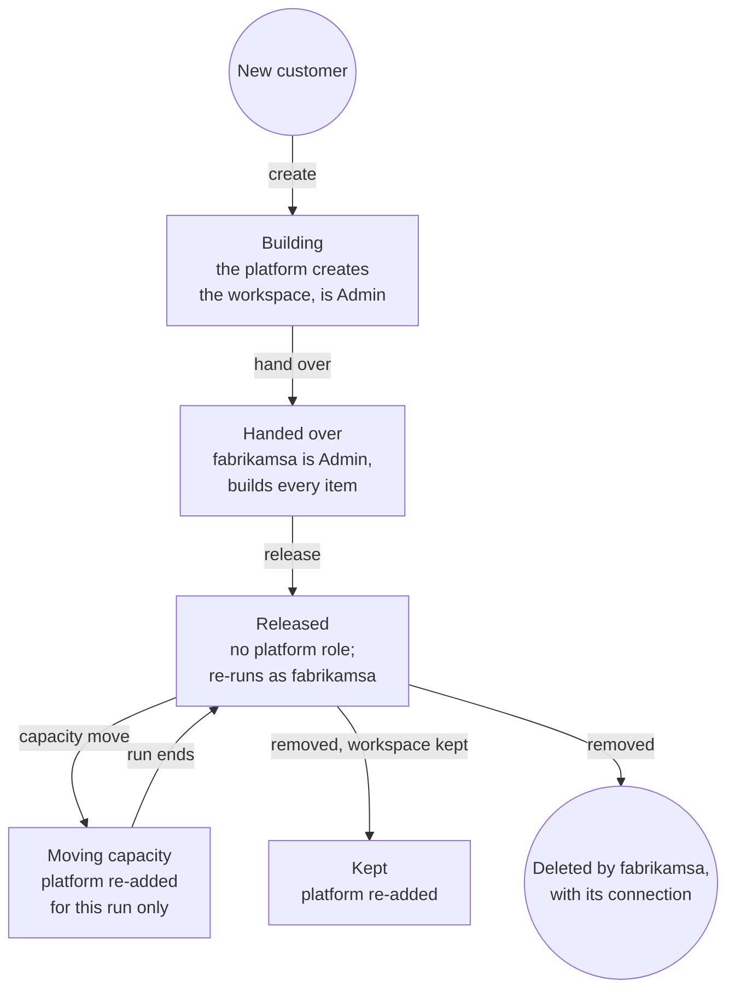

# HiCRM multitenancy, least-privilege and robustness review

Review of the HiCRM platform on Microsoft Fabric, 2026-10-02: the code, a role-enforcing Fabric emulator, fault
injection, and the live `saas-fabrikam` workspace. It answers three questions: are customers truly isolated, does every
identity have only the access it needs, and does the platform stay correct when things fail?

**Verdict.** The design is a sound multitenant model: a shared control plane (the HiCRM app and the platform identity)
and a data plane isolated per customer (a workspace, a SQL database, a semantic model, a connection and a service
account each), on a shared capacity with an optional dedicated one. The review found 18 issues, 4 of them high
(chiefly: the back office had no sign-in, the platform identity kept standing Admin access to every customer, and
isolation had never been tested because the Fabric emulator didn't enforce roles). All 18 are fixed and each fix has a
test that fails if the protection is removed. The biggest remaining risk is the shared control plane: one platform
identity still provisions, reads every service account's secret and can own the service account apps. Section 5
explains how to split it and remove the secrets, along with the other production work.

The rules this review established are now the framework's controls ([FRAMEWORK.md](FRAMEWORK.md#6-controls)), which
`npm run validate` checks against the emulator or, with `--live`, against a deployment.

## 1. How customers are kept apart

| Layer | How customers are separated | Enforced by | Evidence |
| --- | --- | --- | --- |
| Address | Each customer has its own address (`https://<customer>.<APP_DOMAIN>`, locally `http://fabrikam.localhost:3000`). It signs in only that customer's people; anyone else gets the same answer as an unknown person. A session works only at the address that issued it: cookies are host-only (`__Host-` over HTTPS), and the server checks the session's customer against the address's. The back office answers only on the platform's address; any other host name gets 421 | HiCRM and the browser | `test/tenancy.test.js`; live: Fabrikam's session got 401 at `contoso.localhost` and at the platform address |
| Sign-in | The customer comes from a signed cookie, never from the request; the email's domain is checked against the customer's current domains on every request | HiCRM | `test/isolation.test.js`: moving a domain ends sessions at once |
| Within a customer | Each person has a role and territories. CRM queries are scoped in SQL; embed tokens carry the person's row-level security role (`effectiveIdentity`); the data agent, which runs as the service account and sees every territory, answers managers only, while reps get scoped quick answers. Changing someone's access ends their sessions | HiCRM, Power BI | `test/personas.test.js`, `test/assistant.test.js`; live: the Texas rep's token named only Texas |
| API | Report and model IDs from the browser are only accepted if they are in the customer's own workspace, and, until report authoring ships, only the platform's standard reports | HiCRM, then Fabric | Another customer's report and model IDs get 404; `test/standard-report.test.js` |
| Identity | Every customer call runs as that customer's service account, which is Admin of one workspace and has no other role anywhere | Microsoft Entra ID and Fabric | The emulator's call log: every call for Fabrikam ran as `fabrikamsa`, in Fabrikam's workspace |
| Data | One workspace, SQL database, semantic model and connection per customer; the connection belongs to the customer's service account, including for a workspace the platform built before the account existed | Fabric | A service account can't read, query, embed, change or delete anything of another customer; the hand-over test |
| Defence in depth | If the registry mixed up two customers, the wrong service account would be refused by Fabric instead of reading the other customer's data | Fabric | Test with deliberately swapped identities |
| Embedding | V2 embed tokens name the items of one workspace and live 30 minutes | Power BI | Live: requested 04:48:08, expired 05:18:12 |
| Branding | Logos are plain drawings or raster images (an SVG with script, event handlers, external links or HTML is refused), shown only through ``, and served with a sandbox policy | HiCRM | `test/tenancy.test.js` |
| Compute | Per-customer and per-user rate limits; a dedicated capacity per customer when needed | HiCRM, Fabric capacity | One customer's 429s leave another customer unaffected |
| Control plane | The platform identity releases its role after the hand-over; operators sign in; looking at customer data (including the questions people asked the assistant) is logged | HiCRM, Fabric | Release-mode test; operator sign-in and activity log test |

This follows the [Azure guidance for multitenant solutions](https://learn.microsoft.com/azure/architecture/guide/multitenant/overview)
(a shared control plane, an isolated data plane, noisy-neighbour controls). Power BI's own pattern for multitenant
apps, [service principal profiles](https://learn.microsoft.com/power-bi/developer/embedded/embed-multi-tenancy), only
covers the Power BI APIs, so it can't isolate the Fabric items (SQL database, connection, data agent); one service
principal per customer can. The same article notes: "To add extra separation, assign a separate service principal to
each tenant, instead of having a single service principal access multiple workspaces using different profiles."

### Why each customer has two semantic models

`HiCRM Insights` has the territory roles and serves every report. `HiCRM Insights - Assistant` is the same model
without roles and serves only the data agent.

One model can't do both jobs with "app owns data":
- **The data agent runs as a service principal.** The customer's people have no Entra identity, so the service account
  is the only caller the agent can have.
- **Row-level security doesn't work with a service principal as the viewer.** Power BI documents: "Service principals
  can't be added to an RLS role. Accordingly, RLS isn't applied for apps using a service principal as the final
  effective identity" ([source](https://learn.microsoft.com/fabric/security/service-admin-row-level-security#considerations-and-limitations)).
  Embed tokens solve this for reports with `effectiveIdentity`, but the data agent has no equivalent.
- **Live, the agent failed against the model with roles.** Its queries were refused with 401
  `PowerBINotAuthorizedException`, so it reads the twin instead.

**The cost is small:**
- Both are Direct Lake models over the same OneLake tables, so no data is copied.
- Both are generated from the same code, so they can't drift apart.
- Only managers, who see every territory anyway, reach the twin.

**Ways to get to one model, if that matters more:**

| Option | Trade-off |
| --- | --- |
| Point the agent at the SQL database instead of a semantic model | It would generate T-SQL instead of using the model's measures, so its numbers could differ from the reports' |
| Give customers' people Entra identities and call the agent as them ("user owns data") | It needs Entra accounts and licenses for every person, which is a different product model |
| Drop the roles and filter in the browser | Not secure: anyone could remove the filter |

### The platform identity's access over a customer's life

With `PLATFORM_WORKSPACE_ACCESS=release` (the production default), the platform identity holds no role in any customer
workspace at rest, so a leak of its credential reaches no customer data, and it isn't held to Fabric's limit of 1,000
workspaces per identity. Only workspace Admins can add Admins ([workspace roles](https://learn.microsoft.com/fabric/fundamentals/roles-workspaces)),
so the customer's service account is the one that re-adds it, and the activity log records each time.

## 2. Least privilege

| Identity | Role | Why not less |
| --- | --- | --- |
| Platform identity | Contributor on the capacity; Admin of a customer workspace only until the hand-over (and for a capacity move); no Fabric admin API rights, except optionally the read-only ones for the validator (IDN-06) | Creating a workspace makes it Admin; assigning a capacity needs rights on the capacity, which customer accounts never get |
| `fabrikamsa` (one per customer) | Admin of its own workspace; nothing else | Release mode needs it: only Admins add or remove Admins, and the service account removes and re-adds the platform identity. Without release mode, Member would be enough |
| Workspace identity | Contributor of its own workspace | Direct Lake on OneLake needs Read and ReadAll; Viewer has no OneLake data access |
| Support group (optional) | Viewer | Read-only troubleshooting in the Fabric portal |
| Operators | No Fabric access; `ADMIN_KEY` sign-in to the back office | Every look at customer data goes through the app and is logged |
| End users | No Fabric identity | 30-minute embed tokens for named items |

`node scripts/platform-cli.js audit <customer>` (or **Check access** in the back office) compares a workspace with this
table: every principal's role, people with direct access, the managed items, how the model's connection signs in, the
capacity and the CRM schema version. It is read-only and runs as the customer's service account. Exit code 1 means a
failure, so it can run on a schedule.

### Blast radius if a credential leaks

| Credential | Before this review | After |
| --- | --- | --- |
| Platform identity | Admin of every customer workspace, and every service account's secret | No role in any customer workspace (release mode). It can still read every service account's secret from the secret store and, with Graph auto-create, add credentials to the service accounts it owns, so a stolen platform credential still reaches every customer indirectly. See the identity split in section 5 |
| A customer's service account | Its own workspace | Unchanged: its own workspace only, and no capacity rights |
| A customer user's session | Their company, until the cookie expired, even after their domain was removed | Their company, only while the domain still belongs to it; rate-limited |
| The back office URL | Everything, with no sign-in | Needs `ADMIN_KEY`; 5 guesses a minute per address; refused off loopback without a key |
| An embed token | About an hour | 30 minutes, named items only |

The app tier is shared, so whoever controls the running app can act for every customer; that holds for any pooled app
tier. What per-customer service accounts buy is protection against bugs and confused-deputy mistakes: a request for
one customer can't touch another customer's data even if the code mixes them up, because Fabric refuses the token.
Against a stolen credential, the answer is to leave nothing worth stealing: managed identities and federated
credentials instead of secrets, and separate identities for provisioning and for serving requests.

## 3. Scorecard

| # | Severity | Finding | Fix | Test |
| --- | --- | --- | --- | --- |
| 1 | High | The back office API had no authentication | Operator sign-in with `ADMIN_KEY` (timing-safe check; HttpOnly, SameSite=Strict cookie scoped to `/api/admin`; 4 hours); the server refuses a non-loopback `HOST`, `TRUST_PROXY` or `PUBLIC_ORIGIN` without a key | robustness: operator sign-in; unsafe configurations |
| 2 | High | The platform identity kept standing Admin on every customer workspace (blast radius, and the 1,000-workspace limit) | `PLATFORM_WORKSPACE_ACCESS=release`: hand-over, then release; just-in-time access for capacity moves | isolation: release mode; robustness: scale (20 customers, none visible to the platform) |
| 3 | High | Template copying ran as the customer's service account but read the platform's template workspace (it would have failed as soon as roles were enforced) | The platform reads templates, the service account writes | provisioner: Enterprise run |
| 4 | High | The Fabric emulator didn't enforce roles, so isolation had never been tested | The emulator holds each identity to its workspace roles, connection and model ownership, and capacity rights, and logs every call | isolation suite; 15 mutation checks (section 4) |
| 5 | Medium | Sessions survived a sign-in domain moving to another customer | The domain is checked on every request | isolation: moving a domain |
| 6 | Medium | Upgrades showed "setting up" and a failed step hid the CRM | Last-known-good: after the first success, a busy or failed run keeps what works | robustness: upgrades keep the app up |
| 7 | Medium | No per-customer or per-user limits (noisy neighbours, guessing) | Token buckets for sign-in, questions, describe-a-chart, embed tokens, CRM writes and data loads; 429 with `Retry-After`; `X-Forwarded-For` only with `TRUST_PROXY`; the number of buckets is bounded | robustness: rate limits; sign-in limits |
| 8 | Medium | Embed tokens lived about an hour | `lifetimeInMinutes`, 30 by default (`EMBED_TOKEN_MINUTES`, 5 to 60) | robustness: embed tokens; live |
| 9 | Medium | Fabric errors (with IDs and account names) could reach customers | Customers get a plain message and a short reference; details go to the server log; operators still see them | isolation: errors |
| 10 | Medium | One failed registry write blocked every later write | The write queue recovers after a failure | robustness: storage |
| 11 | Medium | Concurrent secret writes could drop a secret | Secret writes run one at a time | robustness: storage |
| 12 | Medium | Service account creation relied on listing owned objects to stay idempotent | Graph upsert keyed on the customer (`uniqueName`), with a tag lookup when Graph answers 204 | identities: upsert, and retry after an interrupted run |
| 13 | Medium | Database connection pools per customer were unbounded | Least recently used and idle pools close (100 open, 15 minutes by default); in-memory demo data never does | robustness: database connections |
| 14 | Medium | Unbounded parallel provisioning (throttling storms) | At most `PROVISIONING_CONCURRENCY` customers at once (4) | robustness: concurrency; scale |
| 15 | Low | CDN scripts had no Subresource Integrity | `integrity` (SHA-384) and `crossorigin` on every CDN script, including the Excel converter loaded on demand | robustness: headers and scripts; in a browser, a tampered copy was blocked |
| 16 | Low | No `Secure` cookies and no production profile | `APP_ENV=production` refuses unsafe settings; `Secure` cookies and HSTS with an https `PUBLIC_ORIGIN`; COOP, CORP, `X-Frame-Options`, Permissions-Policy, `object-src 'none'` | robustness: unsafe configurations; headers; `.env.example` |
| 17 | Low | One capacity for every customer | Optional dedicated capacity per customer (back office, API, CLI `capacity`) | isolation: release mode moves a customer |
| 18 | Low | Operators looking at customer data left no trace | Opening reports, asking the assistant, viewing CRM numbers, loading data and running items are logged in the customer's activity, with the operator's name | robustness: operator sign-in |

Also fixed while testing:

- A lost `createConnection` response made the retry create a second connection under the fallback name (found by
  fault injection; the retry now looks again first).
- A workspace the registry knew was re-created when Fabric answered 404, which could orphan data an admin might still
  restore. Provisioning now stops and says how to recover.
- With the data agent unavailable, "total value of open opportunities by stage" returned counts. Value phrasings now
  map to money measures; the live answer adds up to the CRM's pipeline value.
- An empty `SAMPLE_DATA_DEFAULT=` (as written by `.env.example`) turned sample data off.

Found live, once each customer had its own service account (October 3, 2026):

- **The hand-over failed at first.** Binding a model the caller doesn't own returns 400 `BindNotModelOwner`, not the
  403 the emulator assumed. The service account now takes the model over and binds again on 400, 401 or 403, and the
  emulator answers like Fabric does.
- **A new service account's secret was refused for minutes** (`AADSTS7000215`, then accepted): Microsoft Entra ID
  hadn't replicated it everywhere. Token requests now retry that error and the two other "not there yet" errors
  (`AADSTS700016`, `AADSTS7000229`) three times, over about 17 seconds.
- **Removing the platform identity's role took about an hour to take effect** on `saas-contoso`. The role list and
  the tenant's admin API showed no role at once, but calls kept working until about an hour later. Microsoft doesn't
  document this delay. After a release, confirm with a call that's denied, not only with the role list.
- **The first question after a capacity move failed after 38 seconds** (503), and the next one worked. SQL database in
  Fabric also pauses after 15 idle minutes. Connecting and reads are now retried on transient errors for up to 90
  seconds; a write that may have been applied is never run twice.
- **The question log lost information.** It now keeps answers (up to 4,000 characters) and, when nothing could
  answer, why the quick answer failed too. Before, such a question was shown as "asked before answers were kept".
- **Setup dropped other customers' passwords** from the sign-ins file when run for one customer. It now carries over
  each password after checking it against the stored hash.

## 4. Evidence

**Tests.** 92 tests at the time of the review, all in-process (more since; see [README.md](README.md#test-it)). Two
suites were added for this review:

- `test/isolation.test.js` (8 tests): each service account is Admin of exactly one workspace and is refused everywhere
  else, including the template; customer requests run only as that customer's account; foreign IDs are refused;
  sessions end when domains move; customers never see Fabric details; release mode, capacity moves and removal work
  without standing access; the audit flags drift.
- `test/robustness.test.js` (13 tests): one injected failure at each of 10 provisioning operations (including
  responses lost after Fabric acted), each followed by a clean run with no duplicates; shared runs and the
  concurrency limit; upgrades that pause or fail; rate limits; operator sign-in; unsafe configurations; headers, cookies
  and SRI; embed lifetime; connection pools; storage; 20 customers side by side in release mode.

**Mutation checks.** Each protection was switched off in turn to confirm a test fails. All 15 were caught: session
domain re-check, customer error sanitizing, platform release, per-customer identity at runtime, embed report ownership,
connection lost-response recovery, write queue recovery, serialized secret writes, last-known-good access, per-user
limits, the operator guard, pool eviction, embed lifetime, the provisioning concurrency limit, and the bound on
rate-limit keys (a flood of new keys can't grow memory without limit).

**Live, against `saas-fabrikam` on the trial capacity:**

- A provisioning run with the new code finished in 78 seconds; every step reported "exists" or "up to date", and the
  release step was skipped (keep mode, no service account yet).
- `audit Fabrikam`: 7 ok, 2 to review, 0 failing. It flagged the missing `fabrikamsa` (customer work still runs as the
  shared platform identity) and a person (the administrator who created the workspaces) with direct Admin access; it confirmed the workspace
  identity is Contributor and the model's connection uses it with single sign-on off and no stored secret.
- An embed token requested at 04:48:08 expired at 05:18:12.
- The data agent now answers `FT1 SKU Not Supported`: data agents need a paid F2 or larger capacity
  ([prerequisites](https://learn.microsoft.com/fabric/data-science/data-agent-mcp-server#prerequisites)). The assistant
  fell back to quick answers, logged why, and paused the agent for 15 minutes.
- In a browser, the three pinned CDN scripts loaded with their integrity hashes and a tampered copy was blocked.

**Live, with a service account per customer, Fabrikam and Contoso** (October 3, 2026; `TENANT_IDENTITY_MODE=required`,
`PLATFORM_WORKSPACE_ACCESS=release`):

- Provisioning ended with "The platform identity has no standing access; `<customer>sa` manages the workspace" for
  both customers.
- Each service account listed only its own workspace. Against the other customer's: workspace 403, items 401, embed
  token for its report 404, its data agent "User is not authorized".
- The platform identity: 403 on both workspaces, Fabric and Power BI APIs alike (after the delay above).
- At each customer's address: sign-in, logo and color, the "Sales overview" embed token (30 minutes) for the manager
  and a rep, and the rep's answers scoped to Texas. A session from one customer got 401 at the other's address, and
  Fabrikam's manager couldn't sign in at Contoso's.

## 5. What's left before real customers

In order of priority:

1. **A paid capacity for the assistant.** On the trial capacity the data agent refuses the service accounts
   (`FT1 SKU Not Supported`), so managers get quick answers only. Data agents are documented for F2 or larger
   ([prerequisites](https://learn.microsoft.com/fabric/data-science/data-agent-mcp-server#prerequisites)). The service
   accounts, hand-over and release are done and verified live (section 4).
2. **Remove direct human access** from both workspaces (the administrator who created them is Admin on `saas-fabrikam` and
   `saas-contoso`), or make it documented break-glass access through a PIM-eligible group.
3. **A dedicated platform app.** The current one also has roles on seven workspaces unrelated to HiCRM.
   Rotate its secret too: it was shared earlier (D8). It's also in a security group that may call the Fabric
   admin APIs, including those that make changes, such as updating tenant settings; the app needs none of them.
   Limit the service principal tenant settings to a group of HiCRM's identities as well (IDN-06 warns on both).
4. **Split the control plane identity, and use the federated credentials.** Today one platform identity provisions,
   reads the service accounts' stored credentials and (with auto-create) owns the service account apps. Done: every
   service principal can sign in with a certificate or a federated credential through MSAL, production refuses client
   secrets, and the pilot's service accounts use certificates (live since 2026-10-06). In production:
   - a provisioning identity (managed identity of the provisioning job) creates workspaces, uses the capacity and
     creates service accounts, and can write credentials but not read them;
   - a runtime identity (managed identity of the web app) can only get service account credentials;
   - service accounts sign in with federated credentials trusting the runtime identity
     (`TENANT_CREDENTIAL=federated`, built and tested against a stand-in, not yet live), so there is nothing to steal
     or rotate, and the provisioning identity is removed as owner of each app once it is created.
5. **Real sign-in.**
   - Customer users through Microsoft Entra External ID, or the SaaS app's own identity provider, keeping each
     person's role and territories. The territory roles in the model and in embed tokens are already in place.
   - Operators through Entra ID with Conditional Access and named accounts, instead of a shared key.
6. **More than one server instance**: the registry in a database, rate limits in a shared store (for example Azure
   Cache for Redis), and provisioning as a durable queue with a lease per customer.
7. **Capacity.**
   - Copilot in Power BI and the data agent's code interpreter also need a paid F2 or larger capacity.
   - Capacities per region for data residency, dedicated capacities for large customers, and alerts from the Capacity
     Metrics app.
8. **Monitoring.**
   - Run `audit` on a schedule and alert on any failure; alert on provisioning failures.
   - After a release or any other role removal, confirm with a call that's denied: in the pilot, Fabric applied a
     removal about an hour late.
   - Keep the Fabric audit log of each service account.
   - Send the assistant's question log to a log store with a retention policy, instead of the registry.
9. **Customer addresses in production**: a wildcard TLS certificate for `*.<APP_DOMAIN>` at the proxy (with
   `TRUST_PROXY`), and custom domains per customer if they want their own.
10. **Smaller items:**
    - The audit doesn't yet list who else can use a customer's connection.
    - `style-src 'unsafe-inline'` stays in the CSP because the Power BI client sets inline styles.
    - For customers that need hard isolation, or at very large scale: deployment stamps (a separate app tier, or
      several Fabric tenants or regions).
